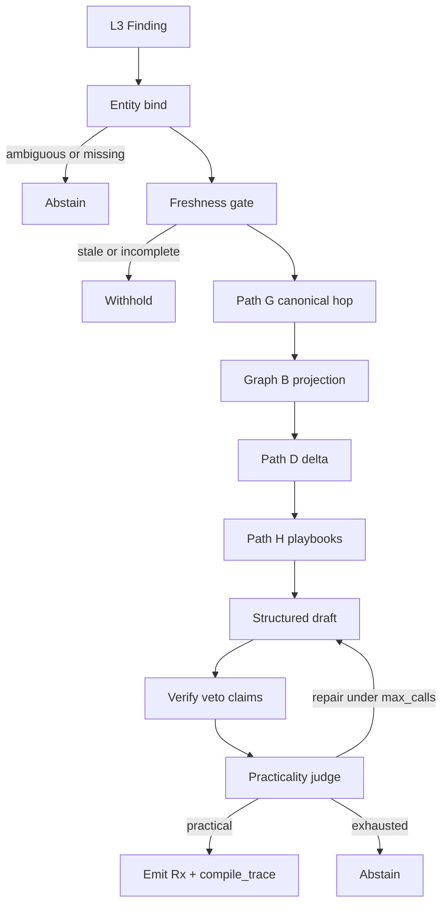
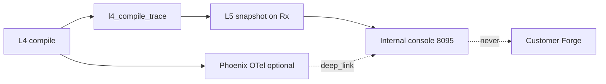

---
type: Product Architecture
title: "L4 — Plant context graphs (canonical + live + Path D)"
description: >-
  Dual plant graphs for practical prescriptions: slow canonical knowledge graph,
  live operational index (no LLM), Path D delta pack, quality-default compiler,
  Lane A retained as opt-in, L5 compile-trace display.
tags: [stamped-energy, technical, layer-spec, l4, context-graph, path-d]
timestamp: "2026-08-20T00:00:00Z"
status: Accepted with ADR-028 — companion to L4-knowledge-and-reasoning.md
---

# L4 — Plant context graphs

> **Naming (2026-08):** Code uses descriptive module names (`plant_context`, `neighborhood`, `delta_facts`, `playbook_corpus`). Letter Path/Graph codes below are historical; only L1–L6 remain as layer codes.

*Companion SSOT · August 2026. Pulls the Path G trigger in [ADR-017](../../../decisions/016-020/ADR-017-l4-adaptive-retrieval-and-web-trust.md). Decision: [ADR-028](../../../decisions/028-032/ADR-028-dual-plant-graphs-and-path-d.md). Research: [context graphs note](../../research/stamped-context-graphs-and-practical-prescriptions.md). Parent: [L4 knowledge and reasoning](L4-knowledge-and-reasoning.md). Eval: [practicality rubric](../../cross-cutting/05-prescription-practicality-eval.md). Staff UI: [L5 internal console](../../../handoff/holistic/improve/stamped-l5-internal-console-handoff.md).*

> L4 still does not detect waste, own tariff arithmetic, write OT, or auto-approve. This document changes **how** a Finding becomes a practical Prescription — not those boundaries.
>
> Gold bar: [demo prescriptions](../../../demo-decks/prescriptions-examples.md). Example 6 (Tuesday inspect blocked → Thursday after Job 447) is Path D, not a better prompt.

---

## 1. Thesis

Two persistent graphs share **the same node IDs**.

| Graph | Name | Update | LLM? | Answers |
| --- | --- | --- | --- | --- |
| **A** | Canonical plant knowledge | Every few days, or on SOP / asset / tariff-structure change | Allowed on the batch; T3 still human-reviewed | What is this plant, what is allowed, who owns what, what is typical |
| **B** | Live operational index | Event-driven (measurements, orders, shift clock) | **Never** | What is true *right now* |
| **Path D** | Delta pack (query-time) | Built per Finding | No (deterministic diff) | What is different from typical/allowed — this *is* Why and Due |

The **quality path** is the default compiler for all categories. **Lane A (0 LLM) is kept, not default.**

---

## 2. Compile flow

Default steps:

1. **Bind** Finding → asset / class / vertical / waste. Tenant-scoped (`org_id` + `plant_id` + asset id). Ambiguous or missing → **abstain** (record candidates on compile-trace). Never guess across plants.
2. **Freshness gate** on Graph B (see §4.1). Fail → **withhold**, not a generic card.
3. Path G hop on Graph A (owners, standby edges, SOP, typical, playbook via `REMEDY_IN`).
4. Live pull Graph B for those IDs (L2 projection — L4 never `L2_DATABASE_URL`).
5. Path D: emit typed delta facts (need / blocker / feasible / who / not) — §5.
6. Path H: playbook chunks filtered by vertical + equipment class + Playbook.`waste_category`. Trust tiers T1–T4 unchanged ([ADR-017](../../../decisions/016-020/ADR-017-l4-adaptive-retrieval-and-web-trust.md)).
7. Deterministic next-best window ([ADR-030](../../../decisions/028-032/ADR-030-five-domain-decision-loop.md) feasibility **at compile**).
8. Draft What/Why/Who/When/Effort from the pack. `template_id` still bounds the **action family**.
9. Verify ₹ / citations / veto (non-tradeable).
10. Practicality judge (language only). Repair while `generation_calls < max_generation_calls` (default **12**; ≥10 allowed, not unbounded). Exhausted → **abstain** with reason. Never emit a generic card to look busy.

**Lane A** (`force_lane=a`, `L4_DEFAULT_LANE=template`, or structured model down): label `provenance.lane = template_fast_path`. Emit **only** when Path D practicality fields are already complete (feasible When + role Who + named What from template). Otherwise **withhold** — model-down is not a license for an infeasible Due.

Terminal statuses for every compile: `emit` | `withhold` | `abstain` (on `l4-compile-trace.terminal`).

---

## 3. Graph A — canonical ontology

Keep this small. ISA-95-shaped, not a MES product ([ADR-030](../../../decisions/028-032/ADR-030-five-domain-decision-loop.md)).

### 3.1 Node types

| Type | Example | Notes |
| --- | --- | --- |
| Plant | `plant_ghaziabad_1` | One site |
| Department | utilities, packaging, melt_shop, pyro, batch_hall | Matches department graph |
| Line / area | compressor house, kiln string, packaging line 1 | |
| Asset | `COMP2`, `KILN1`, `P-12` | Tagged machine |
| AssetClass | screw_compressor, holding_furnace, raw_mill, chiller, CW_pump | Playbook join key |
| Role | utilities_lead, area_supervisor, electrical_lead, mechanical_maint | |
| Person | optional named human | Only if roster exists |
| Constraint | isolation_requires_standby, min_header_bar, validated_setback_band, hold_safe_SOP | Prefer `properties.metric/unit/band_*` |
| Playbook | T1/T2/T3 doc chunk | `properties.waste_category`, `template_id`, `trust_tier` |
| TypicalEnvelope | baseline SP, idle-aux kW | `properties.metric`, `unit`, `band_low`, `band_high`, `window` |
| Vertical | generic \| steel \| cement \| pharma \| packaging | Path H filter |

### 3.2 Edge types

| Edge | From → To |
| --- | --- |
| `CONTAINS` | Plant → Department → Line → Asset |
| `INSTANCE_OF` | Asset → AssetClass |
| `OWNED_BY` | Asset / Line → Role (Role → Person if roster) |
| `STANDBY_FOR` | Asset → Asset (COMP1 standby for COMP2) |
| `FEEDS` / `SERVED_BY` | e.g. WHR → mill, chiller → hall |
| `CONSTRAINED_BY` | Asset → Constraint |
| `REMEDY_IN` | **AssetClass → Playbook** (binary). Filter by Playbook.`waste_category` — do **not** invent a ternary edge |
| `IN_VERTICAL` | Plant → Vertical |
| `CRITICAL_NO_STAGGER` | Department → Asset (already on department graph) |

Refresh: clock (e.g. 72 h) or SOP / asset / tariff-structure change. Store later: L4 Postgres property-graph tables. **Not** Neo4j / Graphiti in this spec.

---

## 4. Graph B — live index (same IDs, no LLM)

Graph B stamps **now** on Graph A IDs. **L2 is source of truth.** L4 reads a projection for the compile window. Contract: [`plant-live-index.json`](../../../contracts/schemas/plant/plant-live-index.json).

| Subject | Properties |
| --- | --- |
| Asset | `running`, `kw`, `vs_typical_pct`, `header_bar`, `available_as_standby`, optional `standby_evidence` |
| Line | `output_zero_for_min`, `occupancy` |
| Order | **`orders[]`**: `order_id`, `status`, `line_id`, `due_at_utc`, `window_end_utc`, `hot`, `uses_asset_ids` — enough to derive Job 447 windows. IDs alone are not enough |
| Tariff | `tod_block`, `md_window_remaining` |
| Shift | `shift_id`; names only via optional [`shift-roster`](../../../contracts/schemas/plant/shift-roster.json) |
| PendingRx | `pending_rx_asset_ids` |

### 4.1 Freshness / completeness (fail closed)

Required on every projection: `freshness.measurements_as_of`, `freshness.orders_as_of`, plus `as_of`.

| Source | Default max age | If stale / missing |
| --- | --- | --- |
| measurements | 5 min | withhold if Path D needs running/kW/standby |
| orders | 60 min | withhold if Path D needs order windows |
| tariff | 24 h | withhold only if ToD/MD is in the delta |
| roster | 12 h | degrade to `owner_resolution=role_only` — never invent a name |

Standby *now*: keep `available_as_standby` boolean; attach `standby_evidence` (`rule_id`, sibling load, header, `as_of`) so Path D is replayable.

---

## 5. Path D — typed delta (deterministic)

Same inputs → same `delta_facts`. No LLM in Path D.

**Inputs**

| Input | Source |
| --- | --- |
| TypicalEnvelope / Constraint bands | Graph A node `properties` |
| Live metric stamps | Graph B assets/lines |
| Order windows | Graph B `orders[]` |
| Standby | `available_as_standby` + `standby_evidence` |
| Owners / shift | Graph A `OWNED_BY` + Graph B `shift_id` (+ roster if present) |
| Action family | Playbook via `REMEDY_IN` + `template_id` |

**Comparators (minimal)**

1. `vs_typical_pct` (or named metric) outside `[band_low, band_high]` → **need**.
2. Isolation blocked when any `STANDBY_FOR` sibling has `available_as_standby=false` **or** an open order lists the asset in `uses_asset_ids` with `window_end_utc` still ahead → **blocker**.
3. Next-best window = first interval after max(`window_end_utc` of blockers) where standby is true (or planned) and ToD rules allow → **feasible**.
4. Who = roles from `OWNED_BY` + shift; name only if roster → **who**.
5. Template / playbook slogans that fail P-1 → **not**.

Each fact may carry `evidence_refs` (measurement / order / standby ids).

---

## 6. Worked example — COMP2 inspect (demo cards 3 + 6)

Fixtures: [`plant_knowledge_graph.valid.json`](../../../contracts/fixtures/plant/plant_knowledge_graph.valid.json), [`plant_live_index.valid.json`](../../../contracts/fixtures/plant/plant_live_index.valid.json), [`l4_compile_trace.valid.json`](../../../contracts/fixtures/intelligence/l4_compile_trace.valid.json).

**Canonical**

- `COMP2` INSTANCE_OF screw_compressor · OWNED_BY utilities_lead + mechanical_maint
- `COMP1` STANDBY_FOR `COMP2` · CONSTRAINED_BY min_header_bar
- TypicalEnvelope `comp2_typical_sp`: vs_typical_pct band −5…+8 over 8w_matched
- `screw_compressor` REMEDY_IN `pb_comp_sp_inspect` (`waste_category=3`, `template_id=tmpl_comp_filter_inspect_v1`)

**Live** (`as_of` Tuesday 09:15)

- COMP2 `vs_typical_pct=+14` (need)
- COMP1 `available_as_standby=false`, sibling_load_pct=90 (blocker)
- Order `447` in_progress on `pkg_1`, `window_end_utc=Thursday 12:00Z`, `uses_asset_ids=[COMP1,COMP2]` (blocker)
- Freshness OK; roster absent → role_only

**Path D**

| Kind | Text |
| --- | --- |
| need | Inspect COMP2 filter / unload valve |
| blocker | Tue 09:00–11:00 infeasible (standby + Job 447) |
| feasible | Thu 14:00–16:00 after Job 447; COMP1 spare |
| who | Utilities lead + mechanical maint · Shift B · compressor house |
| not | “Improve compressor efficiency” · “Tuesday 9am” |

**Emitted Rx (shape — calculator owns ₹; demo numbers `[illustrative]`)**

| Field | Value |
| --- | --- |
| What | Isolate COMP2; inspect suction filter + unload valve; restore before header < 6.5 bar — stop if COMP1 cannot take load |
| Why | COMP2 specific power +14% vs 8-week matched band for 9 days; header matched |
| Who | Utilities lead + mechanical maint · Shift B · compressor house (`role_only`) |
| When | Thu 14:00–16:00 (after Job 447 ends noon) |
| Effort | ~2 h; LOTO + utilities permit; production sign-off on pkg_1 |
| Impact | from calculator only |
| Evidence | `meas:COMP2:sp`, `order:447`, `standby:COMP1` |
| template_id | `tmpl_comp_filter_inspect_v1` |
| lane | `quality` |

Hybrid RAG fetches the inspect playbook. It does **not** discover Job 447 — that came from Graph B `orders[]`.

---

## 7. Router

| Mode | When | `provenance.lane` | Emit? |
| --- | --- | --- | --- |
| **Quality (default)** | All categories | `quality` | After Path D + judge pass |
| Lane A | `force_lane=a`, `L4_DEFAULT_LANE=template`, or model down | `template_fast_path` | Only if Path D When/Who/What already complete; else withhold |

Today’s `CATEGORY_TEMPLATE_ID → Lane A` default is **revoked** by ADR-028. Templates remain the action-family guard on the quality path.

Analyst and Path W budgets are unchanged (still cheap / allowlisted).

---

## 8. Non-tradeables

- No OT write
- Calculator-owned ₹ / kWh / tCOâ‚‚e
- T4 never sole money source
- L5 owns approval; negotiation never auto-commits
- Deterministic gates **before** the judge
- L6 never shows compile guts

---

## 9. L5 visibility (staff verify)

L5 **does not own the graphs.** It stores [`l4-compile-trace`](../../../contracts/schemas/intelligence/l4-compile-trace.json) with the Rx. Required for replay: `snapshots.graph_a_updated_at`, `snapshots.graph_b_as_of`, `max_generation_calls`, `terminal`, `bind`. Internal console (`:8095`) renders it. Phoenix (`:6006`) remains the OTel/LangGraph waterfall; console shows a summary plus `otel_trace_id` deep link.

**Per-Rx tabs** (extend the [internal console handoff](../../../handoff/holistic/improve/stamped-l5-internal-console-handoff.md)):

1. Card — What/Why/Who + AD-5 gate (existing)
2. Graph overview — neighborhood for *this* Rx (canonical edges + live stamps)
3. Retrieval log — Path H / G / D, filters, ranked chunk IDs, trust tier
4. Compile loop — bind → freshness → draft → verify → judge → repair; call count; lane; terminal
5. Eval / practicality — judge rubric next to AD-5 so staff can withhold

Keep `prescription.provenance` small: lane, versions, `compile_trace_id`, optional `otel_trace_id`.

**Decision memory vs plant graphs.** Graph A/B + Path D are *plant-now*. The compile-trace is *why this Rx*. Do not merge closed-loop history into Graph A. Precedent + L5 outcome on the same `compile_trace_id` is a later Improve/L5 step. Never show this on L6.

---

## 10. Ownership

| Concern | Owner |
| --- | --- |
| Telemetry, orders, live properties | L2 |
| Canonical KG + quality compile + Path H/G/D | L4 |
| Detection, TradeoffEngine numbers, rules veto | L3 |
| Compile-trace snapshot, approval, console | L5 |
| Customer card UX | L6 |

---

## 11. Consumer implementation (later)

This document is platform spec. `knowledge-reasoning` implements Path G/D after a platform pin. `closure-verification` internal console renders the compile-trace. Neither is in the ADR-028 docs pass.

*ponytail: no Neo4j, no decision-history graph, no extra ontology — close declared-data gaps first.*
