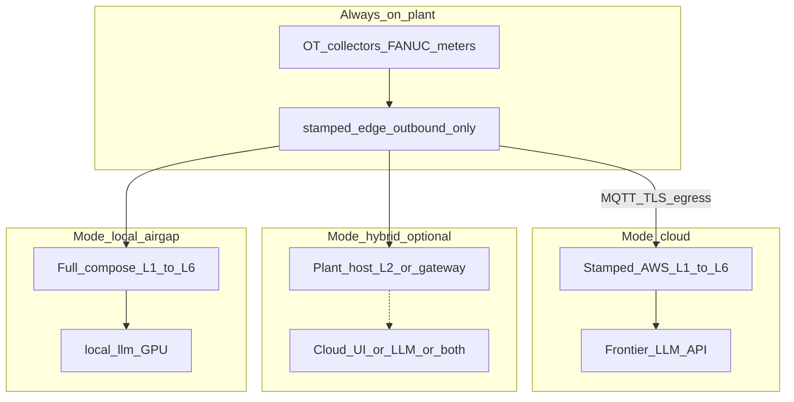
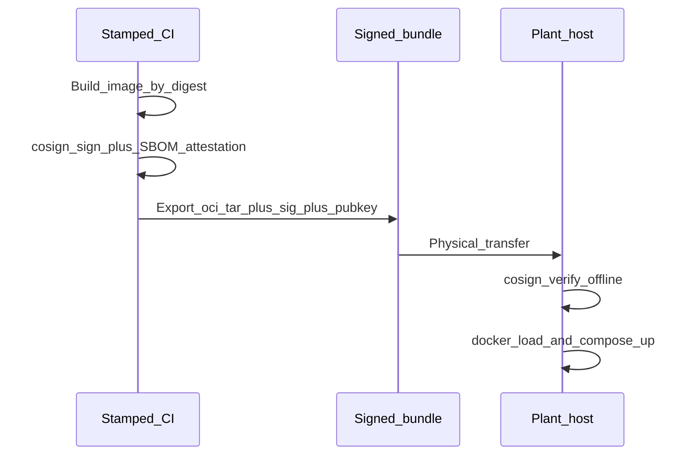
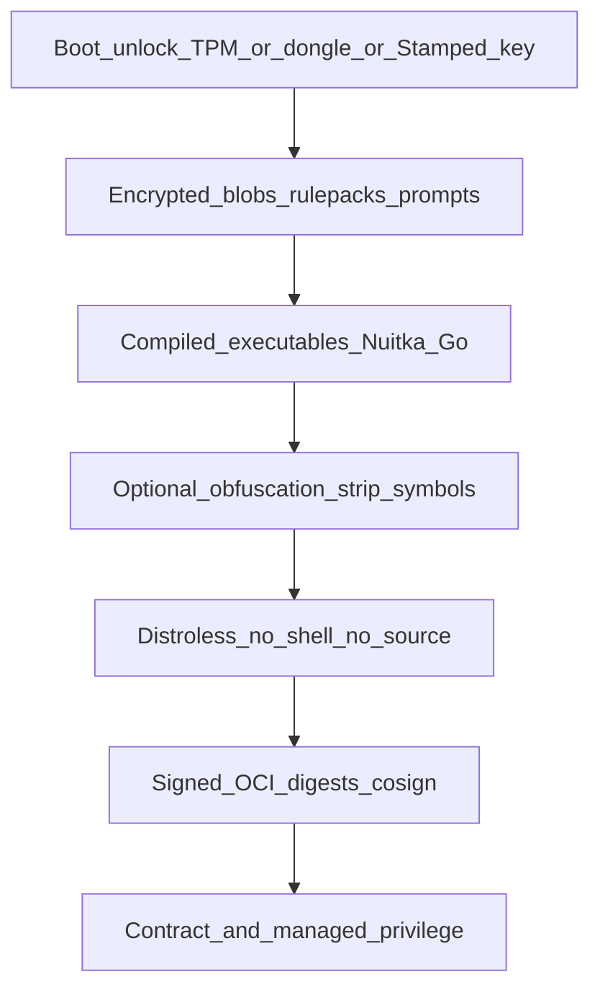
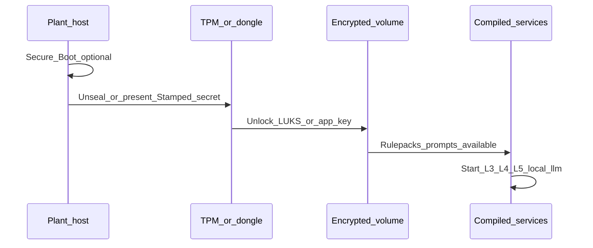
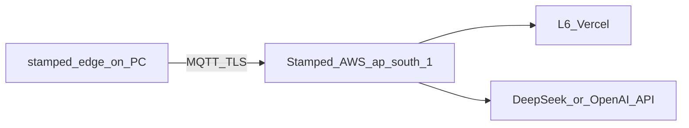
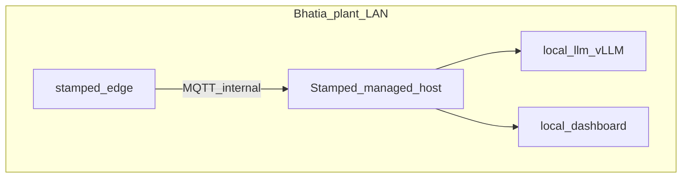

# Bhatia deployment modes — air-gap, hybrid, or cloud

**Audience:** Bhatia Alloy group proposal pack + Stamped engineering  
**Customer context:** ~3 companies, ~5 plants, ~₹1,200–1,300 Cr group revenue; Faridabad forging / HT narrative  
**Status:** Research + placement SSOT for commercial discovery  
**Authority:** [ADR-010](../../decisions/006-010/ADR-010-deployment-profiles-and-portability.md) · [deployment-profiles.md](./deployment-profiles.md) · [cost-effective-aws-pilot.md](./cost-effective-aws-pilot.md) · enterprise-air-gap brief (consumer: `universal-repositary/docs/research/enterprise-air-gap-ai-deployment.md`) · Bhatia technical architecture (consumer: `knowledge-reasoning/docs/client/bhatia-alloy/`) · owner deck: [bhatia-alloy-faridabad-technical/](../../demo-decks/clients/bhatia-alloy-faridabad-technical/)

**Ops model locked:** Customer-furnished hardware; Stamped-managed software (images, updates, weights, config).  
**Product rule:** Same images and contracts in every mode — `STAMPED_DEPLOYMENT_MODE` selects compose/env only.

---

## 1. Executive recommendation

| Prefer | When |
|--------|------|
| **`cloud`** (not air-gap) | IT allows outbound MQTT/TLS or HTTPS from the plant edge |
| **`local-dashboard`** (fully air-gap) | OT policy forbids egress, or owner requires offline shop-floor UI |
| **Hybrid B** (data on plant) | Legal requires time-series residency but allows cloud UI and/or LLM |

**Lead with `cloud` if allowed; sell air-gap only when mandated.** Air-gap adds GPU CapEx, USB update discipline, and higher IP exposure on customer disk.

Owner-facing decks must not pitch “LLM/agentic” language — L3 Findings are deterministic; LLM drafts prescription *language* only.

---

## 2. Three modes (decide per plant)



| Mode | Internet | Typical Bhatia fit | CapEx on site | Opex (indicative) |
|------|----------|--------------------|---------------|-------------------|
| **`cloud`** | Outbound edge → Stamped AWS `ap-south-1` | Default if egress allowed | Edge on existing PC; **no GPU** | ~₹5k/mo infra + LLM tokens |
| **Hybrid** | Controlled allowlist | Series stay plant-local; UI and/or LLM in cloud | Plant server ± GPU | Plant power + cloud + tokens |
| **`local` / `local-dashboard`** | **None** | OT forbids egress; offline demo / shop UI | Host + **GPU** + USB kit | Power/cooling; signed USB updates |

Modes can differ across the ~5 plants (e.g. Faridabad air-gap, other sites cloud) using the **same image tag** and plant-specific config.

---

## 3. Plant vs cloud placement

### 3.1 Always on the plant (all modes)

| Component | Why |
|-----------|-----|
| CNC / meter / collector northbound | Physical OT network |
| **`stamped-edge`** | Tag map, SQLite buffer (e.g. 72h), outbound-only MQTT/TLS or local broker |
| Human approval for any OT write | Never silent writeback |

### 3.2 Can live in the cloud (connected / hybrid)

| Component | Cloud OK when | Notes |
|-----------|---------------|--------|
| L1 cloud ingest + relay | Edge can egress | Fargate / stamped-cloud |
| L2 Timescale (RDS) | Plant accepts off-site series | Often the compliance question |
| L3 engines | Same plane as L2 | Deterministic; no LLM required |
| L4 compile + practicality judge | Connected | DeepSeek / OpenAI API; no plant GPU |
| L5 ledger / gates | Connected | |
| L6 dashboard | Connected | Vercel / CloudFront |
| Bill OCR / object store | Connected | S3; MinIO on plant in `local*` |
| Model weights | N/A (API) | Provider hosts model |
| Updates / OTA | HTTPS deploy | vs signed USB in air-gap |
| Observability (Phoenix/OTel) | Allowlisted SaaS | **Off** in true air-gap |

### 3.3 Fully air-gapped stack (on plant)

Everything in §3.2 moves on-box:

- Mosquitto, Postgres/Timescale, ingest, relay, bill path + **MinIO**
- L2 ingest + query API
- L3 scheduler / engines
- L4 API/worker + **`local-llm` (vLLM)**
- L5 APIs
- **`stamped-l6`** when owner needs UI (`local-dashboard`)
- Pre-staged: OCI images by digest, contracts/schemas, **LLM weights**, embeddings
- Runtime **egress inventory = empty**; updates via signed USB only
- Lane A / template path as LLM-down degrade

### 3.4 Decision matrix (proposal-ready)

| Capability | Fully air-gap `local*` | Hybrid B (data on plant) | Not air-gap `cloud` |
|------------|------------------------|--------------------------|---------------------|
| Edge buffer | Plant | Plant | Plant |
| Time-series L2 | Plant | Plant | **Cloud RDS** |
| L3 Findings | Plant | Plant or cloud | **Cloud** |
| L4 Rx language | **Local LLM** | Local LLM *or* cloud API | **Cloud API** |
| L5 evidence | Plant | Plant or cloud | **Cloud** |
| Owner dashboard | Plant compose | Cloud UI ↔ plant API *or* plant UI | **Vercel** |
| Bill PDFs | MinIO plant | MinIO or S3 | **S3** |
| Updates | Signed USB | Mix | HTTPS / CI |
| GPU CapEx | **Yes (14B–32B)** | Only if L4 local | **No** |
| IP exposure on disk | Highest | Partial | Lowest (mostly edge) |

### 3.5 Hybrid patterns (industry)

| Pattern | On plant | In cloud | When |
|---------|----------|----------|------|
| **A. Edge + full cloud** (`cloud`) | Edge only | L1–L6 + frontier LLM | Default commercial path |
| **B. Data residency** | Edge + L2 (+ optional L3) | L4–L6 + LLM + UI | Series stay here; Rx language OK in India cloud |
| **C. Inference split** | Full stack + local LLM | Optional backup UI / license ping | Near air-gap; rare allowlisted egress |
| **D. Diode / one-way** | Full local stack | Read-only replica / reports out | Regulated; complex |

Bhatia discovery should pick **A vs full local** first; B/C only if legal/OT demands.

### 3.6 Still required when *not* air-gapped

- Outbound-only edge (no inbound plant ports)
- TLS + auth to broker
- Org isolation (`X-Org-Id`), audit hash chain
- Token caps / rules-only soak (LLM bill risk)
- India region for cloud data plane (`ap-south-1`) when sovereign enough
- Clear DPA: which fields leave the plant (tags, kWh, bills, Rx text)

---

## 4. Industry air-gap mechanics

True air-gap ≠ private VPC. Four zones:


| Zone | What happens |
|------|----------------|
| Low-side | Build/sign OCI images + model weights + SBOM on Stamped CI |
| Transfer | Write-once USB / optical / data diode |
| High-side | Verify signatures/hashes; `docker load` or private registry |
| Production | Compose with empty egress inventory |

Industry tooling: Zarf, SUSE Edge Image Builder, vendor signed packages (ECDSA + SBOM + rollback), **Sigstore cosign**. Stamped P0: **Docker Compose**, digest-pinned images (ADR-010).

---

## 5. Sealed / managed appliance

Customer owns power, rack, plant LAN, and physical security. Stamped owns the application image lifecycle.

| Layer | Meaning |
|-------|---------|
| Hardware root of trust | Secure Boot + signed UKI; optional composefs/fs-verity |
| Immutable app image | Distroless / no shell; signed OCI; writable surface = config + data volumes |
| Managed privilege | Stamped admin to compose project / encrypted volumes; customer IT may own host OS only |
| Process | Signed USB updates, change tickets, audit hash chain |

**Honest limit:** Root + disk ownership can still dump layers. Seal raises the bar for compliance; it does not make Python IP unreadable against a determined insider. Mitigate with compiled/encrypted crown jewels (L3 rulepacks, L4 prompts), contracts, and least privilege.

Contract language: *managed appliance on customer-furnished equipment* — not *software you SSH into*.

---

## 6. Signed and attested images



- **Signature:** Stamped signed this digest.
- **Attestation:** Signed statement of build provenance / SBOM (SLSA-style).
- Air-gap verify: offline `cosign verify --key stamped.pub --local-image …` — no phone-home.
- Update agent: verify → atomic swap → healthcheck → rollback. No `pull_policy: always`.

---

## 7. Protecting Stamped IP

| Asset | Risk if customer has root | Mitigation |
|-------|---------------------------|------------|
| L3 rulepacks / engines | High | Compiled + encrypted blob; Stamped-held unlock; no training dumps |
| L4 prompts / graph | Medium–high | Encrypted blob; avoid plaintext quality prompts on disk |
| L4/L5 Python | Medium | Strip images; Nuitka/binary for hot paths; no source mounts |
| Contracts/schemas | Low | Public-ish by design |
| LLM weights | Low | Third-party; separately licensed / encrypted for license control |

**Degrade:** Lane A / template (0 LLM) if GPU dies (ADR-028).

**IP exposure by mode:** highest in full air-gap (full stack on disk); lowest in `cloud` (mostly edge on site). Prefer Cloud Pilot when IP risk dominates OT air-gap requirements.

---

## 7A. IP hardening stack (compile · obfuscate · encrypt-at-boot)

Industry pattern for managed appliances: **raise the cost of reverse engineering**, not claim unbreakable secrecy. Stack these layers for Offline / Residency SKUs that put crown jewels on customer metal.

### 7A.1 Goal and honest limit

| Goal | Realistic outcome |
|------|-------------------|
| Cold disk / stolen drive | Opaque without Stamped unlock (solved with LUKS/TPM + your key) |
| Casual plant IT (`docker exec`, browse layers) | Blocked by distroless + no source + encrypted blobs |
| Determined reverse engineer with **root + live box** | Can eventually dump RAM / attach debugger — **not cryptographically prevented** |
| Legal / commercial deterrent | Contract + audit + license dongle / managed privilege |

Say internally: hardening = **deterrence + process**. Say to Bhatia: *managed appliance; software remains Stamped confidential IP; customer receives licensed runtime only.*

### 7A.2 Layers (bottom → top)



| Layer | Mechanism | Stamped application |
|-------|-----------|---------------------|
| **1. Managed privilege** | Bhatia owns hardware; Stamped alone admins compose / encrypted volumes | Contract language in §5 |
| **2. Signed images** | cosign verify before load | §6 update path |
| **3. Distroless runtime** | No shell, no package manager, no bind-mounted source | Offline compose images |
| **4. Compile to executables** | Go edge (native); Python L3 engines / L4 worker via **Nuitka** (preferred) or PyInstaller; Cython for hottest numeric kernels | Ship `.so` / binary entrypoints, not `.py` trees |
| **5. Obfuscation** | Strip symbols; string encryption; optional PyArmor-class tool on residual Python | Use where compile is incomplete; never as sole control |
| **6. Encrypted blobs** | AES (app-level) or LUKS volume for rulepacks, playbooks, L4 prompt packs, plant-specific packs | Plaintext never in OCI layer; only after unlock |
| **7. Boot unlock** | TPM-bound key, USB/HSM dongle, or Stamped operator unlock at install/boot | Volume mounts; blobs decrypt into process memory |

### 7A.3 Boot unlock sequence (Offline SKU)



1. Host boots (Secure Boot / UKI optional P1).  
2. Unlock encrypted volume with Stamped-controlled material (TPM policy, USB key, or operator passphrase known only to Stamped).  
3. Load compiled engines; decrypt rulepack / prompt blobs into memory (or keep volume mounted only for service UID).  
4. Start mosquitto → L2 → L3 → L4 → L5 → L6 / local-llm.  
5. Updates: replace signed images + re-seal new blobs; never ship plaintext packs on USB alongside unlock keys on the same media.

**Do not** put the unlock secret in the same USB bundle as the encrypted payload without a split-key or on-box TPM seal.

### 7A.4 What to harden by asset (priority)

| Priority | Asset | P0 hardening | P1 hardening |
|----------|-------|--------------|--------------|
| P0 | L3 engines + rulepacks | Nuitka/binary + encrypted pack volume | Symbol strip; per-plant sealed pack |
| P0 | L4 quality prompts / graph config | Encrypted blob unlocked at boot | Split judge vs draft packs |
| P1 | L4/L5 Python glue | Distroless + no source mounts | Nuitka worker binary |
| P1 | Edge agent | Already Go binary; strip release builds | |
| P2 | L6 BFF / UI | Minify; no secrets in browser | |
| — | Contracts / schemas | No extra hardening | |
| — | LLM weights | Encrypt for license/control only | Not Stamped algorithm IP |

### 7A.5 Phased build order (engineering)

| Phase | Deliverable | Exit criteria |
|-------|-------------|----------------|
| **H0** | Distroless Offline images; no source mounts; cosign | `docker history` / exec cannot cat `.py` tree |
| **H1** | Encrypted volume for rulepacks + prompts; Stamped unlock runbook | Cold disk: packs unreadable without unlock |
| **H2** | Nuitka (or equiv.) for L3 engine entrypoints + L4 worker | No ship of L3/L4 source in Offline bundle |
| **H3** | TPM or USB-dongle unseal; split update media | Unlock without typing long secrets on every boot (ops-friendly) |
| **H4** | Optional obfuscation on residual Python; SBOM attest of hardened build | Document residual risk in customer appendix |

Cloud Pilot SKU: H0 only on **edge**; crown jewels stay in Stamped AWS (strongest IP posture).

### 7A.6 What this does *not* prevent

- Memory dump / debugger on a live unlocked host with root  
- Insider with Stamped-equivalent admin credentials  
- Re-implementation from observing inputs/outputs (black-box)  
- Legal disputes without a strong license/DPA  

Mitigate residual risk with: managed privilege, audit logging, watermarking plant-specific packs, and preferring **`cloud`** when Bhatia will allow egress.

### 7A.7 Customer-facing vs internal wording

| Audience | Wording |
|----------|---------|
| **Bhatia / proposal** | Licensed runtime on customer-furnished hardware; Stamped manages software; updates are signed; plant data stays per agreed mode |
| **Internal** | Compile + encrypt-at-boot + seal = deterrence; live-root adversary still in threat model; Cloud Pilot wins on IP |

---

## 8. LLM strategy

### 8.1 What L4 actually needs

Quality path (default): draft → verify → practicality judge (**language only**, not ₹) → repair, up to **`max_generation_calls` ≈ 12**, structured JSON against `prescription.json`. Not open-ended chat; not 1M-context agents.

### 8.2 MoE reality — do not put DeepSeek V4 on plant GPUs

| Claim | Reality |
|-------|---------|
| “MoE activates 13B ⇒ ~13B VRAM” | **False.** Active params = FLOPs/token; full expert set must reside (or page with huge latency). |
| DeepSeek V4-Flash | ~284B total / ~13B active; ~150–175+ GB weights class; multi-GPU recipes |
| DeepSeek V4.1-Flash | ~510 GB checkpoint; ~614 GB GPU memory in published recipes |
| V4-Pro | API/routing — not a plant-box model |

Use DeepSeek **via API** only on connected deployments.

### 8.3 Cloud / hybrid with egress

| Option | Role |
|--------|------|
| **DeepSeek API** (V4.x Flash class) | Primary cheap frontier; no plant GPU |
| **OpenAI / Azure OpenAI** | Alternate; matches `openai_compat` |
| **“GPT-Luna”** | **Not a plant product** — Cursor IDE model slug only; never in customer proposals |

Wire: `L4_MODEL_PROVIDER=openai_compat` or `stack`. L3 stays deterministic.

### 8.4 Fully air-gap local models

| Tier | Model | GPU / VRAM | Host RAM | When |
|------|-------|------------|----------|------|
| **P0 default** | Qwen2.5 / Qwen3 **14B** AWQ/GPTQ or FP8 | **1× 24 GB** | 64 GB | First air-gap plant |
| **P1 quality** | Qwen3 **32B** AWQ or FP8 | **1× 48–80 GB** | 128 GB | If 14B fails eval gate (§10) |
| **Degrade** | Lane A templates | 0 GPU | 32 GB | GPU failure / soak |

Also bundle local embeddings (e.g. BGE-M3). Require **guided JSON** (vLLM) for prescription schema fill.

### 8.5 Hybrid LLM twist

Plant L2/L3 + cloud L4 API over allowlisted HTTPS saves GPU CapEx but **is not air-gap** and exports Finding context — confirm with OT/legal.

---

## 9. SKU one-pager (Bhatia group)

| SKU | Mode | On plant | In cloud | LLM | GPU | Best for |
|-----|------|----------|----------|-----|-----|----------|
| **Bhatia Cloud Pilot** | `cloud` | Edge on existing PC | L1–L6 AWS + Vercel | DeepSeek or OpenAI API | No | Multi-plant rollout, lowest CapEx |
| **Bhatia Residency** | Hybrid B | Edge + L2 (+ L3 optional) | L4–L6 + LLM and/or UI | Cloud API *or* local | Optional | “kWh stays here” |
| **Bhatia Offline** | `local-dashboard` | Full stack + MinIO + L6 | None | Qwen 14B (→32B) | Yes 24–80 GB | OT air-gap / offline owner UI |
| **Bhatia Offline Core** | `local` | Full stack, no L6 UI | None | Qwen 14B | Yes | Headless offline; ops via other channel |

**Commercial default for the group:** Cloud Pilot per plant unless a site fails the discovery checklist (§11).  
**Demo already sold in deck language:** offline one line *or* historical data — map Offline SKU or historical replay on Cloud Pilot.

---

## 10. L4 practicality eval gate (14B vs 32B)

Run before any GPU upsell. Use real Findings (Bhatia historical/line data when available; else LNM / fixture Finding set with Path D fields populated).

### 10.1 Corpus

| Item | Requirement |
|------|-------------|
| Findings | ≥30 diverse (tariff/money-pack, idle/aux, SEC, continuity-blocked, withhold cases) |
| Context | Path D delta + Graph bind + playbook chunks as production would see |
| Schema | `prescription.json` via guided JSON |
| Loop | Full quality path; cap `max_generation_calls` at production default (12) |

### 10.2 Pass / fail metrics (same model for draft + judge)

| Metric | Pass threshold (P0 14B) | Action if fail |
|--------|-------------------------|----------------|
| Schema-valid Rx rate | ≥95% of non-abstain compiles | Fix prompts/serving before upsizing |
| Practicality judge accept (P-1–P-5 language) | ≥80% of compiled Rx | Upsize to 32B *or* tighten playbooks |
| False invent of ₹ / ops claims | **0** (policy fail-closed) | Fail model or prompts — do not ship |
| Abstain when Path D incomplete | 100% correct withhold | Fix router / Lane A boundary |
| p95 latency per compile | ≤120 s on target GPU | Quantize / shorten context / 14B only |
| Hindi/English owner phrasing (if required) | Spot-check ≥8/10 usable | Prefer 32B or bilingual prompt pack |

### 10.3 Decision rule

```text
IF 14B passes all rows → ship P0 GPU BOM (24 GB)
ELSE IF 32B passes and 14B fails judge/phrasing only → ship P1 GPU BOM (48–80 GB)
ELSE IF schema/₹ invent fails on both → do not blame GPU; fix contracts/prompts; use Lane A for demo
```

Record results in plant folder: `docs/client/bhatia-alloy/llm-eval-<date>.md` (create when first eval runs).

---

## 11. Discovery checklist (placement decision tree)

Answer before locking SKU per plant. Owner: Stamped SE + Bhatia IT/OT.

### 11.1 Connectivity and OT

| # | Question | If Yes | If No |
|---|----------|--------|-------|
| D1 | May edge open outbound MQTT/TLS :8883 or HTTPS :443 to Stamped AWS? | Prefer **Cloud Pilot** | Consider Offline or Hybrid |
| D2 | Is there a corporate proxy / SSL inspection that must be allowlisted? | Document FQDNs; still Cloud if allowed | — |
| D3 | Must the plant stay **zero egress** (true air-gap)? | **Offline** SKU | Not air-gap |
| D4 | One-way diode / data diode already in use? | Pattern D; specialist design | Skip |

### 11.2 Data and LLM policy

| # | Question | If Yes | If No |
|---|----------|--------|-------|
| D5 | May time-series (kWh, machine state) leave the plant? | Cloud L2 OK | Hybrid B or Offline |
| D6 | May Finding / Rx text hit a third-party LLM API? | DeepSeek/OpenAI OK | Local LLM or Lane A |
| D7 | India-only data plane required? | `ap-south-1` + DPA | Clarify jurisdictions |
| D8 | Bill PDFs / photos leave plant? | S3 OK | MinIO on plant |

### 11.3 Experience and ops

| # | Question | If Yes | If No |
|---|----------|--------|-------|
| D9 | Owner UI required **offline** on shop floor? | `local-dashboard` | Vercel cloud UI OK |
| D10 | Who has root on the appliance host — Stamped only or Bhatia IT? | Sets seal / IP residual risk | Document in contract |
| D11 | Accept signed USB updates (no internet pull)? | Offline update path | Need Cloud or hybrid OTA |
| D12 | Multi-plant: same mode everywhere or mix? | Fleet policy | Per-plant matrix |

### 11.4 Decision tree (summary)

```text
D3 air-gap mandated?
  YES → Offline (+ D9 for dashboard) → GPU BOM + USB kit
  NO  → D1 egress allowed?
         YES → D5 series may leave?
                YES → Cloud Pilot
                NO  → Hybrid B (plant L2; cloud UI/LLM if D6)
         NO  → Offline or bring temporary allowlist for pilot only
```

### 11.5 Multi-plant topology (group of ~5)

| Plant | Mode (TBD) | Notes |
|-------|------------|-------|
| Faridabad (primary narrative) | ___ | Offline demo vs historical cloud |
| Plant 2 | ___ | |
| Plant 3 | ___ | |
| Plant 4 | ___ | |
| Plant 5 | ___ | |

Fill after discovery workshop; keep one image tag across all.

---

## 12. BOMs (three modes)

Prices are **indicative India CapEx bands** for proposal planning — re-quote before PO.

### 12.1 BOM A — Cloud Pilot (not air-gap)

| Item | Spec | Qty | Notes |
|------|------|-----|-------|
| Edge host | Existing always-on PC, 8 GB RAM, 2+ cores, SSD | 1 | Outbound only; no inbound |
| OS | Windows/Linux supported by edge agent | 1 | |
| Network | Plant LAN → internet path for MQTT/TLS or HTTPS | 1 | Allowlist Stamped broker |
| Stamped cloud | Shared `stamped-pilot` AWS `ap-south-1` | 1 | Mosquitto + RDS + Fargate + S3 |
| L6 | Vercel / CloudFront | 1 | |
| LLM | DeepSeek or OpenAI API keys | 1 | Token caps; rules-only soak option |
| GPU | — | 0 | |
| **CapEx (customer)** | Existing PC | | **₹0–50k** if PC must be bought |
| **Opex** | Infra ~₹5k/mo + LLM | | Script: `pilot-aws-one-factory.py` |

### 12.2 BOM B — Hybrid residency (plant L2)

| Item | Spec | Qty | Notes |
|------|------|-----|-------|
| Edge host | As BOM A | 1 | |
| Plant server | 8–16 cores, **64 GB RAM**, 1–2 TB NVMe | 1 | Compose: mosquitto, Timescale, ingest, L3 optional |
| Backup | Local disk or NAS | 1 | |
| Cloud | L4–L6 and/or LLM API + UI | 1 | Allowlisted HTTPS only |
| Local LLM GPU | Only if D6 = No | 0–1 | Else use API |
| **CapEx** | Plant server ~₹2–6L; GPU optional | | |
| **Opex** | Power + partial cloud + tokens | | |

### 12.3 BOM C — Full air-gap `local-dashboard`

| Item | Spec | Qty | Notes |
|------|------|-----|-------|
| Managed host | 8–16 cores, **64–128 GB RAM**, 2 TB NVMe | 1 | Stamped-managed compose |
| GPU (P0) | **24 GB** class (e.g. RTX 4090 / L4 / L40S) | 1 | Qwen 14B quantized |
| GPU (P1 alt) | **48–80 GB** (A6000 / L40S 48 / A100 80) | 1 | Only if §10 fails on 14B |
| local-llm | vLLM OpenAI-compatible + Qwen weights + BGE-M3 | 1 | Pre-staged on USB/disk |
| Full stack images | Digest-pinned OCI + cosign sigs + SBOM | 1 set | L1–L6 + MinIO + mosquitto + DB |
| L6 | stamped-l6 on compose | 1 | Offline owner UI |
| USB update kit | Hardware-write-once or controlled media + public key | 2 | Primary + spare |
| Air-gap transfer PC | Low-side staging laptop (Stamped) | 1 | Never dual-homed with plant |
| Cooling / UPS | Sized for GPU + host | 1 | Plant facilities |
| **CapEx band** | Host+24 GB GPU **~₹3–8L**; 80 GB class **~₹8–15L+** | | Not multi-H200 |
| **Opex** | Power/cooling only | | No cloud LLM bill |

**Offline IP:** Apply §7A hardening H0–H2 before first customer Offline ship (compiled L3/L4 + encrypted packs + cosign).

### 12.4 Shared non-BOM deliverables (all modes)

- Plant profile + tag map templates  
- Org IDs, TLS certs / broker auth  
- DPA / field-egress table  
- Runbook: edge buffer, Lane A degrade, update verify  
- Eval gate report before Offline GPU PO (§10)  
- IP hardening runbook (§7A): unlock custody, split update media, residual-risk note

---

## 13. Topology sketches

### 13.1 Cloud (preferred when egress OK)



### 13.2 Full air-gap



### 13.3 Hybrid residency

Edge + plant L2/L3; cloud L6 and/or cloud LLM over allowlist — only if §3.5 pattern B is required.

---

## 14. Decisions encoded

1. Three SKUs, one product — decide per plant after §11.  
2. Default offer: **Cloud Pilot** unless air-gap mandated.  
3. Fully air-gap: L1–L6 + local LLM + MinIO; signed USB; empty egress.  
4. Always on plant: OT + stamped-edge + human OT-write approval.  
5. Air-gap LLM: Qwen **14B** → **32B** only if §10 fails; never local DeepSeek V4.  
6. Cloud LLM: DeepSeek API or OpenAI-compat; not GPT-Luna.  
7. Customer metal + Stamped-managed sealed/signed software when host/GPU needed.  
8. **IP hardening (§7A):** compile (Nuitka/Go) + obfuscate residual + encrypted blobs unlocked at boot; H0–H2 before Offline ship; Cloud Pilot when IP risk dominates.  
9. First site: one Faridabad line or historical offline demo; then replicate across ~5 plants.

---

## 15. Related docs

| Doc | Role |
|-----|------|
| [deployment-profiles.md](./deployment-profiles.md) | Mode selector + compose matrix |
| [cost-effective-aws-pilot.md](./cost-effective-aws-pilot.md) | Cloud Pilot opex / edge-on-PC |
| [ADR-010](../../decisions/006-010/ADR-010-deployment-profiles-and-portability.md) | Mode authority |
| [bhatia-alloy-faridabad-technical/](../../demo-decks/clients/bhatia-alloy-faridabad-technical/) | Owner brief deck (no LLM wording) |
| Consumer: `knowledge-reasoning/docs/client/bhatia-alloy/` | Technical architecture ROC |
| Consumer: `universal-repositary/docs/research/enterprise-air-gap-ai-deployment.md` | Air-gap research → ADR-010 |

---

*End of Bhatia deployment modes SSOT.*
