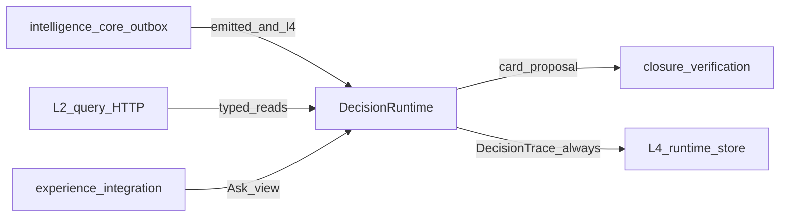

# L4 / knowledge-reasoning — Architecture handoff

> **Audience:** Engineers / agents building or integrating the L4 consumer.  
> **Live consumer repo:** `knowledge-reasoning` (package `stamped_l4`)  
> **Architecture authority (prefer):** [`technical/l4/`](../../technical/l4/) · [`technical/l4/30-as-built.md`](../../technical/l4/30-as-built.md) · [`STAMPED_ARCHITECTURE.md`](../../technical/STAMPED_ARCHITECTURE.md)  
> **ADRs:** [033](../../decisions/033-039/ADR-033-l4-decision-runtime.md)–[040](../../decisions/040-044/ADR-040-l4-production-hardness.md) · [ADR-015](../../decisions/011-015/ADR-015-l3-dual-lane-lab-detections.md)  
> **Contracts:** Finding · card-proposal · decision-trace · decision-case · opportunity-ledger-row under [`contracts/schemas/intelligence/`](../../contracts/schemas/intelligence/)  
> **Platform pack:** git submodule at `external/` ([SUBMODULE.md](../../SUBMODULE.md))

Legacy LangGraph “prescription compiler” / quality-path docs below are **not** the compile path. The live path is **`DecisionRuntime`**.

---

## 1. Mission

**knowledge-reasoning** runs the plant-scoped **decision runtime**: Finding (or discovery work) → staged graph → kernel gates → semantic terminal. It always records a **DecisionTrace**. It delivers a **card-proposal** to `CardSink` only when emit is allowed.

| Is | Is not |
| --- | --- |
| Decision runtime + dual-family seams + PSM + portfolio | Free-roaming agent; OT write |
| Card proposal + DecisionTrace | Final person assignment (L5); customer Forge (L6) |
| Ask Analyst (read-only tools) over L4 | L2 SQL; invent ₹ |
| Opportunity ledger on soft-gate blocks | Override a hard-gate withhold |

---

## 2. Upstream / downstream

- **Intake:** envelopes with `delivery=l4` ∧ `status=emitted` only (ADR-015). Lab never promotes.
- **L2:** HTTP only — no `L2_DATABASE_URL`.
- **Output:** card-proposal via sink when `can_emit()`; prescription **1.0.0** remains a dual-read schema beside card-proposal until retired ([`18-contract-deltas.md`](../../technical/l4/18-contract-deltas.md)).

---

## 3. Compile path (as-built)

1. Inbox / enqueue Finding (or sweep / promote).
2. `PlantWorkQueue` → lease `DecisionCase`.
3. Stages (default): `candidates` → `constraints` → `portfolio` → `minimizer` → `kernel_recheck` → `terminal`.
4. Terminal: `emit` | `supersede` | `withhold` | `abstain`.
5. DecisionTrace always; `CardSink.deliver` only if `emit_enabled && !shadow_only && !kill_switch`.

Orchestration: `worker/decision_runner.py` (`DecisionRuntime`). Legacy `graph/quality.py` LangGraph lanes remain in-tree for analyst / historical paths but are **not** invoked on the compile path (`worker/runner.py` routes compile through the runtime only).

Safe local default: `emit_enabled=false`, `shadow_only=true`. Detail: [`30-as-built.md`](../../technical/l4/30-as-built.md).

---

## 4. Analyst (secondary surface)

Ask Analyst remains a read-only conversational API (tools: knowledge lookup, timeseries, baselines, notes). **Forbidden:** OT write, messaging send, open crawl, SQL, cross-tenant retrieve. Ask does not emit cards.

Retrieval ADRs (017 / 028) still apply to analyst RAG; they do not redefine the decision-runtime compile path.

---

## 5. Guardrails

- Kernel owns terminals, hard stops, money references, constraint evaluation
- Models never assign evidence tier or ₹
- Soft-gate blocks → opportunity ledger / owner backlog; hard-gate withhold hidden from customer Now queue
- Bounded model budgets; fixture providers for CI (`L4_MODEL_PROVIDER=""`)

---

## 6. Bootstrap checklist

1. Pin `external/`; read [`technical/l4/README.md`](../../technical/l4/README.md) → [`00-kernel.md`](../../technical/l4/00-kernel.md) → [`30-as-built.md`](../../technical/l4/30-as-built.md)
2. Work in `knowledge-reasoning`; run R1 boot / smoke from that repo’s docs
3. Never take `L2_DATABASE_URL`
4. Do not treat LangGraph quality path as the Finding → card compile path

---

## 7. Related docs

| Doc | Why |
| --- | --- |
| [`technical/l4/`](../../technical/l4/) | Normative architecture contract |
| [`30-as-built.md`](../../technical/l4/30-as-built.md) | Shipped package map and flags |
| [`15-l3-l4-interface.md`](../../technical/l4/15-l3-l4-interface.md) | Finding floor + L3 methods port |
| [`technical/l3/`](../../technical/l3/) | How Findings are produced |
| ADR-017 / ADR-018 | Analyst retrieval / pilot history (not compile SoT) |
