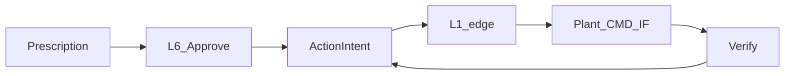

# stamped-l5 — ActionIntent (human-guided command path)

> **Audience:** L5 / L6 / L1 edge integrators.  
> **Authority:** [ADR-029](../../decisions/028-032/ADR-029-human-guided-ot-command-path.md) · [L5 SSOT §16](../../technical/layers/l4-l6/L5-closure-and-verification.md)  
> **Parent handoff:** [stamped-l5-architecture-handoff.md](./stamped-l5-architecture-handoff.md)

---

## Mission delta

L5 remains workflow + verify. **Additionally**, when plant writeback is enabled, L5 owns **ActionIntent**: authz → semantic command → signed edge dispatch → ACK → verify.

| In | Out |
| --- | --- |
| ActionIntent state machine + audit | Raw Modbus/OPC register APIs |
| Allowlist + capability checks | Opening OT sockets from L5 cloud |
| Desk / WhatsApp approve hooks for L6 | E-stop / safety PLC replacement |
| Post-write verification via existing clearance path | Autonomous execute-within-limits |

---

## Flow

1. Operator Approves/Executes on L6 (or allowlisted WA button).  
2. L5 creates `ActionIntent` (`pending_approval` → `queued` after policy).  
3. Worker dispatches signed payload to edge; status `dispatched`.  
4. Edge writes **command tags only**; returns ACK → `acked`.  
5. Clearance poller / telemetry check → `verified` or `failed`.

---

## Integration notes

- Contract: `action-intent.json` (+ machine capability / allowlist).  
- L6 BFF calls **L5 only** ([ADR-022](../../decisions/020-023/ADR-022-l6-bff-runtime-boundary.md)) — never edge write URLs.  
- If writeback off or capability missing: UI falls back to assign-only; do not show a live Execute that cannot succeed.  
- Consumer code: **Wave C** after site checklist passes — this doc is spec.

---

## Related

| Doc | Use |
| --- | --- |
| [ADR-029](../../decisions/028-032/ADR-029-human-guided-ot-command-path.md) | Decision |
| [OT site checklist](../holistic/ot-write-site-checklist.md) | Wave C gate (added in pilot commit) |
| [L1 SSOT write path](../../technical/layers/l1-l2/L1-connect-and-normalise.md) | Edge command tags |
