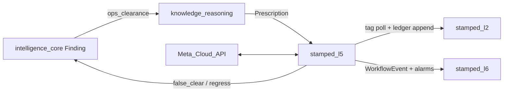

# stamped-l5 / closure-verification — Architecture handoff

> **Architecture authority (prefer):** [`technical/layers/L5-closure.md`](../../technical/layers/L5-closure.md) · [`STAMPED_ARCHITECTURE.md`](../../technical/STAMPED_ARCHITECTURE.md).  
> **Audience:** Engineers / agents working on the L5 consumer or integrating L6.  
> **Consumer repo (live):** `closure-verification` — package `stamped-l5`  
> **ADRs:** [ADR-019](../../decisions/016-020/ADR-019-l5-runtime-and-consistency.md) · [ADR-020](../../decisions/020-023/ADR-020-l5-mv-claim-governance.md) · [ADR-021](../../decisions/020-023/ADR-021-l5-notification-and-evidence.md)  
> **L3 dependency:** Finding **1.2.0** `ops_clearance` ([`technical/l3/04-finding-contract.md`](../../technical/l3/04-finding-contract.md)) · [ops-clearance prompt](../agents/prompts/stamped-l3-ops-clearance-consumer-prompt.md)  
> **Contracts:** [`prescription.json`](../../contracts/schemas/intelligence/prescription.json) · card-proposal (dual-read) · [`workflow-event.json`](../../contracts/schemas/envelope/workflow-event.json) · [`ledger-entry.json`](../../contracts/schemas/closure/ledger-entry.json)  
> **Build plan:** [stamped-l5-build-plan.md](./stamped-l5-build-plan.md) (historical; see consumer README for shipped surface)

---

## 1. Mission

**closure-verification** closes the loop: accept an L4 proposal → alarm/notify → act → **ops-verify on telemetry** → track calculated ₹/kWh with honest labels.

| Is | Is not |
| --- | --- |
| Workflow + durable timers + clearance | L3 detection engines |
| Alarm raise/ack/escalate/clear | Re-implementing MD/idle/SEC detectors |
| Ops-clearance verification | Claiming “verified on DISCOM bill” from ops alone |
| WhatsApp-first notification (+ SMS fallback) | Customer Forge UI (`experience-integration`) |
| Internal console (staff statuses) | Customer Now queue |
| Autonomy classes default **off** | Silent OT writes |

**ops_confirmed ≠ bill-verified.** Customer L6 must hide withhold / pending-review statuses.

---

## 2. Upstream / downstream



| Rule | Detail |
| --- | --- |
| Hard gate | Every cited Finding must include `ops_clearance` |
| VERIFIED | Ops-cleared — not bill |
| Financial SoR | L2 ledger via idempotent append |
| No L2 DB URL | HTTP only |

---

## 3. Target repo layout

```text
stamped-l5/
  packages/
    api/
    worker/              # timers, clearance poller, outbox, opportunity_cost
    domain/
      workflow/
      alarms/            # EMS router
      notification/
      verification/      # ops_clearance eval
      evidence/
      integration/
    migrate/
  tests/
  external/
```

---

## 4. Domain modules

| Module | Owns |
| --- | --- |
| `workflow` | States; `verified` = ops-cleared |
| `alarms` | EMS lifecycle + L6 query |
| `notification` | Meta templates / webhooks |
| `verification` | Poll L2; eval predicates; regress |
| `integration` | Finding fetch, L2 append, measurements |

---

## 5. P0 capability band

| Capability | Band |
| --- | --- |
| Intake + owner + ops_clearance hard gate | **P0 must** |
| Alarm raise/ack/escalate/clear | **P0 must** |
| Clearance poller + ops_confirmed ledger | **P0 must** |
| Potential savings at accept | **P0 must** |
| WhatsApp templates | **P0 must** |
| Bill-verified path | **Deferred** |
| SMS send | **P1** |

---

## 6. Related docs

| Doc | Use |
| --- | --- |
| [stamped-l5-build-plan.md](./stamped-l5-build-plan.md) | Commit matrix |
| [stamped-l5-action-intent.md](./stamped-l5-action-intent.md) | Human-guided OT command path |
| [stamped-l3-ops-clearance-consumer-prompt.md](./stamped-l3-ops-clearance-consumer-prompt.md) | Paste into L3 agents |
| [L5 SSOT](../../technical/layers/l4-l6/L5-closure-and-verification.md) | Full architecture |
