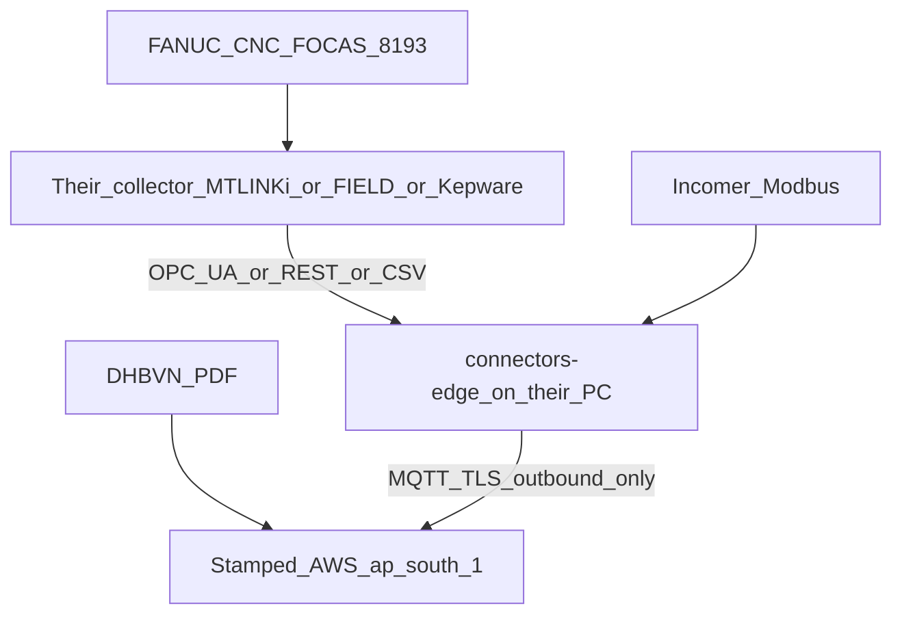

# LNM Auto Faridabad — plant, equipment, incentives, EE / ME / SW

Internal study pack. Labels: **public** · **field** · **inferred** · **illustrative**. Nameplates and bills on the walk override this file.

**Site:** 228-D, HSIIDC Industrial Estate, Sector 59, Ballabgarh, Faridabad 121004  
**Leave-behind:** [`demo-decks/clients/lnm-auto-faridabad-technical/`](../demo-decks/clients/lnm-auto-faridabad-technical/)  
**Runbook:** [`lnm-runbook-26aug-9sep.md`](./lnm-runbook-26aug-9sep.md)

---

## 1. What LNM is commercially

| Fact | Source |
|------|--------|
| Precision forging + machining + HT + surface; die casting claimed | public |
| ~100,000 sq ft; plants in Faridabad and Jaipur (Mahindra World City) | public |
| ~95% export, 23+ countries; EU / NA OEM and Tier-1 | public |
| Founded ~1996; family business publicly moving to professional leadership | public / LinkedIn |
| Products: three-point linkage, tractor engine parts, axle parts, PTO drive shafts, mining picks & blocks | public |
| IATF 16949, ISO 9001, ISO 14001, ISO 45001 + ZED | public |
| IndiaMART: Sanjeev Mel (CEO), Sandeep Mall (partner); turnover band 25–100 Cr | public, verify |
| **Three adjacent factories** at Sector 59; combined power **~₹22 lakh/month** | **field** |
| Weak / absent energy monitoring (no good EMS) | **field** |
| FANUC CNCs; some already on a shop-floor data collector (DC), not all | **field** |

They sell **reliability and export delivery**, not domestic commodity tonnage. Cost, on-time, and IATF traceability keep accounts. Energy waste that hits MD, idle CNC aux, or HT hold is also a **dispatch / quality / TPM** story — not a green lecture.

Jaipur is **out of scope** for this demo → pilot cycle.

---

## 2. How a part moves (process chain)

Confirm which islands sit in which of the three adjacent factories on the walk.

```mermaid
flowchart LR
  CAD[CAD_CAM_die_fixture]
  RM[Bar_billet]
  Forge[Heat_press_hammer_2500t]
  HT[Normalize_carburize_QT_induction_nitride]
  CNC[Turn_VMC_grind_hob_broach]
  Surf[Zinc_eCoat_phosphate]
  QC[Inspection_PDIR]
  WH[Warehouse_JIT_export]
  CAD --> RM --> Forge --> HT --> CNC --> Surf --> QC --> WH
```

**Part process design (public):** SolidWorks / AutoCAD / Creo; DFM / DFA; FEA on forge and machine; in-house dies, fixtures, gauges. That is why they will respect a **process-aware** energy suggestion and reject a naive “turn it off.”

**Warehousing (public):** India / Europe / USA stock; JIT; linked to final inspection, PDIR, shipping. Late heat treat or MD-forced load shed is a **delivery** problem.

---

## 3. Three factories + ₹22L scale

**Field:** three factories beside one another at Sector 59; combined electricity ~₹22 lakh/month.

| Do | Do not |
|----|--------|
| Pick **one** factory as Factory 1 on 26 Aug | Assume equal kWh split across three sheds |
| Ask: one DHBVN consumer or three? One CD or three? Shared compressed air? | Roll all three in week 1 |
| Treat Factory 1 as a full plant (incomer + process) | Start with a 2-machine toy cell and call it a pilot |

**Inferred load character (confirm on walk):**

| Factory character | Usually dominates | Connect story |
|-------------------|-------------------|---------------|
| Forge / HT | kWh and MD spikes | Feeder meters; schedule-aware Rx |
| Machine / CNC | FANUC tags, idle aux | Northbound from their DC |
| Surface | Rectifiers + bath heat | Feeder / rectifier kW |

**Order-of-magnitude only (not a promise):** ₹22L/mo campus-wide is board-visible; a 10% movement is ~₹2L/mo across all three. After bills land, compute implied kVAh / CD with a **script** — no mental arithmetic in front of the customer.

First Stamped line = **one factory**. The other two = expansion after this one works.

---

## 4. Equipment map (public + walk priority)

Nameplates on 26 Aug override this table.

| Island | Published kit | How it uses power | What we can connect | What we must never prescribe |
|--------|---------------|-------------------|---------------------|------------------------------|
| Forge | Closed die ≤30 kg; hammer & press to 2500 t; heat before hit | Heat is the kWh hog; the hit is an MD spike | Feeder kW if metered; press start if in SCADA | “Stop the press mid-heat to save MD” |
| HT | Normalize, carburize, Q&T, induction harden, nitride, shot blast | Hold/soak = idle money; induction = short MD spike | Zone temp + kW if available; else feeder | Kill atmosphere/soak on a live charge |
| Machine | CNC turn, VMC, centerless / surface / cylindrical grind, broach, serration, hobbing, MIG | Spindle + servo + **aux** (coolant, hydraulics, conveyor, gantry) | FANUC northbound state / current — **not** FOCAS | Write CNC programs / FOCAS writes |
| Automation | In-house gantry + robot loaders on CNC | Keeps the cell electrically alive between parts | Cell state via their FANUC DC | Disable robots for energy |
| Surface | Zinc, zinc-flex, e-coat, phosphate; thickness / adhesion / salt-spray | Rectifiers + bath heaters; night hold | Feeder / rectifier kW | Dump bath temperature |
| Die cast | Claimed on site | Melt + hold | Only if live at chosen factory | — |
| Quality | Inspection / testing page exists; no public CMM list | Low kW | Ignore for energy demo | — |
| Warehouse | PDIR / dispatch linked; EU / US stock | Lighting / HVAC if any | Later | — |
| Utilities | **Not on website — walk priority** | Compressors, quench pumps, cooling, lighting, possible DG | Incomer + compressor kW / pressure | Isolate compressor with no standby air |

**Our leave-behind waste set (illustrative until live tags):** press vs SQF preheat overlap · HT hold · CNC idle aux · compressor unload · DHBVN ToD / MD. Do not invent LNM kW numbers until we have tags.

---

## 5. Where their incentives lie — what they want from us

### Dual value (this account)

1. **Energy monitoring they do not have** — live incomer, demand, PF, ToD, machine / feeder overlay. This is the **27 / 29 “it works”** moment.  
2. **Prescriptions + history insights** — what to do now, what they missed last month, verified against the bill. This is why we are not a cheap logger.

Do not sell (1) without (2) or they price us as an EMS. Do not sell (2) without (1) or electrical says they still cannot see the plant.

**Copy tension:** public canon says we are not an EMS replacement. For LNM, monitoring is an unmet need. Demo **shows** monitoring; commercially we sell Industry Energy Management + prescriptions + verify.

### Buyer map

| Who | Incentive | Want by 29 Aug | What wins a contract |
|-----|-----------|----------------|----------------------|
| MD / family | ₹22L/mo power; export quotes; professionalising ops | One screen: factory kW, month vs bill, idle money | Named ₹ movement they can defend, without OT risk |
| Plant / production | Dispatch, OEE, IATF | Monitoring that does not fight FANUC or the schedule | Rx that respect heat / charge / export windows |
| Electrical | No EMS today — fly blind on MD / PF / ToD | **Generic EMS screens:** incomer kW/kVA/PF/MD, trends, shift, ToD, 5–10 machine overlays | Incomer live; bill lines match the picture |
| Maintenance / TPM | Work orders already exist | Compressor / HT drift with an owner | Inspect / tune they can drop into TPM |
| CNC / FANUC owner | Collector is their baby | We read northbound; we do **not** add FOCAS | Idle + current still on = wasted kW, in rupees |
| IT | No inbound, no new Wi-Fi drama | Agent on an existing PC, outbound HTTPS | Same |
| Quality / ISO 14001 / ZED | Audit evidence | Energy trend for management review | Optional; do not lead with this |
| Export / planning | JIT, EU / US warehouses | Do not disturb soak / forge heat | History: “last month these coincidences cost X” |

### What they already spend intelligence on

| Stack | Job | Gap vs Stamped |
|-------|-----|----------------|
| FANUC + gantry / robots | Uptime and cycle | No DISCOM bill, no incomer kWh, no PF, no rupees |
| In-house ERP (deck) + Frappe (HR) | Orders / people | Not energy |
| TPM / work orders | Maintenance closure | No ₹-scored energy Rx |
| Meters (if any) | Local readouts | No plant-wide EMS-class picture |

**Pitch line (FANUC objection):**  
*You already know which machines are idle. We tell you what that idle costs against the actual DHBVN bill.*

**Pitch line (EMS gap):**  
*You do not have a working energy picture. We put kW, MD, PF, and the bill on one screen in two days — then tell you what to do about it.*

---

## 6. Electrical cheat sheet

### DISCOM and tariff (structure — then read *their* bill)

- **DISCOM:** DHBVN (Faridabad / Ballabgarh).  
- **Typical:** HT industrial, often 11 kV in Sector 59 — **confirm voltage and contract demand (CD) on the bill**.  
- **FY 2025-26 structure (HERC / Sales Circular D-04/2025, public):** HT 11 kV energy **695 paisa/kVAh**; fixed charge **₹290 / kVA of CD / month**. Duty, municipal tax, FSA extra.  
- **ToD / ToU / night concession:** separate circular (e.g. D-22/2025). Pull **slots from their bill**, not from memory.

### What you must be able to say without notes

| Topic | Point |
|-------|--------|
| kVAh billing | Poor PF inflates billed units (`kVAh ≈ kWh / PF`). PF on the incomer is for diagnosis even when there is no separate “PF penalty” line. |
| MD | Billing demand = kVA peak in a 15/30-min window (confirm interval on the meter). Coincident starts (press + SQF + induction + compressor) are the MD story. Stagger is free money **if** production allows. |
| Incomer (mandatory) | Modbus RTU/TCP on Schneider / Elmeasure / L&T / Secure / HPL class. Need kW, kVA, kWh/kVAh, PF, MD. **Parallel to FANUC — never instead of.** |
| Servo / spindle current | Proxy for waste overlay — **not** calibrated power. Verify still needs the incomer. |
| Compressed air | Specific power (kW vs header pressure / flow). Unload at night with leaks = Pillar 2. Catalog Rx: inspect inlet filter + unload valve — keep `[illustrative]` until baseline. |
| Induction hardening | Tens–hundreds of kW for seconds–minutes. Looks like a fault on a 15-min MD window if it coincides with forge preheat. |
| E-coat / zinc | DC rectifiers + tank heaters. Ask whether baths stay at temp through lunch and second shift. |

### Three-consumer checklist (ask day one)

1. One DHBVN consumer number or three?  
2. One CD or three?  
3. Shared compressed-air header across factories?  
4. Last 3–12 months PDFs for **all** consumers on campus (even if we only pilot one factory).

---

## 7. Mechanical cheat sheet

| Topic | Point |
|-------|--------|
| Forge | Closed-die repeatability vs open die. 2500 t line = demand **event**, not continuous load. Stagger **preheat vs press start** — do not fight the hit. |
| SQF / carburize / Q&T | Atmosphere and soak are metallurgy-first. Rx = hold-setback when **no charge is scheduled**, not “turn the furnace off.” |
| CNC cell | Cycle time ≠ spindle-on ≠ **aux-on**. FANUC `RUNNING / IDLE / STOP / ALARM` + spindle/servo current: idle or alarm with current still flowing = wasted kW. Gantry/robot can keep the cell alive between parts. |
| Grind / hob / broach | High specific energy per part; idle with coolant on is still real kW. |
| TPM / IATF | They already have work orders. We do not replace CMMS. We attach ₹ and evidence to an inspect/tune they can drop into TPM. |
| Export / JIT | Never prescribe an action that risks a hot die, live soak, or dispatch window. Negotiate to the next feasible slot. |

---

## 8. Software / OT cheat sheet

### Architecture (what we do)

**Rule:** Do **not** put a second FOCAS client on machines they already poll. Consume the box they paid for. Cloud ingest never speaks FANUC — only envelopes.

### Collector discovery (whole FANUC job on the walk)

1. Is there a Windows box named MT-LINKi / FIELD / FANUC DC / Kepware?  
2. Northbound: OPC UA (best), HTTPS REST / Web API (good), scheduled CSV (fastest if IT is slow).  
3. Classic MT-LINKi: mainly OPC UA **client**; MongoDB + web UI + Web API / CSV northbound — **not** a reliable OPC UA **server**. FIELD Basic Package publishes OPC UA + HTTPS REST + CSV. FASOPC is Americas-only — do not assume it.  
4. Demo machines = **already on that DC**. Dark machines join **their** collector later. We do not FOCAS them.  
5. Edge agent on a PC they already have. Outbound MQTT 8883/443 only. Zero inbound ports.

### Connector readiness (connectors-edge)

| Connector | Use here | Ready? |
|-----------|----------|--------|
| opcua | FIELD or Kepware OPC UA | Yes |
| restpoller | FIELD REST or MT-LINKi Web API | Yes (bearer today) |
| filewatch | Scheduled CSV export | Yes — fastest if IT is slow |
| modbus | Incomer meter (mandatory) | Yes |
| mtconnect | FASMTC / TrakHound | Sim only — live HTTP poll still stub |
| historian | SQL only | Not MT-LINKi MongoDB |
| FOCAS | Direct to each CNC | **Out of scope** |

### ERP / MES

- Deck: in-house ERP. Careers stack uses Frappe Cloud.  
- Wave A: shift / output CSV is enough. Do **not** promise SAP PM writeback.

### Deployment default

Edge on **their PC** + Stamped AWS `ap-south-1` (`cloud` profile). See [`handoff/deployment/cost-effective-aws-pilot.md`](../handoff/deployment/cost-effective-aws-pilot.md). Fallback: `local-dashboard` on that PC if IT blocks outbound MQTT.

---

## 9. Win lines (short)

- *You do not have a working energy picture. FANUC tells you who is idle. We put kW, MD, PF, and the DHBVN bill on one screen, then tell you what that idle costs.*  
- *Two days: monitoring. A few more days: what you should have done last month, and what to do this week. Factory 1 only. The other two sheds after this one works.*  
- Humans approve. No second FOCAS client. No silent writes. Sample ₹ is illustrative until M&V is locked.

---

## 10. Sources

| Source | Use |
|--------|-----|
| https://lnmauto.com/ (facilities, infrastructure, products, certifications, company profile, equipment, warehousing) | public plant / process |
| IndiaMART LNM Auto Industries Pvt. Ltd. | public company meta |
| Field notes (three factories, ₹22L, weak EMS, FANUC DC) | this pack’s locked assumptions |
| [`copy/decks/CLIENT_BRIEFS.md`](../copy/decks/CLIENT_BRIEFS.md) | named brief claims |
| DHBVN Sales Circular D-04/2025 | tariff structure |
| [`technical/layers/l1-l2/L1-connect-and-normalise.md`](../technical/layers/l1-l2/L1-connect-and-normalise.md) | L1 protocols |

---

*Update after 26 Aug walk: factory 1 name, consumer IDs, collector type, incomer make/model, CD, ToD slots from bill.*
