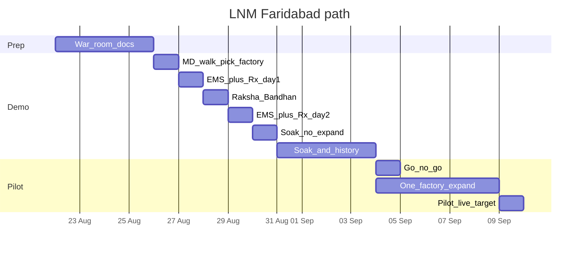

# LNM Faridabad — runbook 26 Aug → 9 Sep 2026

Internal. Pair with [`lnm-plant-ee-me-sw.md`](./lnm-plant-ee-me-sw.md) and [`../handoff/deployment/cost-effective-aws-pilot.md`](../handoff/deployment/cost-effective-aws-pilot.md).

**Slip:** Call moved the site visit from Mon 24 to **Wed 26 Aug** (+2 calendar days). Raksha Bandhan stays **Fri 28** (holiday does not move), so demo days are **Thu 27 and Sat 29**, not 27–28.

**Goal:** Win the demo (EMS-class monitoring + prescriptions + history path), soak, then land a **one-factory** pilot live by **8–9 Sep** and a commercial next step the same week.

**Leave-behind URL (when published):** LNM technical brief under decks-stamped / local [`demo-decks/clients/lnm-auto-faridabad-technical/`](../demo-decks/clients/lnm-auto-faridabad-technical/).

---

## 0. Timeline overview

| Date | Job | Done when |
|------|-----|-----------|
| 22–25 Aug | Study plant doc + this runbook; pack kit | You can talk process, MD, FANUC, EMS gap without notes |
| **Wed 26** | MD + walk all three sheds enough to **pick Factory 1**; start connect | Factory 1 named; incomer path; first tag or CSV; bills requested |
| **27** | **Show energy monitoring** + ≥1 prescription (demo day 1) | Electrical nods at EMS-class screen; MD sees a ₹-labelled action |
| **28** | Raksha Bandhan — remote only | Agent still up |
| **29** | **Show energy monitoring** + ≥1 prescription (demo day 2) | Same bar as 27; fold into soak if MD is not on site Saturday |
| 30 | Soak; optional history batch | Overnight uplink healthy |
| 31 Aug–3 Sep | Soak + history pack + gated Rx | Idle finding vs incomer; one-pager if history exists |
| **4 Sep** | Go / no-go for rest of **that factory** | Written yes from MD or plant head |
| 4–8 Sep | Expand Factory 1 (more DC machines, compressor, one HT/forge feeder) | Wave A smoke path |
| **8–9 Sep** | Pilot live; commercial same week | Named next step. Other two factories = expansion |

---

## 1. Prep (22–25 Aug)

### Study

- [ ] [`lnm-plant-ee-me-sw.md`](./lnm-plant-ee-me-sw.md) end to end  
- [ ] FANUC northbound table (OPC UA / REST / CSV — no FOCAS)  
- [ ] DHBVN structure: 695 p/kVAh, ₹290/kVA CD — then **their** bill overrides  
- [ ] Dual pitch: no EMS + FANUC synergy  

### Pack kit

| Item | Why |
|------|-----|
| Laptop + deck / leave-behind | MD room |
| Modbus USB / RS-485 adapter + spare cable | Incomer |
| OPC UA cert USB / runbook notes | If FIELD / Kepware |
| Edge agent install media / compose | Their PC |
| NDA / mutual if needed | Before bill share |
| Phone for photos of nameplates | Incomer, collector UI |

### Ask in advance (WhatsApp / email if you have a contact)

- Last 3–12 months DHBVN PDFs (all campus consumers)  
- Always-on PC with outbound HTTPS for the agent  
- Who owns electrical, CNC / FANUC, IT  

---

## 2. Wednesday 26 Aug — MD + walk + first connect

### 2.1 MD room (30–45 min)

**Order:** outcomes → monitoring gap → FANUC synergy → one-factory ask. Do **not** lead with “agentic AI” or “we are read-only.” Prefer: operators stay in control; humans approve; no silent OT writes ([`copy/CONTROL_AND_ACTION.md`](../copy/CONTROL_AND_ACTION.md)).

**Lines:**

1. *You do not have a working energy picture. We put kW, MD, PF, and the bill on one screen in two days — then tell you what to do about it in rupees.*  
2. *Your FANUC collector already knows who is idle. People are not living in that screen — we put it in the setter’s hand and score it against the DHBVN bill. We do not replace FANUC.*  
3. *Factory 1 only for the demo soak. The other two sheds after this one works.*  

**Ask for a yes/no/later on:**

- Factory 1 pick after the walk  
- Incomer access + bills  
- Read of their FANUC collector (not a second FOCAS client)  
- PC for the agent  
- 5–10 machines **already on the DC**  

### 2.2 Plant walk (all three sheds enough to choose)

Walk with electrical + CNC / maintenance if possible.

| Stop | Capture |
|------|---------|
| Each shed identity | What process lives where (forge / HT / machine / surface) |
| Collector box | Screenshot UI; MT-LINKi vs FIELD vs Kepware vs unknown |
| Incomer panel(s) | Make / model, Modbus RTU vs TCP, CT/PT, CD sticker if any |
| Compressors | Count, feeder meters, header gauge |
| One HT / forge | Feeder meter? Schedule board? |
| Candidate PC | Always-on, LAN, outbound HTTPS |

**Decision before you leave for install:** name **Factory 1**. Prefer the shed where (a) incomer is reachable and (b) 5–10 FANUC machines are already on the DC. If those conflict, favour incomer + bills first — monitoring is the 27 / 29 proof.

### 2.3 First connect (same day)

Priority order if time is short:

1. **Incomer** Modbus or EMS / logger CSV path  
2. **Collector northbound** — OPC UA or REST or **CSV drop** (CSV wins if IT is slow)  
3. Edge agent on their PC → MQTT TLS outbound  
4. Request history files (bills + FANUC export + any meter Excel)

**Done when:** Factory 1 named; incomer access path documented; at least one CNC state tag **or** a committed daily CSV path; bills requested in writing.

### 2.4 Discovery checklist (leave with yes / no / later)

| # | Item | Answer |
|---|------|--------|
| 1 | Which factory is Factory 1? | |
| 2 | One vs three DHBVN consumers / CDs? | |
| 3 | Shared compressed air across factories? | |
| 4 | Collector type (screenshot) | |
| 5 | Northbound: OPC UA / API token / CSV? | |
| 6 | Incomer make / model + RS-485 or TCP | |
| 7 | Last 3–12 months bills (all consumers) | |
| 8 | FANUC history export available? | |
| 9 | Always-on PC for agent | |
| 10 | Owners: electrical, maintenance, CNC, IT | |
| 11 | 5–10 machine list **from the collector** | |

---

## 3. Thursday 27 and Saturday 29 Aug — EMS-class demo + prescriptions

This is the core demo window. **Show monitoring even if Rx is still staff-gated.** Friday 28 is Raksha Bandhan — see §5; do not treat it as a demo day.

**Thu 27 is the must-win day** (MD + electrical likely on site). Sat 29 is demo day 2 if the plant is running and decision-makers are in; otherwise fold 29 into soak and do not wait for a second MD showing.

### 3.A Generic EMS layer (must work)

What a generic EMS would show — they do not have this today:

| Screen | Content |
|--------|---------|
| Incomer now | kW, kVA, PF, running MD vs CD, kWh/kVAh today vs yesterday |
| Trends | Time series (1-min or best available), shift overlay |
| ToD | Bands from **their** DHBVN bill — not memorised slots |
| Machines | 5–10: RUN / IDLE / STOP / ALARM + proxy current if FANUC gives it |
| Layout | Factory → feeder / island → machine (even if only Factory 1 is live) |

**Success:** Electrical can navigate without asking “where is the real number?”

### 3.B Prescriptions (main value — staff-gated)

| Target | Notes |
|--------|-------|
| ≥1 idle overlay | FANUC idle/alarm with current still flowing, scored against **incomer** — `[illustrative]` until baseline locked |
| Optional compressor | Only if kW + pressure exist; else skip rather than fake |
| Gate | `stamped_rx_gate_enabled=true` — bad Rx never hit the floor WhatsApp |

**Success:** MD sees a What / Why / Who / ₹ / When card with evidence flip.

### 3.C History insights (start as soon as files land)

**Ask for:**

- 3–12 months DHBVN PDFs  
- FANUC DC export (CSV or API date range)  
- Any existing meter logger Excel  

**Produce (script, not LLM arithmetic):**

- Month-on-month kVAh, MD hits, PF  
- If FANUC history: idle hours × conservative kW assumption — label **proxy**  
- “If you had staggered X vs Y on these dates…” as **retrospective hypotheses**, not savings claims  

If history is thin by 29th: show the **method** on one bill + one live idle day; finish the one-pager during 31 Aug–3 Sep.

### 3.D Demo-day script (suggested)

1. Open EMS-class incomer screen — “this is what you do not have today.”  
2. Overlay 5–10 machines — “FANUC state on the same timeline as kW.”  
3. Flip one idle Rx — “this is what we add: owner, window, rupees.”  
4. If history: one slide “last quarter hypotheses.”  
5. Close: soak through 3 Sep → go/no-go 4 Sep → Factory 1 pilot 8–9 Sep.

---

## 4. 30 Aug — soak, do not expand

- Let Factory 1 run. Do **not** add islands.  
- Confirm overnight SQLite buffer / MQTT uplink.  
- Optional: batch-ingest history files overnight.

---

## 5. 28 Aug — Raksha Bandhan

- Holiday. **Do not** schedule IT or OT.  
- Remote health check only.  
- Falls **between** demo days 27 and 29. Agent installed on 26 must stay up through the holiday.  
- Soak calendar is **31 Aug–3 Sep**, not 29–3 Sep.

---

## 6. 31 Aug – 3 Sep — soak + history pack

| Work | Done when |
|------|-----------|
| Live idle findings vs incomer | ≥1 finding with ₹ **illustrative** (not servo-amps-only) |
| Staff-gated Rx queue | Internal console shows all Rx including fails |
| WhatsApp | Shadow only — no client blast until go/no-go |
| History one-pager | “What you could have done / what to do now” if data exists |
| Bill ingest | At least one recent DHBVN PDF validated as `BillLine` |

Align with Wave A checklist: [`handoff/holistic/stamped-holistic-pilot-stack.md`](../handoff/holistic/stamped-holistic-pilot-stack.md).

---

## 7. Friday 4 Sep — go / no-go

**Expand only the rest of Factory 1** (not Jaipur, not all three unless they insist in writing).

| Go if | No-go / delay if |
|-------|------------------|
| Incomer live and matches bill story | Only FANUC idle charts, no meter |
| ≥1 credible idle or MD-related finding | OT fight over second FOCAS |
| MD / plant head says continue | IT blocks outbound and refuses local-dashboard fallback |
| Collector northbound stable | Dark machines demanded as week-1 scope |

**Written yes** from MD or plant head before expansion.

---

## 8. 4–8 Sep — Factory 1 expand (pilot)

| Priority | Scope |
|----------|--------|
| 1 | Remaining networked CNCs **via their DC** |
| 2 | One compressor (kW + pressure if possible) |
| 3 | One HT or forge feeder |
| 4 | Bills locked for M&V language |

Smoke path (Wave A): L1 envelopes → L2 → L3 idle / compressor or MD finding → L4 Rx → L5 gate → L6 approved list.

**Out of scope this week:** SAP PM writeback; TradeoffEngine / order negotiation (Wave B); other two factories; vibration PdM.

---

## 9. 8–9 Sep — pilot live + commercial

| Outcome | Ask |
|---------|-----|
| Pilot live on Factory 1 | Named commercial next step **this week** — not “next quarter” |
| Other two factories | Expansion SKU after Factory 1 proves monitoring + Rx + verify |
| Contract narrative | Dual value: energy picture they lacked + prescriptions verified against DHBVN |

Do not quote sample leave-behind ₹ as LNM’s money. Lock M&V language before any guarantee talk.

---

## 10. Risks (internal)

| Risk | Mitigation |
|------|------------|
| Entire-factory in 4–5 days only if CNCs already on DC | Dark machines = **their** networking job |
| 28 Aug sits between demo days | Agent up from 26; no IT/OT on 28; Thu 27 is the must-win showing |
| Sat 29 MD may not be on site | Do not bank the ₹ card on Saturday; win it on 27 |
| No incomer = no contract-grade Verify | Never skip meter because CNC was easy |
| They price us as EMS | Always pair monitoring with ≥1 Rx + bill story |
| Second FOCAS offered by a helpful CNC guy | Refuse politely; consume their collector |
| Sample ₹ treated as promise | Say **illustrative** out loud |

---

## 11. Win lines (repeat)

- *You do not have a working energy picture. The FANUC collector already knows who is idle — people are not living in that screen. We put it in the setter’s hand, with kW, MD, PF, and the DHBVN bill on one action.*  
- *Two days: monitoring. A few more days: what you should have done last month, and what to do this week. Factory 1 only.*  
- Humans approve. No second FOCAS client. No silent writes.

---

*Update after each day: Factory 1 name, consumer IDs, connector path chosen, blockers.*
