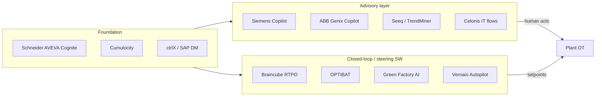

# 03 — Europe industrial AI manufacturing efficiency — deep dive

**Status:** exploration — not a product lock  
**Promoted from:** agent enrichment draft 2026-09-24

**Prepared for:** Stamped Energy — internal strategy  
**Date:** 2026-09-24 (IST)  
**Scope:** Named European (and Europe-active) vendors whose offerings touch **plant efficiency** — throughput, yield, energy intensity, quality stability, OEE/uptime, variable cost — via industrial AI, analytics, or adjacent stacks.  
**Expanded from:** `universal-repositary/external/research/competitive/industrial-ai-global-2026-09-22/Industrial_AI_Deep_Dive_Europe.md`  
**Method:** Vendor sites, EU press, partner pages, prior internal research pass. **No invented statistics.** Figures attributed to vendors or third-party press are marked **vendor-claimed** or **press-reported**.

**Stamped lens:** Software-only plant efficiency — measurable outcomes on existing OT/IT without selling PLCs, drives, or capital equipment. Integration and coexistence with majors, not displacement.

---

## How to read this document

| Column / field | Meaning |
|---|---|
| **KPI owned** | Primary outcome metric the vendor explicitly optimizes or reports on |
| **Advisory vs closed-loop** | Whether the product stops at recommendations/copilot, or can write setpoints / automate control |
| **HW vs SW** | Hardware-heavy (edge appliances, CNC, sensors) vs software/platform/analytics |
| **Buyer** | Typical economic buyer and champion |
| **Stamped implication** | What a **software-only** efficiency product should assume when coexisting with this vendor |

**Adjacency to Stamped (from parent research):** Direct = outcome peer on production/process efficiency; Adjacent = partial overlap or different primary KPI; Foundation = data/automation layer Stamped should integrate with; Irrelevant = wrong layer for plant PE lock.

---

## Europe efficiency landscape — executive snapshot

Europe combines **automation incumbents productizing GenAI copilots** (Siemens, ABB, Schneider/AVEVA, Bosch) with **outcome specialists** (Oden, Braincube, OPTIMITIVE, Green Factory AI, Vernaio) and **analytics self-serve** (Seeq, TrendMiner). **Data-fabric consolidation** (Schneider agreement to acquire Cognite for **$3.1B**, **press-reported**) reshapes where contextualized time-series and twin data will live. **Physics and engineering AI** (PhysicsX, Neural Concept, CloudNC, Productive Machines) optimizes design and machining more than day-to-day methods engineering on the line.

**Critical disambiguation:** **Celonis** owns *business process* intelligence on ERP/IT event logs — order-to-cash, procure-to-pay, production *workflow* visibility — **not** manufacturing process engineering (setpoints, recipes, energy per ton, cycle-time methods). Stamped must not let procurement conflate the two meanings of “process.”

---

## Master comparison table (efficiency-relevant Europe entities)

| # | Entity | HQ / anchor | Primary efficiency KPI | Advisory ↔ closed-loop | SW vs HW | Stamped adjacency |
|---|--------|-------------|------------------------|-------------------------|----------|-------------------|
| 1 | Siemens (Industrial Copilot + Senseye) | DE / UK (Senseye) | Uptime, maintenance labor, reactive work | Mostly advisory (Copilot); Senseye PdM alerts | SW + Siemens automation HW ecosystem | Foundation |
| 2 | ABB Genix / Genix Copilot | CH / SE | APM alert burden, reliability | Advisory GenAI on APM | SW on ABB stack | Adjacent |
| 3 | Schneider + AVEVA + Cognite | FR / UK / NO | Energy intensity, operational margin (via data + apps) | Varies by app; Cognite enables app layer | SW platform | Foundation |
| 4 | Bosch ctrlX AUTOMATION | DE | Machine OEE, time-to-commission | Platform; apps vary | HW control + SW apps | Foundation |
| 5 | SAP Digital Manufacturing | DE | Schedule adherence, quality, MES KPIs | Mostly advisory / workflow | SW (cloud MES) | Adjacent |
| 6 | Dassault 3DEXPERIENCE | FR | Virtual manufacturing, plan quality | Planning/simulation | SW PLM/MOM | Adjacent |
| 7 | Braincube (RTPO / CrossRank) | FR | Throughput, yield, energy, waste | Advisory → optional closed-loop steering | SW IIoT platform | Direct–Adjacent |
| 8 | Oden Technologies | SE (EU ops) | Quality, throughput drivers | Recommendations / optimization | SW | Direct |
| 9 | OPTIMITIVE / OPTIBAT | ES | Specific energy, throughput, emissions | Open-loop → closed-loop to DCS/PLC | SW | Direct (energy-heavy process) |
| 10 | Green Factory AI | FI | Chemicals, lime, gas, steam intensity | Advisory first → approved writeback | SW edge/on-prem | Direct |
| 11 | Vernaio (Process Booster X) | DE | Variable cost, quality, energy per line | Copilot / Autopilot modes | SW (causal AI) | Direct |
| 12 | Zentio | EU | Schedule, flow, high-mix delivery | Agent recommendations | SW | Adjacent |
| 13 | Arrakis | UK / FR | Custom industrial KPIs (FDE-led) | Project-dependent | SW + services | Adjacent |
| 14 | Seeq (EU deployments) | US HQ; EU customers/partners | Investigation time, energy, yield insight | Self-serve analytics; agents (Seeq Intelligence) | SW | Adjacent |
| 15 | TrendMiner | BE | Process deviation, golden batch | Analytics / monitoring | SW | Adjacent |
| 16 | Cosmo Tech | FR | Planning scenarios, resilience | Simulation / decision support | SW | Adjacent |
| 17 | PhysicsX | UK | Simulation-led process/design KPIs | Engineering optimization | SW | Direct (methods reference) |
| 18 | Neural Concept | CH | CAE cycle time, design performance | Design advisory | SW | Irrelevant–Adjacent |
| 19 | CloudNC | UK | CAM programming time, spindle utilization | CAM automation | SW + machine integration | Adjacent |
| 20 | Productive Machines | UK | CNC chatter, tool life, surface | Optimization advisory | SW | Adjacent |
| 21 | Celonis | DE | Process cycle time (IT), working capital | Execution apps on mined flows | SW | Adjacent (IT only) |
| 22 | Cumulocity (Software AG) | DE | Device fleet uptime, IoT ops | Platform; app-dependent | SW IIoT | Foundation |
| 23 | Xyte | IL / EU OEMs | Aftermarket revenue, device health | OEM cloud ops | SW | Mostly irrelevant |
| 24 | Infinite Uptime | IN HQ; EU footprint | Machine health, downtime | PdM advisory | SW + sensors partner ecosystem | Adjacent (PdM) |
| 25 | Imagimob (Infineon) | SE | Edge inference on sensor | TinyML on device | SW tooling + chip HW | Foundation |
| 26 | Rockwell Automation (EU) | US HQ; EU plants | OEE, production visibility | FactoryTalk / Plex analytics | SW + HW | Foundation |

---

## Dossiers (26 named entities)

Each dossier follows the same schema for Stamped software-only planning.

---

### 1. Siemens — Industrial Copilot + Senseye

| Field | Detail |
|---|---|
| **KPI owned** | Maintenance productivity, predictive failure lead time, engineering task time (Copilot); asset reliability (Senseye) |
| **Advisory vs closed-loop** | **Industrial Copilot:** advisory GenAI on engineering/ops/maintenance workflows. **Senseye:** PdM alerts and diagnostics — not closed-loop process setpoint control |
| **HW vs SW** | Primarily **SW** (Copilot, Senseye, Industrial Edge apps) sold into **Siemens automation HW** installed base |
| **Buyer** | VP Operations / Maintenance, automation engineering leads in Siemens-centric plants (discrete + process) |
| **URLs** | https://www.siemens.com/global/en/products/automation/topic-areas/industrial-ai.html · https://press.siemens.com/global/en/pressrelease/siemens-expands-industrial-copilot-new-generative-ai-powered-maintenance-offering · https://www.senseye.io/ |

**What they sell:** Industrial Edge, Xcelerator digital twins, Industrial Copilot (PLC/HMI assistance, NL queries, maintenance GenAI linked to Senseye), Senseye predictive maintenance (acquired 2022).

**Vendor-claimed:** Siemens press cites pilots with **~25% less reactive-maintenance time** when using generative AI maintenance offerings linked to Senseye — **vendor-claimed**.

**Stamped implication (software-only):** Treat Siemens as **integration surface** (historian, MES adjacency, energy meters on same network). Stamped owns **verified energy M&V and methods-engineering efficiency KPIs** Copilot does not certify. Partner path: export Stamped outcome narratives into Copilot context, never compete as PLC/DCS replacement.

---

### 2. ABB — Ability / Genix Industrial IoT & AI Suite + Genix Copilot

| Field | Detail |
|---|---|
| **KPI owned** | Alert prioritization, mean time to diagnose, work-order quality (Copilot); process reliability via Genix APM |
| **Advisory vs closed-loop** | **Genix Copilot:** advisory GenAI on APM (RCA narratives, work requests). Process optimization apps may vary by deployment |
| **HW vs SW** | **SW** suite on ABB process automation footprint; ABB also sells drives/instruments (**HW**) |
| **Buyer** | Head of reliability, process automation director (metals, mining, pulp, chemicals, energy utilities) |
| **URLs** | https://new.abb.com/process-automation/genix/abb-genix-copilot · https://www.abb.com/ |

**Stamped implication:** Same pattern as Siemens — **advisory layer on top of APM**, not substitute for Stamped’s efficiency verification. Stamped software-only should ingest Genix-exposed tags and return outcome deltas beside Genix Copilot stories.

---

### 3. Schneider Electric + AVEVA + Cognite (agreement to acquire)

| Field | Detail |
|---|---|
| **KPI owned** | Enterprise energy intensity (Schneider EMS), production efficiency and safety (AVEVA), industrial data contextualization for app KPIs (Cognite) |
| **Advisory vs closed-loop** | Mix: energy advisory + control in Schneider portfolio; AVEVA MES/PI analytics; Cognite **data fusion** enables third-party and first-party apps (open- vs closed-loop depends on app) |
| **HW vs SW** | Schneider **HW+SW** (breakers, drives, EMS); AVEVA/Cognite **SW** |
| **Buyer** | CIO/CTO digital plant, energy manager, head of manufacturing IT |
| **URLs** | https://www.se.com/ · https://www.aveva.com/en/products/braincube-the-leading-industrial-analytics-for-process-health/ · https://www.cognite.com/ · https://www.reuters.com/business/schneider-electric-buy-ai-software-firm-cognite-31-billion-2026-06-30/ |

**Press-reported:** Schneider agreement to acquire Cognite for **$3.1B** (Jun 30, 2026); Cognite **2025 revenue >$170M**, ~**800 people** — **Schneider/Reuters, press-reported**. Deal subject to regulatory approval — treat as **pending**, not closed.

**Stamped implication:** Strongest **Energy + industrial data** mega-stack in EU accounts. Stamped Energy should plan **Cognite/AVEVA PI/EMS connectors** as first-class. Outcome apps (Stamped) sit **above** the fabric; displacement is unrealistic.

---

### 4. Bosch Rexroth — ctrlX AUTOMATION

| Field | Detail |
|---|---|
| **KPI owned** | Machine builder time-to-market, OEE at machine level, connectivity for app ecosystem |
| **Advisory vs closed-loop** | **Platform:** Linux-based control; efficiency depends on third-party ctrlX apps — typically **closed-loop at machine**, not plant-wide PE |
| **HW vs SW** | **HW** control platform + **SW** app store / dev environment |
| **Buyer** | Machine OEM CTO, automation engineering (discrete manufacturing) |
| **URLs** | https://www.boschrexroth.com/en/de/company/ctrlx-automation/ |

**Stamped implication:** Foundation for **OEM machines** Stamped may later optimize at **plant** layer. Software-only Stamped targets end-user plants; ctrlX is relevant when efficiency KPIs must be pulled from machine-edge apps.

---

### 5. SAP — Digital Manufacturing cloud + AI (Joule)

| Field | Detail |
|---|---|
| **KPI owned** | Production order performance, quality notifications, manufacturing insights in SAP cloud MES |
| **Advisory vs closed-loop** | MES workflows + AI insights — generally **advisory** relative to OT setpoints |
| **HW vs SW** | **SW** (cloud MES/ERP adjacency) |
| **Buyer** | SAP manufacturing IT owner, plant manager in SAP-centric factories |
| **URLs** | https://www.sap.com/products/scm/digital-manufacturing.html |

**Stamped implication:** **Integrate, don’t replace.** Stamped efficiency outcomes should map to SAP DM KPIs for executive roll-up; SAP AI is not a substitute for OT-level energy/process optimization.

---

### 6. Dassault Systèmes — 3DEXPERIENCE / DELMIA / virtual twin

| Field | Detail |
|---|---|
| **KPI owned** | Plan-vs-actual in virtual manufacturing, engineering change cycle time, quality in digital mock-up |
| **Advisory vs closed-loop** | **Simulation and planning** — offline/online twin advisory; shopfloor closed-loop via other systems |
| **HW vs SW** | **SW** (PLM/MOM); public company EPA: DSY |
| **Buyer** | VP Engineering, manufacturing engineering, digital twin program lead |
| **URLs** | https://www.3ds.com/ · DELMIA manufacturing operations narratives on 3ds.com |

**Stamped implication:** Overlap with Stamped **Process** is at **methods planning**, not live SEC/kWh/t. Useful for **digital thread** story; Stamped still owns plant-floor measured efficiency.

---

### 7. Braincube — Productivity Management System, RTPO, CrossRank AI

| Field | Detail |
|---|---|
| **KPI owned** | Production speed, yield, waste, **energy consumption**, problem-solving time — Braincube markets **RTPO** (Real-Time Process Optimization) |
| **Advisory vs closed-loop** | **Continuous steering:** recommends and can **adjust controllable settings in real time** as conditions change — partner materials describe **closed-loop optimization** options; deployment often starts with guidance |
| **HW vs SW** | **SW** platform; integrates PLC, APC, historian, MES, SCADA, ERP |
| **Buyer** | Process engineer, continuous improvement director, head of manufacturing (process industries) |
| **URLs** | https://braincube.com/platform/ · https://braincube.com/resources/real-time-process-optimization-unlocking-manufacturing-performance-from-variability/ · https://www.aveva.com/en/products/braincube-the-leading-industrial-analytics-for-process-health/ |

**Product notes:** **CrossRank AI** ranks variables driving outcomes; **Product Clones** = product-run digital twin models. **Funding:** **€83M** growth equity (Nov 2023) — **press-reported** (Tech.eu).

**Vendor-claimed (customer deployments, Braincube marketing):** e.g. **25%** production speed, **12%** yield, **35%** waste, **19%** energy, **90%** less problem-solving time, ROI **3 months** — all **vendor-claimed**, process-dependent.

**Stamped implication:** **Closest EU platform peer** for software-only process efficiency with energy KPI. Stamped must differentiate on **India GTM, M&V rigor, methods-engineering lock**, and vertical focus — not on “multivariate AI” alone. AVEVA partnership channel matters for EU enterprise access.

---

### 8. Oden Technologies

| Field | Detail |
|---|---|
| **KPI owned** | Throughput, quality drivers, scrap reduction — “AI products for manufacturing process optimization” |
| **Advisory vs closed-loop** | **Recommendations** and optimization insights from unified factory data — not primarily DCS closed-loop vendor |
| **HW vs SW** | **SW** (data platform + AI suite) |
| **Buyer** | VP Operations, head of manufacturing analytics (discrete + process) |
| **URLs** | https://oden.io/ · https://siliconangle.com/2024/04/11/oden-technologies-raises-28-5m-launch-ai-driven-products-manufacturing/ |

**Funding:** Series B **$28.5M** (Apr 2024), total ~**$58.7M** reported — **press-reported**.

**Stamped implication:** **Direct outcome peer** for production-linked KPIs. Study GTM packaging post-Series B. Stamped wins on explicit **energy + process engineering** twin lock and regional delivery, not generic “factory AI.”

---

### 9. OPTIMITIVE — OPTIBAT® 7

| Field | Detail |
|---|---|
| **KPI owned** | Specific energy (kWh/t), throughput, emissions — economic KPIs under constraints |
| **Advisory vs closed-loop** | **Open-loop recommendations** → **closed-loop** setpoints to DCS/PLC/APC (documented customer paths) |
| **HW vs SW** | **SW**; OPC-UA, REST; K8s multi-site; edge-to-cloud hybrid |
| **Buyer** | Plant manager, process control engineer (cement, chemicals, metals, pulp & paper) |
| **URLs** | https://optimitive.com/product/ · https://optimitive.com/company/ · https://optimitive.com/suma-capital-invests-e1-million-in-optimitive-and-completes-its-e5-million-series-a-to-boost-industrial-energy-efficiency-with-ai/ |

**Vendor-claimed:** Up to **6%** energy savings and **10%** production improvement depending on process — **OPTIMITIVE press, vendor-claimed**. **75+ installations** — **company site, vendor-claimed**. Series A **€5M** completed with Suma Capital, Cemex Ventures, TITAN — **press**.

**Stamped implication:** **Direct competitor** in energy-intensive **software-only closed-loop** optimization. Stamped must match or exceed **constraint modeling, open→closed deployment discipline**, and **M&V transparency** for Indian and export-facing plants.

---

### 10. Green Factory AI

| Field | Detail |
|---|---|
| **KPI owned** | Chemical, lime, gas, steam, adhesive usage; CO₂ and margin per process loop |
| **Advisory vs closed-loop** | **Advisory first** (“nothing touches controls until operator approves”); staged **writeback** and autonomous modes when approved — **vendor product page** |
| **HW vs SW** | **SW** — containerized **on-prem / edge** inside factory network |
| **Buyer** | Technology & R&D manager, mill director (pulp & paper, chemical, steel) |
| **URLs** | https://greenfactory.ai/product/ · https://greenfactory.ai/ · https://greenfactory.ai/about-us/ |

**Vendor-claimed (website case snippets):** e.g. **6%** chemical dose, **7.65%** lime, **8%** gas, **10%** steam — **vendor-claimed**; € savings figures on site are **vendor-claimed**.

**Stamped implication:** **Nordic/EU direct peer** for **software-only, constraint-safe setpoint optimization** with strong **energy/chemical intensity** narrative. Stamped can learn **edge-first, firewall-friendly deployment** messaging; compete on geography, sectors, and verification standards.

---

### 11. Vernaio — Process Booster X (aivis® causal AI)

| Field | Detail |
|---|---|
| **KPI owned** | Variable cost per line, quality stability, throughput, energy — “high six-figure to **€1M per line**” annual cost reduction **vendor-claimed** on website |
| **Advisory vs closed-loop** | **Copilot** (decision support) and **Autopilot** (closed-loop control) — **vendor-stated** |
| **HW vs SW** | **SW** — causal models from existing data; cloud or on-prem |
| **Buyer** | Process industry line owner, head of production (paper, nonwovens, textiles, glass, automotive process lines) |
| **URLs** | https://www.vernaio.com/process-booster-x/process-industry · https://www.vernaio.com/aivis · https://www.vernaio.com/blog/vernaio-revolutionizes-process-optimization-with-groundbreaking-causal-ai-solution-process-booster-x |

**Stamped implication:** **Material EU peer** for **causal / interventional** optimization without new HW. Stamped should articulate how its methods-engineering layer complements or differs from **causal world models** — especially for buyers asking “explainability vs CrossRank/ML.”

---

### 12. Zentio — Agentic Twin

| Field | Detail |
|---|---|
| **KPI owned** | Schedule adherence, flow, high-mix factory orchestration |
| **Advisory vs closed-loop** | **Agent recommendations** on live factory model — scheduling/planning focus vs continuous process setpoints |
| **HW vs SW** | **SW**; EU data residency emphasis |
| **Buyer** | Operations director, planning manager (high-mix discrete) |
| **URLs** | https://zentio.ai/ |

**Stamped implication:** **Adjacent** — efficiency via **flow and WIP**, not primary SEC. Integrate when Stamped customers need scheduling-aware energy campaigns.

---

### 13. Arrakis — industrial AI OS (FDE model)

| Field | Detail |
|---|---|
| **KPI owned** | Custom — aerospace, energy, logistics, manufacturing (**press** verticals) |
| **Advisory vs closed-loop** | **Project-dependent**; forward-deployed engineers (**FDE**) |
| **HW vs SW** | **SW** platform + **services-heavy** delivery |
| **Buyer** | CTO / digital transformation sponsor in industrial conglomerates |
| **URLs** | https://fortune.com/2026/07/22/arrakis-a-startup-betting-ais-biggest-payoff-is-in-industrial-sectors-not-office-work-emerges-from-stealth-with-38-million-in-venture-funding/ · https://thenextweb.com/news/arrakis-ai-startup-38-million-stealth-industrial |

**Funding:** ~**$38M** total, **$30M Series A** — **press-reported** (Fortune/TNW, Jul 2026).

**Stamped implication:** **GTM contrast** — productized SaaS vs FDE OS. Stamped should decide consciously: when to refuse bespoke OS deals and when a thin FDE layer is required for first plant proof.

---

### 14. Seeq — Industrial Analytics & AI (European deployments & partner channel)

| Field | Detail |
|---|---|
| **KPI owned** | Time-to-insight, energy efficiency investigations, yield/margin understanding — SME-driven |
| **Advisory vs closed-loop** | **Self-serve analytics** and **Seeq Intelligence** agents — decision support, not DCS closed-loop |
| **HW vs SW** | **SW** (Analytics, Enterprise, Intelligence tiers) |
| **Buyer** | Process engineer, reliability engineer, manufacturing SME |
| **URLs** | https://www.seeq.com/product/our-offerings/ · https://amitec.eu/products/seeq/ · https://www.seeq.com/resources/press-releases/clonbio-selects-seeq-for-enterprise-wide-analytics/ |

**EU angle:** **Amitec** positions as **Seeq Competence Center for Europe** (Germany/Werusys). **ClonBio** multi-year agreement for EU biorefinery assets including **Pannonia Bio (Hungary)** — **Seeq press, 2024**. **Merck Cramlington UK** continuous manufacturing case — **case study literature**.

**Vendor-claimed / case:** Refinery analysis **4 months → 30 minutes** — **Microsoft case study, vendor/partner-reported**.

**Stamped implication:** Seeq is **how engineers find efficiency hypotheses**; Stamped can **operationalize and verify** chosen KPIs. Integration story: Stamped feeds validated outcomes back into Seeq workbooks for continuity.

---

### 15. TrendMiner — self-service process analytics (Proemion Holding)

| Field | Detail |
|---|---|
| **KPI owned** | Golden batch, deviation detection, process performance stability |
| **Advisory vs closed-loop** | **Analytics / monitoring** — engineer self-serve |
| **HW vs SW** | **SW** |
| **Buyer** | Process engineer, production manager (batch/process) |
| **URLs** | https://www.trendminer.com/ · https://www.finsmes.com/2024/04/proemion-holding-acquires-trendminer.html |

**M&A:** Acquired by **Proemion Holding** (Apr 2024) — **press-reported**.

**Stamped implication:** Complementary **diagnostic layer**; Stamped owns closed-loop or advisory optimization with **M&V**. Avoid duplicating TrendMiner-style exploration UI unless Stamped PE requires it.

---

### 16. Cosmo Tech

| Field | Detail |
|---|---|
| **KPI owned** | Scenario KPIs — supply, operations, resilience (planning horizon) |
| **Advisory vs closed-loop** | **Simulation / decision twin** — planning, not minute-by-minute setpoints |
| **HW vs SW** | **SW** |
| **Buyer** | COO office, supply chain + operations strategy (Lyon, FR) |
| **URLs** | https://cosmotech.com/ |

**Stamped implication:** **Adjacent** for **capacity and energy scenario planning**; live plant efficiency still Stamped/Specialist domain.

---

### 17. PhysicsX

| Field | Detail |
|---|---|
| **KPI owned** | Simulation-heavy engineering KPIs — design and process physics outcomes |
| **Advisory vs closed-loop** | Engineering optimization workflows |
| **HW vs SW** | **SW** (physics AI platform) |
| **Buyer** | Chief engineer, R&D director, advanced manufacturing |
| **URLs** | https://www.physicsx.ai/ · https://www.physicsx.ai/newsroom/physicsx-announces-300m-series-c-to-accelerate-physics-ai-for-industrial-engineering |

**Funding:** **$300M Series C** announced — **company press, press-reported**.

**Stamped implication:** **Methods reference** for hybrid physics+ML; not typical shopfloor PE buyer. Useful for **technical credibility** when Stamped embeds physics-informed constraints.

---

### 18. Neural Concept

| Field | Detail |
|---|---|
| **KPI owned** | CAE turnaround, design performance (surrogate models) |
| **Advisory vs closed-loop** | **Design advisory** — not live line control |
| **HW vs SW** | **SW** |
| **Buyer** | Head of simulation, R&D (Lausanne, CH) |
| **URLs** | https://www.neuralconcept.com/ |

**Stamped implication:** **Wrong champion** for plant PE unless DfM loop explicitly ties design to line efficiency. Keep separate in sales collateral.

---

### 19. CloudNC

| Field | Detail |
|---|---|
| **KPI owned** | CAM programming time, CNC utilization — **vendor-claimed** shop counts in prior research |
| **Advisory vs closed-loop** | **CAM automation** — machine program generation |
| **HW vs SW** | **SW** (CAM AI) + machine shop integration |
| **Buyer** | Job shop owner, manufacturing engineering (UK) |
| **URLs** | https://www.cloudnc.com/ |

**Stamped implication:** **Adjacent** — efficiency at **programming/spindle** layer, not plant SEC. Relevant for aerospace/defence supply chains in EU.

---

### 20. Productive Machines

| Field | Detail |
|---|---|
| **KPI owned** | Chatter avoidance, surface quality, tool life (CNC physics) |
| **Advisory vs closed-loop** | Machining parameter **optimization advisory** |
| **HW vs SW** | **SW** |
| **Buyer** | CNC process owner, machine shop technical lead (UK) |
| **URLs** | https://solutions.productivemachines.co.uk/ |

**Stamped implication:** Point solution for **metal-cutting efficiency**; Stamped plant-wide software should **ingest** machine-level gains without claiming CAM physics core.

---

### 21. Celonis — process intelligence (ERP / IT)

| Field | Detail |
|---|---|
| **KPI owned** | **Business process** cycle time, working capital, conformance to designed ERP flows — **not OT setpoints** |
| **Advisory vs closed-loop** | **Execution apps** that trigger **IT/workflow** actions — not DCS closed-loop |
| **HW vs SW** | **SW** |
| **Buyer** | CFO, shared services, supply chain transformation (often **not** plant PE lead) |
| **URLs** | https://www.celonis.com/ · https://funding.tech.eu/companies/37B6813B-B1EA-4A07-879E-93393A1B79C1 |

**Explicit boundary:** Celonis **process mining** analyzes **how work flows through IT systems** (SAP, Oracle, etc.). It may include **production order** timelines, but it is **not** manufacturing **process engineering** (recipes, temperatures, energy per unit, methods freezes). **Do not equate Celonis with Stamped Process.**

**Funding (press):** ~**€2.2B** raised; historical **$13B+** valuation narratives — **press-reported**.

**Stamped implication:** Only **Adjacent** when joint customer wants **order-to-cash** visibility beside **OT efficiency**. Sales training: maintain glossary split — **business process** vs **manufacturing process**.

---

### 22. Software AG — Cumulocity IoT

| Field | Detail |
|---|---|
| **KPI owned** | Device connectivity uptime, fleet KPIs, IoT app enablement |
| **Advisory vs closed-loop** | **Platform** — closed-loop depends on customer/partner apps |
| **HW vs SW** | **SW** IIoT platform |
| **Buyer** | IoT platform owner, OT/IT architect |
| **URLs** | https://www.softwareag.com/en/products/iot/cumulocity-iot.html |

**Note:** Software AG ownership/private status — confirm current branding in live deals.

**Stamped implication:** **Foundation** — Stamped apps can publish/subscribe via Cumulocity in EU enterprises standardizing on it.

---

### 23. Xyte

| Field | Detail |
|---|---|
| **KPI owned** | OEM **aftermarket** revenue, remote device management — not factory-wide efficiency |
| **Advisory vs closed-loop** | Cloud ops for **device OEMs** |
| **HW vs SW** | **SW** (OEM cloud) |
| **Buyer** | OEM product manager, service director |
| **URLs** | https://www.xyte.io/ |

**Stamped implication:** **Mostly irrelevant** to software-only **plant** efficiency unless Stamped partners with OEMs on **embedded energy analytics** — niche.

---

### 24. Infinite Uptime — European footprint

| Field | Detail |
|---|---|
| **KPI owned** | Machine health, unplanned downtime reduction |
| **Advisory vs closed-loop** | **PdM advisory** — maintenance actions |
| **HW vs SW** | **SW** platform; ecosystem includes sensors/partners |
| **Buyer** | Maintenance manager, reliability lead |
| **URLs** | https://www.infiniteuptime.com/ · TechCrunch coverage of multi-country footprint — **press** (~30 countries claimed, **vendor/press-reported**; EU-specific plant counts **not disclosed** in prior pass) |

**Stamped implication:** **Adjacent PdM** — out of scope if Stamped avoids maintenance-first positioning; acknowledge in RFPs where buyers bundle PdM with “AI efficiency.”

---

### 25. Imagimob (Infineon ecosystem)

| Field | Detail |
|---|---|
| **KPI owned** | Edge model accuracy/latency on sensor — enabler KPI |
| **Advisory vs closed-loop** | On-device inference |
| **HW vs SW** | **SW** TinyML tooling + **Infineon chip HW** |
| **Buyer** | Embedded engineer, sensor OEM (Stockholm, SE) |
| **URLs** | https://www.imagimob.com/ |

**Stamped implication:** **Foundation** for edge; Stamped remains cloud/historian-centric unless product roadmap includes TinyML partners.

---

### 26. Rockwell Automation — European installed base (FactoryTalk / Plex)

| Field | Detail |
|---|---|
| **KPI owned** | OEE, production visibility, quality in discrete (automotive strong in EU) |
| **Advisory vs closed-loop** | Analytics + MES; control via Rockwell HW |
| **HW vs SW** | **HW + SW** |
| **Buyer** | Plant manager, controls engineer (Allen-Bradley sites) |
| **URLs** | https://www.rockwellautomation.com/ |

**Stamped implication:** Same as Siemens/Rockwell EU pattern — **integrate** with FactoryTalk/Plex data for Stamped outcomes; do not position as automation replacement.

---

## Thematic cuts (efficiency architecture)

### Advisory copilots vs closed-loop optimizers

**Stamped positioning:** Operate in **closed** or **advisory** lane with **verified KPIs**; use foundation vendors for data access; never confuse **Copilot toil reduction** with **SEC or cycle-time outcomes**.

### Energy-intensive process vs discrete high-mix

| Cluster | Representative EU vendors | Efficiency KPI emphasis |
|---------|---------------------------|-------------------------|
| Process continuous | OPTIMITIVE, Braincube RTPO, Green Factory AI, Vernaio, Oden | kWh/t, yield, emissions, variable cost |
| Process analytics | Seeq, TrendMiner, ABB Genix | Deviation, energy investigations, reliability |
| Discrete / high-mix | Zentio, Bosch ctrlX, CloudNC, Productive Machines | Schedule, OEE, CAM/spindle |
| IT / business process | **Celonis** | Working capital, ERP flow time — **not PE** |

---

## Braincube RTPO / CrossRank — extended note (required depth)

Braincube’s **Real-Time Process Optimization (RTPO)** is marketed as a **continuous layer** beside live production: adapt operating targets as conditions change rather than fixed setpoints. **CrossRank AI** ranks input variables by impact on outputs to support root cause, recipes, and setpoints. **Product Clones** contextualize each production run (time-series + asset + process data).

**Deployment posture (vendor narrative):** Integrates with existing IT/OT; supports on-prem, hybrid, cloud; can **steer** process with operator alignment and, per partner descriptions, **closed-loop** options.

**Competitive read for Stamped:** RTPO is the **clearest EU articulation** of “software-only margin from variability.” Stamped should compare **proof duration, constraint governance, India plant economics, and M&V** — not feature checklists alone.

---

## OPTIBAT / OPTIMITIVE — extended note

**OPTIBAT® 7** targets **heavy industry** (cement, chemical, petrochemical, metal, pulp & paper) with:

- Historical + ML process models  
- **OPC-UA / REST** integration  
- **Open-loop** recommendations transitioning to **closed-loop** setpoints to DCS/PLC/APC  
- Multi-objective optimization under explicit constraints  
- Kubernetes-scale multi-site deployments  

**Stamped read:** OPTIMITIVE is **explicitly energy + throughput** with **autonomous** positioning — closest **Spanish/EU** analog to Stamped Energy narrative on intensive process. Series A **€5M** and strategic investors (Cemex Ventures, TITAN) signal **cement vertical lock-in**.

---

## Celonis — standalone warning block

| Question | Celonis | Stamped / manufacturing PE |
|----------|---------|----------------------------|
| Data source | ERP, CRM, IT event logs | Historians, DCS tags, meters, MES, quality |
| “Process” means | Business workflow | Physical/chemical process, methods |
| Typical win | Finance + transformation | Operations + energy + yield |
| Closed-loop | Workflow automation in IT | Setpoints, recipes, energy campaigns |

**Sales rule:** If buyer says “we have Celonis for process,” ask **which process** before accepting efficiency RFP scope.

---

## Europe narrative for Stamped (software-only plant efficiency)

Europe is where **industrial gravity wells** turn GenAI into **copilots** (Siemens Industrial Copilot + Senseye, ABB Genix Copilot, Schneider–Microsoft industrial narratives) and where **data fabric M&A** (Schneider **agreement** to acquire Cognite for integration with AVEVA) redefines the **app layer** above contextualized OT/IT data. That consolidation does **not** eliminate outcome specialists; it **raises the bar** for what Stamped must plug into.

**Outcome specialists teach Stamped how buyers pay for efficiency:**

- **Braincube RTPO / CrossRank** and **Oden** — production variability and multivariate steering.  
- **OPTIMITIVE OPTIBAT** and **Green Factory AI** and **Vernaio** — constraint-safe setpoints, energy and variable cost, advisory→closed-loop journeys **without selling new machines**.  
- **Seeq** and **TrendMiner** — engineer self-serve proves hypotheses; Stamped should **close the loop** with verified outcomes, not rebuild exploration UX.  
- **PhysicsX / Neural Concept / CloudNC / Productive Machines** — upstream or machining-layer efficiency; Stamped avoids champion confusion (R&D vs plant PE).

**Celonis** owns **IT process intelligence** — valuable for **enterprise transformation**, **not** a substitute for manufacturing process engineering. Stamped’s India and export GTM should treat **European majors as integration surfaces** (Schneider/AVEVA/Cognite, Siemens, SAP, Rockwell, Bosch) and **European outcome vendors as method and packaging references** (pricing proof points, deployment safety, open vs closed-loop).

**Software-only strategic imperatives:**

1. **First-class connectors** to PI/Cognite, Siemens data paths, SAP DM, and historian-neutral ingestion.  
2. **M&V and KPI contracts** that copilots and analytics platforms do not certify.  
3. **Explicit glossary** separating business process mining from manufacturing PE in every EU-facing deck.  
4. **Segment choice:** energy-intensive process (OPTIMITIVE/Green Factory/Vernaio/Braincube battleground) vs discrete high-mix (Zentio, machine OEM via ctrlX) — Stamped cannot win both with one message.  
5. **Partnership over displacement** in EU enterprise accounts until Stamped has reference plants **in region** or **same multinationals’ India sites** as wedge.

**Closing line for internal use:** Europe proves that **efficiency software** is a category — closed-loop, advisory, and analytics layers coexist. Stamped wins by **owning measured plant outcomes** on customer infrastructure, not by out-copiloting Siemens or out-mining Celonis.

---

## Source appendix

### Majors, platforms, analytics

- Siemens Industrial Copilot maintenance expansion: https://press.siemens.com/global/en/pressrelease/siemens-expands-industrial-copilot-new-generative-ai-powered-maintenance-offering  
- Siemens industrial AI topic: https://www.siemens.com/global/en/products/automation/topic-areas/industrial-ai.html  
- Senseye: https://www.senseye.io/  
- ABB Genix Copilot: https://new.abb.com/process-automation/genix/abb-genix-copilot  
- Schneider Electric: https://www.se.com/  
- AVEVA (Braincube partnership page): https://www.aveva.com/en/products/braincube-the-leading-industrial-analytics-for-process-health/  
- Cognite newsroom (Schneider agreement): https://www.cognite.com/en/company/newsroom/schneider-electric-announces-agreement-to-acquire-cognite  
- Reuters Schneider–Cognite: https://www.reuters.com/business/schneider-electric-buy-ai-software-firm-cognite-31-billion-2026-06-30/  
- Bosch ctrlX: https://www.boschrexroth.com/en/de/company/ctrlx-automation/  
- SAP Digital Manufacturing: https://www.sap.com/products/scm/digital-manufacturing.html  
- Dassault Systèmes: https://www.3ds.com/  
- Software AG Cumulocity: https://www.softwareag.com/en/products/iot/cumulocity-iot.html  
- Celonis funding explorer (Tech.eu): https://funding.tech.eu/companies/37B6813B-B1EA-4A07-879E-93393A1B79C1  

### Outcome specialists & optimization

- Braincube platform / RTPO: https://braincube.com/platform/ · https://braincube.com/resources/real-time-process-optimization-unlocking-manufacturing-performance-from-variability/  
- Braincube funding (Tech.eu €83M): https://tech.eu/2023/11/29/french-iiot-platform-braincube-secures-eur83-million-investment/  
- Oden Technologies: https://oden.io/  
- Oden Series B (SiliconANGLE): https://siliconangle.com/2024/04/11/oden-technologies-raises-28-5m-launch-ai-driven-products-manufacturing/  
- OPTIMITIVE product & company: https://optimitive.com/product/ · https://optimitive.com/company/  
- OPTIMITIVE Series A (company news): https://optimitive.com/suma-capital-invests-e1-million-in-optimitive-and-completes-its-e5-million-series-a-to-boost-industrial-energy-efficiency-with-ai/  
- Green Factory AI: https://greenfactory.ai/ · https://greenfactory.ai/product/  
- Vernaio Process Booster X: https://www.vernaio.com/process-booster-x/process-industry · https://www.vernaio.com/aivis  

### Analytics, twins, engineering AI

- Seeq offerings: https://www.seeq.com/product/our-offerings/  
- Amitec Seeq Europe competence center: https://amitec.eu/products/seeq/  
- ClonBio / Seeq press release: https://www.seeq.com/resources/press-releases/clonbio-selects-seeq-for-enterprise-wide-analytics/  
- TrendMiner: https://www.trendminer.com/  
- TrendMiner acquisition (FinSMEs): https://www.finsmes.com/2024/04/proemion-holding-acquires-trendminer.html  
- Cosmo Tech: https://cosmotech.com/  
- Zentio: https://zentio.ai/  
- Arrakis (Fortune): https://fortune.com/2026/07/22/arrakis-a-startup-betting-ais-biggest-payoff-is-in-industrial-sectors-not-office-work-emerges-from-stealth-with-38-million-in-venture-funding/  
- Arrakis (TNW): https://thenextweb.com/news/arrakis-ai-startup-38-million-stealth-industrial  
- PhysicsX Series C: https://www.physicsx.ai/newsroom/physicsx-announces-300m-series-c-to-accelerate-physics-ai-for-industrial-engineering  
- Neural Concept: https://www.neuralconcept.com/  
- CloudNC: https://www.cloudnc.com/  
- Productive Machines: https://solutions.productivemachines.co.uk/  
- Imagimob: https://www.imagimob.com/  
- Xyte: https://www.xyte.io/  
- Infinite Uptime: https://www.infiniteuptime.com/  
- Rockwell Automation: https://www.rockwellautomation.com/  

### Internal lineage

- Parent Europe annex: `universal-repositary/external/research/competitive/industrial-ai-global-2026-09-22/Industrial_AI_Deep_Dive_Europe.md`  
- Global parent (reference): `Industrial_AI_Competitor_and_Tech_Deep_Dive_2026-09-22.md` (same folder)

---

*End of exploration draft — not product lock.*
