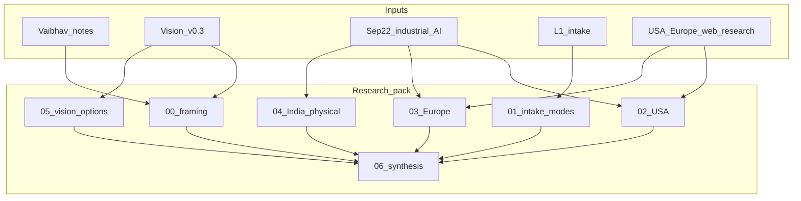
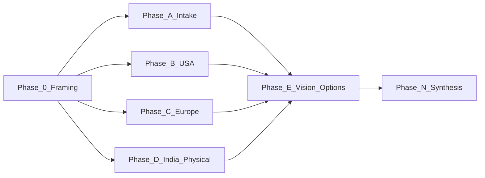

# Plant efficiency exploration — Master Execution Plan

> Nawab **project** profile (full §0–§18).  
> This is **exploration and market research**, not a product lock and not a rewrite of master architecture docs.  
> Supersedes all lite / energy-only drafts of this plan.

---

## §0 Plan metadata

| Field | Value |
|-------|-------|
| **Profile** | **project** |
| **Mode** | project (research pack) |
| **Stack** | Markdown research artifacts under `L1-L6/docs/research/` |
| **Base branch** | current working branch / `main` |
| **Feature branch** | `docs/plant-efficiency-exploration` |
| **User commit budget** | **Ask on approve** — proposed default **8** (research-pack work class; coalesce if user sets lower) |
| **Delivery** | cursor-plan → repo files under `docs/research/plant-efficiency-exploration-2026-09/` + optional copy of this plan as `IMPLEMENTATION_PLAN.md` in that folder |
| **Supersedes** | lite energy-only and lite efficiency drafts of `plant_value_from_intake` |
| **Authority / inputs (non-final)** | [Stamped_Product_Vision_v0.3.md](file:///C:/Users/vinay/Downloads/Stamped_Product_Vision_v0.3.md); [Vaibhav x Stamped Energy notes 2026-09-22](file:///C:/Users/vinay/Downloads/Meet%20with%20Vaibhav%20x%20Stamped%20Energy%20%E2%80%93%202026_09_22%2013_25%20IST%20%E2%80%93%20Notes%20by%20Gemini.md); Sep 22 industrial-AI pack (55+ companies); L1 intake contracts; IBM/arXiv as secondary |
| **Estimated commits** | **8** (must match user budget when set) |
| **Lead agent** | Orchestrate research workstreams, spawn readonly explorers, write synthesis, commit matrix rows |

**Hard constraints from user**

- Exploration only — Vision v0.3 is **one arbitrary direction**, not final.
- Not energy-bounded — company problem space = **plant / manufacturing efficiency**.
- Software-only near term; hardware later.
- Candidate core remains **data → action → evidence**; explore alternatives.
- Full master/architecture rewrite = **deferred** (listed, not executed here).

---

## §1 North star & scope boundary

### Objective

When this plan completes, Stamped has a **source-cited, multi-region exploration pack** that (a) maps software-available plant data to efficiency value modes, (b) surveys USA / Europe / India solutions extensively, (c) folds Vaibhav’s investor guidance into product-vision options, and (d) leaves open questions — without locking strategy.

### Deliverables

Research pack at `docs/research/plant-efficiency-exploration-2026-09/`:

| File | Role |
|------|------|
| `README.md` | Pack index, how to read, honesty rules, status = exploration |
| `00-framing-vaibhav-and-vision.md` | Investor call synthesis + Vision v0.3 as non-final map |
| `01-intake-and-value-modes.md` | Data we take in → efficiency outcomes (not energy-only) |
| `02-usa-deep-dive.md` | USA/NA company + solution survey (expand Sep 22 + new names) |
| `03-europe-deep-dive.md` | Europe majors + specialists + new names |
| `04-india-and-physical-ai.md` | India Energy/Process peers + BrightAI / Bright Machines / Noetive absorb-ignore |
| `05-product-vision-option-space.md` | Option matrix for product vision (single vs dual, metrics, scalable vs service) |
| `06-synthesis-and-open-questions.md` | Cross-cut gaps, what to steal, what not to build, deferred doc rewrite list |
| `PROGRESS.md` | Live status |
| `SOURCES.md` | URL index; vendor-claimed tagged |

### Non-goals

- Locking Vision v0.3 or a fundraising narrative as final
- Executing the “100 discovery calls” program (out of scope; noted as recommended next)
- Rewriting `00-stamped-master-document.md` / architecture / competitor pack in place
- Shipping product code, hardware, or DCS writeback
- Claiming Vaibhav’s shared company list before it arrives (slot reserved)

### Priority

| Priority | Items |
|----------|-------|
| **P0** | Framing (Vaibhav) · intake→modes · USA · Europe · synthesis |
| **P1** | India/physical-AI · vision option space depth · new peers beyond Sep 22 |
| **Deferred** | 100 discovery calls · Exa alumni outreach · full doc de-energy rewrite · Vaibhav company-list ingest when received |

---

## §2 Prerequisites & blockers

| Item | Status | Blocks | Resolution |
|------|--------|--------|------------|
| Sep 22 industrial-AI pack readable in repo | done | WS-B/C/D | Use as baseline; deepen, do not duplicate blindly |
| Vision v0.3 + Vaibhav notes paths | done | Phase 0 | Local Downloads paths cited |
| Vaibhav competitor / company list | **pending** | enrichment of 02/03 | Reserve “Vaibhav list” appendix; integrate when shared |
| User commit budget confirmation | pending | §9 freeze | Confirm 8 or override before commit 1 |
| Live plant claim audit | N/A | honesty | Mark Faridabad / cycle-time claims as founder-reported, not independently verified |

---

## §3 Authority & artifact map

| Document | Path | Role |
|----------|------|------|
| Vision v0.3 (exploration) | `C:\Users\vinay\Downloads\Stamped_Product_Vision_v0.3.md` | One direction — not law |
| Vaibhav meeting notes | `C:\Users\vinay\Downloads\Meet with Vaibhav x Stamped Energy – 2026_09_22 13_25 IST – Notes by Gemini.md` | Investor guidance for framing |
| Industrial AI pack | `universal-repositary/external/research/competitive/industrial-ai-global-2026-09-22/` | Baseline 55+ company dossiers |
| L1 intake | `universal-repositary/external/technical/layers/L1-connect-and-normalise.md` | Data filter |
| Architecture (pre-build) | `…/02-technical-architecture.md` | Historical Energy math — outdated as sole identity |
| This plan | Cursor plan + pack `IMPLEMENTATION_PLAN.md` | Execution contract |
| PROGRESS | pack `PROGRESS.md` | Live status |

---

## §4 Architecture & system map

Research pack structure (not product runtime):



### Target layout

```text
docs/research/plant-efficiency-exploration-2026-09/
├── README.md
├── IMPLEMENTATION_PLAN.md   # copy of approved plan
├── PROGRESS.md
├── SOURCES.md
├── 00-framing-vaibhav-and-vision.md
├── 01-intake-and-value-modes.md
├── 02-usa-deep-dive.md
├── 03-europe-deep-dive.md
├── 04-india-and-physical-ai.md
├── 05-product-vision-option-space.md
└── 06-synthesis-and-open-questions.md
```

### Trust boundaries

- No invented statistics; vendor numbers tagged **vendor-claimed**.
- Gemini meeting notes may mis-hear figures (e.g. “2.5 trillion” vs “2.5 million”) — flag and prefer transcript detail where conflicting.
- Founder pilot claims (cycle time 30–40%, Faridabad scopes) marked **founder-reported**.

---

## §5 Workstreams

| ID | Name | Owns paths | Depends on | Lead / subagent |
|----|------|------------|------------|-----------------|
| WS-0 | Framing | `00-…`, `README`, `PROGRESS` | budget confirmed | lead |
| WS-A | Intake → value modes | `01-…` | WS-0 | lead |
| WS-B | USA deep dive | `02-…` | WS-0 | explore subagent + lead |
| WS-C | Europe deep dive | `03-…` | WS-0 | explore subagent + lead |
| WS-D | India + physical AI | `04-…` | WS-0 | lead |
| WS-E | Vision option space | `05-…` | WS-0, partial B/C | lead |
| WS-N | Synthesis | `06-…`, `SOURCES.md` | A–E | lead |

### WS-0 — Framing (Vaibhav + Vision)

- **Objective:** Encode investor guidance and non-final vision as the exploration brief.
- **Must capture from Vaibhav call (2026-09-22):**
  - Team already expanded from energy ROI → **overall plant efficiency**.
  - Energy is a **small slice** of plant cost vs quality / overall efficiency (Vaibhav).
  - ~15 factory-insight competitors in active talks with auto (Honda, TVS); niche focus works.
  - BrightAI + stealth players around Adani / Johnson / Reliance class accounts.
  - Founder playbook: (1) talk to many users early — aim **100 discovery calls** India+US+Europe; (2) **detailed global competitor study** (this pack); (3) build targeted scalable product, not zombie SaaS.
  - Software automates faster than hardware; enhance workers, don’t replace them next 5 years.
  - Faridabad CNC/VMC tooling/cut optimization **founder-reported 30–40% cycle-time** cut — Vaibhav: treat as **localized service play** unless generalized into a product for **MNC / multi-site / million-dollar** problems (e.g. documentation inefficiencies).
  - Near-term: 6 pilots, Monad fellowship demo day, fundraising narrative help offered.
- **Vision v0.3:** company = manufacturing efficiency; Energy + Process hypotheses; Process = methods engineering only; outcomes + freeze; software-first. Mark **non-final**.

### WS-A — Intake and value modes

- **Objective:** Exhaustive map from L1 records (+ CNC/MTConnect Path A) to efficiency outcomes (cost, time, throughput, quality proxy, energy, intensity).
- Include incumbent replaced/improved per mode; software-only feasibility; gaps for Process-shaped data (drawings, tooling docs).

### WS-B — USA deep dive (extensive)

Baseline from Sep 22 USA annex + **mandatory expansion**. For each material peer: KPI owned, advisory vs closed-loop, HW vs SW, vs Stamped efficiency hypothesis, sources.

**Must cover (minimum):**

*Outcome / process AI:* Fero Labs, Imubit, Basetwo, Sight Machine, MachineMetrics, Guidewheel, UptimeAI, SparkCognition/Avathon, C3 AI Process Optimization  
*Analytics / decision intelligence:* Seeq (incl. Seeq Intelligence), TrendMiner (US footprint), Parsable  
*OEE / visibility / frontline:* Tulip, Factory Apps-class no-HW trackers, KAI OEE (if material)  
*PdM / process health (adjacent):* Augury, Uptake, Tractian  
*Vision quality (adjacent/out):* Landing AI, Cognex, Instrumental, Elementary  
*CNC / CAM adjacent:* CloudNC, Toolpath, Productive Machines/SenseNC  
*Foundation / majors:* Cognite, Palantir, HighByte, Litmus, Rockwell, Emerson/Aspen, Honeywell Forge, GE Vernova, Microsoft/AWS/Google industrial  
*Physical AI narrative:* Bright Machines, Noetive, BrightAI (US HQ)  
*New web finds to dossier:* Jemba, MadeOS, Green Factory AI (if US-facing), others discovered in Phase B search

**Depth bar:** not a name list — each priority peer gets problem / data in / method / buyer / payment model / Stamped implication.

### WS-C — Europe deep dive (extensive)

**Must cover (minimum):**

*Majors / copilots:* Siemens Industrial Copilot + Senseye, ABB Genix, Schneider + AVEVA (+ Cognite), Bosch ctrlX, SAP DM, Dassault  
*Outcome specialists:* Braincube (RTPO / CrossRank / Product Clones), Oden Technologies, OPTIMITIVE / OPTIBAT, Green Factory AI, Vernaio (if material)  
*Planning / agents:* Zentio (AI-native production planning), Arrakis  
*Analytics:* Seeq EU, TrendMiner, Cosmo Tech  
*Sim / eng AI:* PhysicsX, Neural Concept  
*CNC:* CloudNC, Productive Machines  
*Process mining hazard:* Celonis (IT process ≠ manufacturing PE)  
*Other:* Cumulocity, Xyte, Infinite Uptime EU expansion

Same depth bar as USA.

### WS-D — India + physical AI

Greenovative, ZeroWatt, EnergiSensEI, Infinite Uptime, Nanoprecise ECM, Lambda Function, Dashnode, Emithran, Intellithink; TVS/Honda deployment theaters as accounts not single comps.  
BrightAI / Bright Machines / Noetive: **absorb** observe→guide-action and multi-KPI efficiency; **ignore** hardware toolkit for near term.

### WS-E — Product vision option space

Produce options (not a pick):

| Option | Sketch | Tension with Vaibhav |
|--------|--------|----------------------|
| A | Energy-only (legacy docs) | Rejected by team + Vaibhav cost-slice point |
| B | Single “plant efficiency” product, data→action | Matches efficiency frame; risk of unfocused zombie SaaS |
| C | Vision v0.3 dual: Energy + Process (methods) | Clear champions; Process needs new data paths; risk of two GTMs too early |
| D | Efficiency wedge now (software prescribe) → Process beachhead later | Aligns with software-first + scalable product advice |
| E | Documentation / methods orchestration for MNCs | Vaibhav’s “million-dollar multi-site” hint; needs validation |

Score options on: scalable vs service, India SMB vs MNC, software-only fit, proof metric, discovery-call questions.

---

## §6 Agent orchestration & subagent spawn map

| ID | Trigger | Type | readonly | Task | Sync point | Gate |
|----|---------|------|----------|------|------------|------|
| S1 | After Phase 0 | explore | true | USA peer expansion beyond Sep 22; return company table + URLs | Before commit 3 | — |
| S2 | After Phase 0 | explore | true | Europe peer expansion; Braincube/Oden/Zentio/OPTIMITIVE/Green Factory depth | Before commit 4 | — |
| S3 | Optional mid | explore | true | Net-new software-only efficiency startups 2025–26 (global) | Before Phase N | — |

### Spawn S1 — USA expansion

```text
Full Repository Path: d:\Startups\Stamped_Energy\L1-L6
Workstream: WS-B
Task: Expand USA/NA industrial AI for manufacturing efficiency (not energy-only). Start from industrial-ai-global-2026-09-22 USA annex. Add Guidewheel, Jemba, MadeOS, Green Factory AI, KAI OEE, Factory Apps-class, and any material 2025-26 peers. For each: KPI, HW vs SW, advisory vs closed-loop, buyer, URL, Stamped implication for software-only plant efficiency.
Authority: Sep 22 pack; no invented stats; vendor-claimed tagged.
Return: markdown table + short dossier bullets.
Do NOT: edit files; do not research vibration PdM as a recommended Stamped pillar.
```

### Spawn S2 — Europe expansion

```text
Same constraints as S1 for Europe: Siemens/ABB/Schneider copilots, Braincube, Oden, Zentio, OPTIMITIVE, Arrakis, PhysicsX, Green Factory AI, Vernaio if material.
Return: markdown table + dossier bullets.
Do NOT: edit files; do not equate Celonis IT process mining with manufacturing process engineering.
```

**Parallel limit:** 2 (S1 ∥ S2)  
**File ownership:** lead writes all pack files; subagents return text only

---

## §7 Phase map & dependencies



| Phase | Objective | Workstreams | Commits | Depends on | Exit gate |
|-------|-----------|-------------|---------|------------|-----------|
| 0 | Scaffold + Vaibhav/vision framing | WS-0 | 1–2 | budget | README + 00 exist; status=exploration |
| A | Intake → value modes | WS-A | 3 | 0 | 01 complete with mode×incumbent table |
| B | USA deep dive | WS-B + S1 | 4 | 0 | ≥25 named USA/NA entities with implications |
| C | Europe deep dive | WS-C + S2 | 5 | 0 | ≥20 named EU entities with implications |
| D | India + physical AI | WS-D | 6 | 0 | BrightAI absorb/ignore explicit |
| E | Vision option space | WS-E | 7 | A + partial B/C | Options A–E scored; no lock |
| N | Synthesis + sources | WS-N | 8 | A–E | 06 + SOURCES; deferred rewrite list |

---

## §8 Todo registry

```yaml
todos:
  - id: phase-0-framing
    content: "Phase 0: research pack scaffold + Vaibhav/vision framing + PROGRESS"
    status: pending
  - id: ws-a-intake
    content: "WS-A: intake taxonomy and efficiency value-mode matrix"
    status: pending
  - id: ws-b-usa
    content: "WS-B: USA deep dive (expand Sep 22 pack + new peers)"
    status: pending
  - id: ws-c-europe
    content: "WS-C: Europe deep dive (majors + specialists + new peers)"
    status: pending
  - id: ws-d-india-hw
    content: "WS-D: India peers + BrightAI/physical-AI absorb-ignore"
    status: pending
  - id: ws-e-vision
    content: "WS-E: product-vision option space from Vaibhav + v0.3 + research"
    status: pending
  - id: phase-n-synthesis
    content: "Phase N: master synthesis, gaps, deferred doc rewrite list, validate links"
    status: pending
```

---

## §9 Commit matrix

**User commit budget (proposed):** **8** — confirm or override before commit 1.

| # | WS | Commit | Contents | Gate | Agent |
|---|-----|--------|----------|------|-------|
| 1 | 0 | `docs: scaffold plant-efficiency exploration pack` | folder, README, PROGRESS, IMPLEMENTATION_PLAN copy | paths exist | lead |
| 2 | 0 | `docs: frame exploration from Vaibhav call and vision v0.3` | `00-framing-…` | Vaibhav bullets + non-final v0.3 | lead |
| 3 | A | `docs: map intake to plant efficiency value modes` | `01-intake-…` | mode×data×incumbent table | lead |
| 4 | B | `docs: USA industrial efficiency AI deep dive` | `02-usa-…` | ≥25 entities; S1 merged | lead (+S1) |
| 5 | C | `docs: Europe industrial efficiency AI deep dive` | `03-europe-…` | ≥20 entities; S2 merged | lead (+S2) |
| 6 | D | `docs: India peers and physical-AI absorb-ignore` | `04-india-…` | BrightAI/BM explicit | lead |
| 7 | E | `docs: product vision option space exploration` | `05-vision-…` | options scored, none locked | lead |
| 8 | N | `docs: synthesize plant-efficiency exploration` | `06-synthesis-…`, `SOURCES.md` | open Qs + deferred rewrite list | lead |

If user sets budget **6:** coalesce 1+2, and 6+7.  
If user sets **10+:** add Vaibhav-list ingest commit + discovery-call script outline (still no 100 calls).

---

## §10 Test & CI strategy

| Tier | Purpose | Trigger | Command |
|------|---------|---------|---------|
| Fast | Link/path existence | each commit | PowerShell: test pack files exist; README lists all |
| Medium | Honesty scan | Phase N | Manual: no untagged vendor %; status=exploration in headers |
| Slow | N/A — no runtime | — | N/A — research pack |

**CI:** N/A — documentation research; no app CI required.

---

## §11 Research log & decisions

| Topic | Options | Choice | Source | Record in |
|-------|---------|--------|--------|-----------|
| Energy-only identity | Keep / drop for exploration | **Drop as sole frame** | Vaibhav + team GTM | 00, 05 |
| Vision v0.3 | Lock / explore | **Explore only** | User | 00, 05 |
| Hardware | Now / later | **Later** | User | 04, 06 |
| Core hypothesis | Data→action / other | **Primary candidate**; others explored | User | 01, 05 |
| USA/EU depth | Lite list / extensive dossiers | **Extensive** | User | 02, 03 |
| Product lock | Yes / no | **No** this plan | User | 06 |

---

## §12 Documentation & artifact sync

| Event | Update |
|-------|--------|
| Plan approved | Copy to pack `IMPLEMENTATION_PLAN.md` |
| Each phase | `PROGRESS.md` |
| Phase N done | Point leadership to `06-synthesis-…` |
| Later (out of scope) | Master/architecture/competitor de-energy rewrite using deferred list |

---

## §13 Quality gates & checkpoints

| Gate | When | Checklist | Blocks |
|------|------|-----------|--------|
| Framing done | end Phase 0 | Vaibhav cost-slice + 100-calls + scalable-vs-service captured | A–E parallel OK after |
| Regional depth | end B/C | Min entity counts met; sources cited | Phase E quality |
| No lock | end E | Options table; “not decided” banner | Phase N |
| Pack complete | end N | All files + SOURCES; deferred rewrite list | — |

### Human checkpoints

- [ ] Confirm commit budget (default 8)
- [ ] When Vaibhav sends company list — schedule ingest (extra commit or amend Phase N)
- [ ] Approve whether discovery-call program becomes a separate plan

---

## §14 Validation & hardening

1. Every company claim has URL or `Not disclosed` / `vendor-claimed` / `founder-reported`.
2. Gemini note figure conflicts flagged.
3. Celonis / supply-chain / labour explicitly excluded from Process-shaped options.
4. Energy peers demoted from “the category” to “one lever.”
5. Software-only path never silently assumes BrightAI hardware.

**Orchestrator:** `docs/research/plant-efficiency-exploration-2026-09/PROGRESS.md` checklist = green.

---

## §15 Cutover / rollout

N/A for product cutover.  
**Research cutover:** share `06-synthesis` + `05-vision-options` with founders; optionally with Vaibhav at next biweekly.  
**Explicit non-cutover:** do not update public website or master product docs until a separate decision plan.

---

## §16 Exit criteria

### P0

- [ ] Pack exists with all 00–06 files + README + SOURCES + PROGRESS
- [ ] Vaibhav guidance encoded (efficiency > energy slice; discovery; competitor study; scalable product; software > hardware)
- [ ] Vision v0.3 treated as non-final
- [ ] USA ≥25 and Europe ≥20 named entities with Stamped implications
- [ ] Intake→efficiency modes with incumbents
- [ ] Vision options A–E scored without locking
- [ ] Deferred doc-rewrite list written

### P1

- [ ] New peers beyond Sep 22 pack included (Jemba, MadeOS, Green Factory, Zentio, OPTIMITIVE, etc.)
- [ ] Slot ready for Vaibhav company list

---

## §17 Risks & rollback

| Risk | Mitigation |
|------|------------|
| Exploration turns into accidental product lock | Banners on every file; options not recommendations |
| Under-sampling USA/EU | S1/S2 + min entity counts |
| Service-play CNC story over-generalized | Vaibhav critique explicit in 00 and 05 |
| Waiting on Vaibhav list blocks pack | Ship without; appendix “pending list” |
| Scope explosion into 100 calls | Keep calls as recommended next plan |

**Rollback:** delete feature branch / revert 8 doc commits; no runtime impact.

---

## §18 Execution protocol

```text
1. Confirm commit budget
2. Ponytail on every edit
3. Phase 0 → spawn S1∥S2 → Phases A–E per §9 → Phase N
4. Update PROGRESS each phase
5. Do not rewrite master/architecture in this plan
6. Stop at exploration pack; hand vision decision to a later plan
```

---

## §19 graph-engineering

N/A — graph-engineering not requested.

---

## Open questions

- Confirm **commit budget** (propose 8).
- Prefer company brand language in pack: “Stamped” vs “Stamped Energy” during exploration?
- When Vaibhav’s company list arrives, ingest in same pack or new commit?
- After pack: separate plan for **100 discovery calls**?

## Approval

**Profile:** project (full nawab). Approve to begin Phase 0 after commit-budget confirmation.
