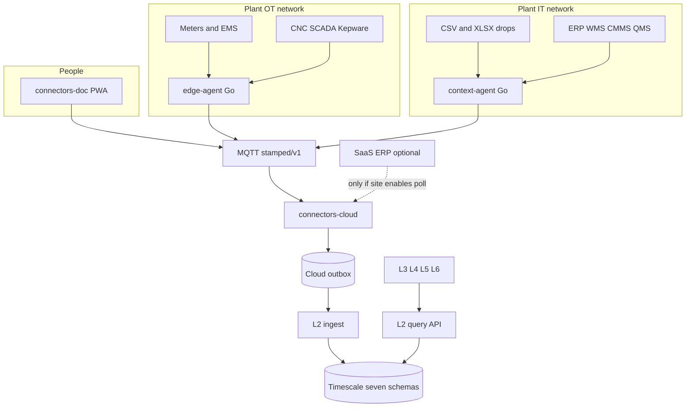

# L1–L2 data plane

How plant systems become closed records in one TimescaleDB, and how later layers read them only over HTTP.

**Authority:** ADR-031 · founder vision `09` · coarse architecture `14`  
**Proof:** [R1_BOOT.md](../../docs/plans/l1-l2-context-records/planning/R1_BOOT.md) · [T1_TRIALS.md](../../docs/plans/l1-l2-context-records/planning/T1_TRIALS.md) (workspace)

> Paths above resolve from the workspace `docs/plans/` tree; in the contract repo alone, see the consumer READMEs that link here.

## What you can do

- Configure meters, CNC/SCADA, EMS exports, DISCOM bills, and ERP/WMS/CMMS/QMS/shift sheets into a fixed set of records.
- Keep collecting while the WAN is down (agent SQLite ~72h, then MQTT QoS 1).
- Refuse bad payloads before they become facts (schema DLQ; bills still need the rupee gate; unmapped tags/columns do not become zeros).
- Store once in L2 with RLS. L3–L6 call query HTTP only — never `L2_DATABASE_URL`.
- Prove a Bhatia-shaped site with files when the live ERP is unknown.

What this does **not** do: write to PLC/CNC/ERP/QMS/CMMS; become those systems; invent `asset_id` or timestamps.

## Pieces and how they connect



`edge-agent` and `context-agent` are two commands in `connectors-edge/packages/edge-agent`. They share buffer and MQTT uplink. They do not share a network: OT never holds ERP credentials; IT never polls Modbus.

## Protocols by program

**edge-agent (OT):** Modbus TCP/RTU, plant MQTT / Sparkplug B, OPC UA, MTConnect (sim-first), BACnet/IP (sim-first), DLMS (sim-first), EMS file watch, single-number REST poller, historian SQL (sqlite driver today). No FOCAS / native S7 / EtherNet/IP — reach those via OPC UA, Modbus, Kepware, or plant CSV.

**context-agent (IT):** CSV/XLSX file drops, HTTPS REST/OData, read-only SQL (`SELECT` + watermark only).

**connectors-doc:** human upload → review → MQTT. No subscribe. No L2 open.

**connectors-cloud:** MQTT subscribe + HTTP backfill (`POST /v1/context` wrapper). Schema validate → dedupe → outbox → L2. SaaS REST poller exists but **`CONTEXT_POLL_ENABLED` defaults off**; empty poll list polls nothing.

## How to load a source

1. Pick a pack under `profiles/systems/` (or bill profile).
2. Add an instance to site config: pack id + folder / base URL / DSN reference. Secrets are `secret_ref` names only.
3. Override columns where the plant export differs. Resolve machine names via `asset_aliases`.
4. Start `edge-agent` or `context-agent`. Restart for new ERP instances.

## What happens to one row

Pack maps fields → timezone (default Asia/Kolkata) → UTC; lakh grouping; asset alias. Unresolved → `unmapped_tag` event. Context change-detection uses last-hash in SQLite; `asset_state` also heartbeats every 60s. Buffer → MQTT → cloud validate → outbox → L2 inbox (201 new / 200 duplicate) → `route_record`.

Context dedupe is `sha256(org|plant|record_type|business_id|observed_at)` (see `TOPICS.md`). Latest reads order by `observed_at`.

## How L2 stores it

One TimescaleDB, seven schemas:

| Shape | Types |
| --- | --- |
| Dense hypertable | `measurement` |
| On-change + heartbeat hypertable | `asset_state` |
| Insert-on-change tables | `process_batch`, `flow_position`, `maintenance_context`, `quality_status`, `material_availability`, `shift_roster`, `operating_rate` |
| Existing | `event`, `production_record`, `production_order`, `bill_line` |
| Registry (GET only) | `plant_constraint` |

## What each record is for

- Energy: measurement, bill_line, tariff, asset_state  
- Cost: + operating_rate (calculator still owns rupees)  
- Time: asset_state, production_record, production_order  
- Continuity: process_batch, flow_position  
- Exception: event, maintenance_context, quality_status, material_availability  

## L4 tool catalog

Allowlisted in `contracts/tools/l2-query-tools.json`, served at `GET /v1/agent-tools`. No SQL, no `org_id` argument, no `graph/traverse`. Org comes from `X-Org-Id` on the service credential.

## Boot (proven)

```text
cd "D:\Startups\Stamped_Energy\L1-L6\Connector - L1\connectors-edge"; uv run --python 3.12 --with requests --with psycopg[binary] python scripts/e2e_context_l2.py --workspace "D:\Startups\Stamped_Energy\L1-L6" --report "D:\Startups\Stamped_Energy\L1-L6\docs\plans\l1-l2-context-records\planning\R1_BOOT.md"
```

R1 row counts (Bhatia fixtures): measurement 9, asset_state 1, production_order 1, production_record 1, process_batch 1, shift_roster 1, bill_line 1.

## Trials

T1 ran 22/22 PASS against that stack (happy path, fail-closed unmapped paths, auth/tenant, tool catalog, A→B→A / late older, replay, WAN and L2-down drain, heartbeat, IST/lakh, SQL write reject, poller off/on, bill gates, lost last-hash).

## Honest holes

- Live ERP credentials not exercised; file packs are the floor.
- DLMS / BACnet / MTConnect remain sim-first in the field path.
- Flat CSV `asset_state` / `shift_roster` without full schema objects still need the e2e `*.publish.json` wrappers (noted in R1).
- Two changes inside one poll interval can collapse to one context publish; a wiped last-hash may resend one extra history row per business id.
