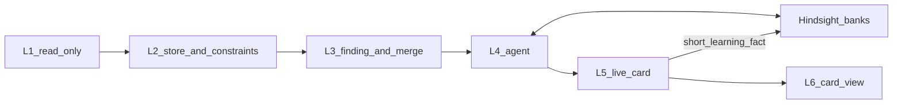

# Stamped — Product & Technical Architecture (SSOT)

*Status: current · 2026-09-24*  
*Authority:* product framing is [ADR-030](../decisions/028-032/ADR-030-five-domain-decision-loop.md) and [`research/plant-efficiency-exploration-2026-09/09-stamped-founder-vision.md`](../research/plant-efficiency-exploration-2026-09/09-stamped-founder-vision.md).  
*Coarse evolution (how the stack changes):* [`14-coarse-architecture.md`](../research/plant-efficiency-exploration-2026-09/14-coarse-architecture.md).  
*As-built hops and invariants:* [`13-as-built-invariants.md`](../research/plant-efficiency-exploration-2026-09/13-as-built-invariants.md).

This file is the **overall** product + technical architecture. It does not replace layer-repo deep-dives. Per-layer specs under [`layers/`](layers/) and handoffs under [`../handoff/`](../handoff/) will be updated in a later pass; until then, prefer this file and `14` over older L4 “compiler-only” wording in those deep-dives.

> Honesty: `[~]` approximate · `[!]` evolving — verify before customer-facing claims. Do not invent savings, customers, or revenue.

---

## 1. What Stamped is

**Stamped** helps plant teams **choose, assign, and verify** the next operating action across **energy, cost, time / throughput, continuity / flow, and short-horizon exceptions**.

One meaningful condition → **one decision card** → **one owner** → honest closure. Energy is the entry wedge, not the product name and not the category. Recommend and assign by default. Hard stops in ADR-030 and vision `09` stay absolute.

| Dimension | Definition |
| --- | --- |
| **Category** | Closed operational decision loop (not EMS / monitoring-only / OpEx suite) |
| **Buyer outcome** | A named next action with owner and evidence that closes — across five domains |
| **Client enemy** | Insight without closure — dashboards that never become assigned, verified actions |
| **Integration** | Read / ingest default; write-back human-confirmed, narrow, allow-listed |
| **Operating loop** | detect → recommend → assign → act → verify (optional propose learning) |
| **Proof** | Evidence labeled Measured / Confirmed / Modeled / Unknown; domain sections separate; calculator owns money |

### Five domains on one card

```text
One product — Stamped
 ├── Energy · Cost · Time/throughput · Continuity/flow · Exception response
 ├── One primary domain section per card; optional secondary sections; one owner
 └── Stack L1→L6 topology stays (ADR-008); claim is the closed action
```

| Say | Do not say |
| --- | --- |
| Stamped | Product name with Energy appended |
| Five-domain decision loop | Withdrawn dual-pillar framing |
| Energy as entry wedge | Energy-only company |
| Choose / assign / verify | Dashboard-only / runs the plant |
| Read ERP/MES context | We replace MES / APS / ERP |

**30-second pitch:** Put the next operating action in front of one named owner. Close it with honest evidence. Start where energy data opens the door; expand when a non-energy decision closes the same way.

External marketing is archived under [`archive/external-marketing-2026-09/`](../archive/external-marketing-2026-09/). Agents do not take identity from that folder.

---

## 2. Named outcome domains

| Domain | Owns | Does not own |
| --- | --- | --- |
| **Energy** | When/how loads run; avoidable use / intensity where data supports | Retail energy, bill-audit firm, meter hardware, critical remote control |
| **Cost** | Visible operating-cost levers | Plant ledger / FP&A |
| **Time / throughput** | Machine-minutes, dwell, constraint-cell next choice | Full plant schedule publish |
| **Continuity / flow** | One handoff / batch / queue decision | New dispatch list / month-ahead plan |
| **Exception response** | Next choice after stop / slip under visible constraints | APS / MRP replacement; quality hold release |

On the card these are **sections**, not five queues. Each section that applies has its own claim, evidence tier, and effect. Sections are never summed into one headline savings number.

---

## 3. Operating loop

| Step | Name | What happens |
| --- | --- | --- |
| 1 | Ingest | Meters, machine state, production, maintenance context, calendars, structured human input |
| 2 | Normalize | Join enough to name one condition (condition key) |
| 3 | Detect | ML models / methods / rules → Finding with verification plan |
| 4 | Recommend | L4 agent: cross-section check, options, constraints, uncertainty, one owner role |
| 5 | Assign | L5 resolves role → person on shift |
| 6 | Record | Accept / edit / reject / defer + reason |
| 7 | Verify | Named evidence; honest closure state |
| 8 | Propose learning | Short learning fact into plant memory; named-owner gate for production rule changes |

---

## 4. L0–L6 stack (overall)

Topology is unchanged. Jobs inside L4–L6 are the evolution.

```text
L0  Plant systems (customer-owned)
L1  Connect & normalise          → read-only connectors (edge / cloud / bill)
L2  Universal store              → only layer with the DB; constraints + roster + condition context
L3  Intelligence core            → Findings (detect); lab never becomes operator work
L4  Agent & memory               → card proposal; plant bank + dialogue banks; never executes
L5  Closure & action             → live card, verify, autonomy policy (default off)
L6  Experience                   → one card queue, constraint UI, Ask (view over L4)
```



| Layer | Overall job | Must not |
| --- | --- | --- |
| **L1** | Read plant and document signals; add connectors only when a decision family needs them | OT write; plant message-broker of record |
| **L2** | Canonical store; constraint registry; shift owner resolution; condition key | Give L3–L6 a database URL; become a plant-wide industrial graph |
| **L3** | Detect conditions; emit Findings; merge same condition_key; verification plan on each Finding | Open L2 SQL; promote Lab to L4; invent ₹ |
| **L4** | Long-lived agent: memory, cross-section check, card proposal, emit / withhold / abstain | Assign the final person; notify; execute; write equipment or master data |
| **L5** | Own the live card; resolve person; verify; close; run only certified+enabled autonomy classes | Draft options; invent recommendations; override a withhold |
| **L6** | Decision product UI: Now queue, card, close, autonomy settings, constraints, Ask | Hold bank keys in the browser; five inboxes; summed ₹ headline |

**Layer-per-repo** communicates only through versioned contracts in this pack ([ADR-008](../decisions/006-010/ADR-008-layer-repo-topology-and-interfaces.md)).

Spine invariants that must stay true until an explicit contract bump: only L2 opens Timescale; Lab never promotes (`emitted` + `delivery=l4` only); money cites tariff or tagged fallback; customer UI hides withhold/abstain; ops-confirmed ≠ bill-verified. Detail: [`13-as-built-invariants.md`](../research/plant-efficiency-exploration-2026-09/13-as-built-invariants.md).

---

## 5. Two objects: proposal vs live card

| Object | Owner | Nature |
| --- | --- | --- |
| **Card proposal** | L4 | Immutable. Domain sections, one recommended action, ≤2 alternatives (including “no action”), proposed owner role, autonomy class or human-only, uncertainty, verification plan (may only narrow the Finding’s plan), compile trace id. |
| **Live card** | L5 | Mutable. Person, eight closure states, history, same domain sections, whether a human or an enabled class ran it. |

Prescription **1.0.0** remains as a schema. The card proposal is a **new schema beside it**; L5 dual-reads until 1.0.0 is retired. One product — not two customer SKUs. Field list: [`15-contract-deltas.md`](../research/plant-efficiency-exploration-2026-09/15-contract-deltas.md).

Closure states (minimum): Open; Assigned; In progress; Closed — verified; Closed — no change; Rejected; Deferred / expired; Blocked / disputed. Closed ≠ successful.

---

## 6. L4 agent (overall, not implementation)

L4 is a **complete overhaul** of the old prescription compiler. The shell that stays is emit / withhold / abstain, a trace on every run, a constraint gate, calculator-owned ₹, and no equipment or master-data write.

**Memory — [Hindsight](https://hindsight.vectorize.io/)**

| Bank | Scope | Holds | Does not hold |
| --- | --- | --- | --- |
| Plant bank | One per plant | World facts; short learning facts from closes / withholds | Full card body; chat transcripts |
| Dialogue bank | One per conversation | That thread (stable document id) | Other threads; plant operating knowledge |

Banks are hard walls. Ask merges plant + dialogue reads in L4; Hindsight has no cross-bank query. Hosting (cloud vs self-host) is an L4-repo decision.

Self-improvement is **observation consolidation** from short learning facts (family, asset, sections, disposition / withhold reason, constraint hit, evidence tier) — not storing the whole card. An ineligible close may teach that evidence was missing; it must not teach that the action worked. Production thresholds / mental models change only with named-owner acceptance.

**Cross-section check.** Before emit, L4 checks upstream feed, downstream block, shared utilities, shift, and open cards on related assets. A locally attractive action that starves another cell is withheld or ships with the conflict visible. Specialist passes reconcile into **one** card.

**Tools.** Allowlisted typed reads: L2 query HTTP, constraint registry, open cards, Hindsight recall / reflect. No raw SQL, no open web as authority, no OT write.

**Owner routing.** Configured roles only: production task → production head; operational task → ops head. L4’s language model chooses the role; L5 resolves the person on shift. That choice is a closed **decision seam** (later replaceable by a decision model such as [Jev](https://jevtypesafeai.com/jev-ai) without changing the card). Seams are reserved; this architecture does not require Jev to be wired yet.

**Ask.** L6 paints the thread; L4 holds the session. Ask does not emit cards, change autonomy, or issue a second prescription. Chat enters the plant bank only via explicit promotion after confirm or verified closure.

---

## 7. L5 action and autonomy

L5 is the case layer: open card, resolve person, accept / edit / reject / defer, notify when destination is clear, verify against L2, close honestly, emit the short learning fact.

**Autonomy default: no actions.** A class runs only after **Stamped certifies** it and a **named plant owner enables** it. First catalog classes (from vision `09`): suppress duplicate notification; open a review task. A plant may propose another class; it stays pending until certified as reversible, low-risk, audited, watched, rollback-ready, and not a hard stop. Idle-load and equipment actions are **not** in the catalog.

Hard stops that never become autonomy classes: automatic safety / remote critical-equipment command; quality hold release; maintenance authorization; silent change to customer priority, promise date, routing, master data, or full dispatch; recommendation that outranks a known plant constraint.

**Constraints.** Named plant owner authors rows in L6; L2 stores them; L4’s constraint gate withholds on conflict regardless of predicted benefit.

---

## 8. L6 experience (overall)

Home is the **next action**, not a dashboard.

| Surface | Job |
| --- | --- |
| **Now** | One queue, one owner, due / review, primary domain, honest state |
| **Card** | Condition, cross-section checks, recommended action + alternatives, domain sections, constraints, uncertainty, accept / edit / reject / defer |
| **Close** | Verified / no-change / rejected / deferred / blocked in the same place as open work |
| **Autonomy** | Default “no autonomous actions”; certified classes off until enabled; stop / revert / dispute on in-flight autonomous work |
| **Constraints** | Author / expire / review plant constraints |
| **Evidence** | Live vs Preview honesty; signals as proof behind a card |
| **Ask** | Secondary conversational view over L4 memory |

Compiler / Hindsight internals stay off the customer card.

---

## 9. Pilot 1 and admission rule

**Pilot 1:** confirmed machine idle with extra loads still on. Operational task → ops head. Primary section energy; machine-minutes (if any) as a separate time section. Autonomy off. Verification follows **IPMVP retrofit isolation** on the named auxiliary circuit: Option B (load + idle interval measured) may close as verified; Option A keeps estimated parameters Modeled; whole-facility meter is the wrong boundary. Detail: [`16-pilot-and-hard-stops.md`](../research/plant-efficiency-exploration-2026-09/16-pilot-and-hard-stops.md).

**Next family** (alarm dwell, then handoff or exception) only with a named owner role, verification source already in L2, reviewed constraint, and reusable template. New L1 connectors follow that manifest — not an “ingest everything” program.

What we will not build: [`17-do-not-build.md`](../research/plant-efficiency-exploration-2026-09/17-do-not-build.md). Layer-repo sequence: [`18-propagation.md`](../research/plant-efficiency-exploration-2026-09/18-propagation.md).

---

## 10. How value is engineered

Value is **not** one model score and **not** a fixed savings-% identity claim.

> Closed decision cards × honest closure (including rejection and no-change) × evidence that matches its tier.

Architecture must (a) detect conditions across domains, (b) assign one owner, (c) verify with labeled evidence, (d) learn from eligible closures without inventing success.

---

## 11. Technology defaults (cost-first for the spine; agent compute is not the constraint)

| Concern | Default | Upgrade when |
| --- | --- | --- |
| TSDB | TimescaleDB on Postgres | Scale / retention pressure |
| Messaging | Mosquitto MQTT (L1) · Postgres outbox | Need Redpanda-class bus |
| Runtime shape | Modular monoliths per layer repo | Clear satellite boundaries |
| Deploy modes | `local`, `local-dashboard`, `cloud` ([ADR-010](../decisions/006-010/ADR-010-deployment-profiles-and-portability.md)) | Same contracts in all modes |
| Edge | Go agent; no OT write on the default path | Plant-accepted earned path only inside hard stops |
| L4 memory | Hindsight plant + dialogue banks | Hosting chosen in L4 repo |
| Decision seams | Language model today; closed answer sets | Optional decision-model (e.g. Jev) later at those seams only |

India compliance by design: CERT-In residency, DPDP — [`../compliance/`](../compliance/).

---

## 12. Anti-confusion

| Concern | Stamped is | Stamped is not |
| --- | --- | --- |
| Energy | Entry wedge + one domain section | Energy-only product / EMS dashboard |
| Time / flow / exception | Sections on the same card | APS / logistics SKU / plant OS |
| Equipment / maintenance | May escalate with evidence | Full CMMS / vibration PdM company |
| MES / ERP | Read context | Dispatch / WIP / scheduling SoR |
| L4 agent | Latest-tech for recommend + memory + learn | The company; silent plant control |
| Autonomy | Certified class, default off | Progressive equipment autonomy |
| Memory | Plant bank + per-conversation dialogue banks | Chat as system of record |

---

## 13. Reading map (agents)

| Priority | Doc |
| --- | --- |
| 1 | [`AGENT-START.md`](../research/plant-efficiency-exploration-2026-09/AGENT-START.md) → [`09`](../research/plant-efficiency-exploration-2026-09/09-stamped-founder-vision.md) → [`10`](../research/plant-efficiency-exploration-2026-09/10-stamped-vision-agent-alignment.md) |
| 2 | [ADR-030](../decisions/028-032/ADR-030-five-domain-decision-loop.md) |
| 3 | **This file** (overall stack) |
| 4 | [`14-coarse-architecture.md`](../research/plant-efficiency-exploration-2026-09/14-coarse-architecture.md) and [`15`](../research/plant-efficiency-exploration-2026-09/15-contract-deltas.md)–[`18`](../research/plant-efficiency-exploration-2026-09/18-propagation.md) |
| 5 | [handoff/README.md](../handoff/README.md) → your layer (update when layer deep-dives catch up) |
| 6 | [`contracts/`](../contracts/) + `scripts/contracts/contract-check.sh` |
| 7 | Layer specs under [`layers/`](layers/) — prefer this file + `14` if they still describe L4 as compiler-only |
| Legacy names | Thin pointers in [`pointers/`](pointers/) redirect here |

Prior product snapshot: tag `v2026.09.24`. Marketing archive is not identity.
