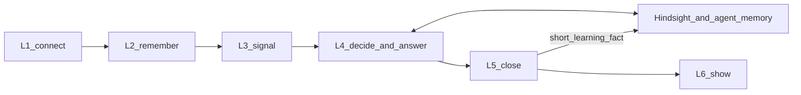

# Stamped — Product & Technical Architecture (SSOT)

*Status: current · 2026-09-26*  
*Company policy (wins on identity):* [`Stamped_Master_Document.md`](../Stamped_Master_Document.md).  
*Supporting history:* [ADR-030](../decisions/028-032/ADR-030-five-domain-decision-loop.md) (amended — five-domain list superseded by four outcomes), vision [`09`](../research/plant-efficiency-exploration-2026-09/09-stamped-founder-vision.md) / [`10`](../research/plant-efficiency-exploration-2026-09/10-stamped-vision-agent-alignment.md).  
*L3 architecture:* [`l3/`](l3/) · Finding dual-lane · engine catalog.  
*L4 architecture:* [`l4/`](l4/) · ADRs [033](../decisions/033-039/ADR-033-l4-decision-runtime.md)–[040](../decisions/040-044/ADR-040-l4-production-hardness.md).  
*Layer pages:* [`layers/`](layers/).  
*Coarse evolution:* [`14-coarse-architecture.md`](../research/plant-efficiency-exploration-2026-09/14-coarse-architecture.md).  
*As-built hops and invariants:* [`13-as-built-invariants.md`](../research/plant-efficiency-exploration-2026-09/13-as-built-invariants.md).

This file is the **overall** product + technical architecture. Per-layer detail lives under [`layers/`](layers/); deep L3 under [`l3/`](l3/); deep L4 under [`l4/`](l4/). Prefer those over archived specs under [`archive/cleanup-2026-09/technical/`](../archive/cleanup-2026-09/technical/) and over older “compiler-only” L4 wording in handoffs.

Status labels used in layer pages: **as-built** (code on a consumer repo’s main) · **contract** (schema or ADR) · **direction** (not built). Do not invent detectors, stages, savings, customers, or revenue.

> Honesty: `[~]` approximate · `[!]` evolving — verify before customer-facing claims.

---

## 1. What Stamped is

**Stamped** helps a plant team **choose, assign, and verify** the next operating action across **quality and yield, energy and waste, uptime, and dynamic scheduling** — so the plant improves from a decision, not from another dashboard.

One meaningful condition → **one decision card** → **one owner** → honest closure. Energy and waste is one outcome and a practical entry; it is not the company name and not the category. Recommend and assign by default. Hard stops in the master document stay absolute.

### Tech and innovation bar

The company is the closed decision loop. **L3 and L4 are the core:** L3 turns plant volume into evidence; L4 is the agentic brain that investigates, decides, and answers. Compute cost is not a reason to under-build either. Hard stops still bind what the system may *do* to the plant; they do not cap how ambitious the intelligence inside L3 and L4 may be.

We study state-of-the-art agentic systems (planning, tools, memory, evaluation, selective control) and first-class detection / ML methods, then adopt what raises the quality of the card — without becoming a plant OS or silent controller.

| Dimension | Definition |
| --- | --- |
| **Category** | Closed operational decision loop (not EMS / monitoring-only / OpEx suite) |
| **Buyer outcome** | A named next action with owner and evidence that closes — across four outcomes |
| **Client enemy** | Insight without closure — dashboards that never become assigned, verified actions |
| **Integration** | Read / ingest default; write-back human-confirmed, narrow, allow-listed |
| **Operating loop** | detect → recommend → assign → act → verify (optional propose learning) |
| **Proof** | Evidence labeled Measured / Confirmed / Modeled / Unknown; primary outcome + effect tags; calculator owns money |

### Four outcomes, one card

```text
One product — Stamped
 ├── Outcomes: Quality and yield · Energy and waste · Uptime · Dynamic scheduling
 ├── One primary outcome per card; optional effect tags (cost, flow, time); one owner
 └── Stack L1→L6 topology stays (ADR-008); claim is the closed action
```

| Say | Do not say |
| --- | --- |
| Stamped | Product name with Energy appended |
| Four outcomes on one card | Five-domain list as live identity; withdrawn dual-pillar framing |
| Energy and waste as entry | Energy-only company; verified savings on the DISCOM bill as identity |
| Choose / assign / verify | Dashboard-only / runs the plant / plant OS |
| Read ERP/MES/APS/QMS/CMMS context | We replace those systems |

**30-second pitch:** Put the next operating action in front of one named owner. Close it with honest evidence. Start where energy and waste opens the door when useful; expand when quality, uptime, or a near-term sequence closes the same way.

External marketing is archived under [`archive/external-marketing-2026-09/`](../archive/external-marketing-2026-09/). Agents do not take identity from that folder.

---

## 2. Named outcomes (and effects)

Every meaningful condition creates **one decision card**. It carries one primary outcome and optional effect tags. Ownership is singular until explicitly reassigned. Effects are never stacked into one invented savings number.

| Outcome | Owns | Does not own |
| --- | --- | --- |
| **Quality and yield** | Drift before defect; a correction a person accepts (process / parameter) with check evidence | Quality hold release, conformance sign-off, process acceptance |
| **Energy and waste** | Energy and material waste against good output; the state or condition that drove it | Retail energy firm, meter hardware, critical remote control, DISCOM bill as product identity |
| **Uptime** | Stops, micro-stops, slow running; next action from plant procedures, then a check | Maintenance authorization or lockout bypass |
| **Dynamic scheduling** | Constraint-aware sequence for the next few hours or one shift when the plan breaks | Silent publish of full dispatch, MRP rewrite, promise-date / priority / routing / master-data change; APS replacement |

**Effects on the card (not outcomes of their own):** cost, continuity / flow, and time. A quality drift can be money and lost throughput; a schedule change can be energy and flow. Those stay on the same card.

**Category modules (direction).** Shared core = same loop, four outcomes, L1–L6. Modules specialize evidence and decisions by plant type. First worked example: precision manufacturing / CNC (including tool-life as a quality-and-yield family). Modules extend the core; they do not replace it.

---

## 3. Operating loop

| Step | Name | What happens |
| --- | --- | --- |
| 1 | Ingest | Meters, machine state, quality and production records, maintenance context, calendars, structured human input |
| 2 | Normalize | Join enough to name one condition (condition key) |
| 3 | Detect | L3 **signal**: ML / methods / rules → Finding with verification plan (quality drift, energy/waste vs output, fault/slow patterns, departures from near-term plan) |
| 4 | Recommend / answer | L4 **brain**: Finding **or** certified discovery → investigate across line/batch/shift/state → plan, tools, PSM, memory, constraints, portfolio → emit / supersede / withhold / abstain; **or** answer a plant query from the same context |
| 5 | Assign | L5 resolves role → person on shift |
| 6 | Record | Accept / edit / reject / defer + reason |
| 7 | Verify | Named evidence; honest closure state |
| 8 | Propose learning | Short learning fact into plant memory; named-owner gate for production rule or threshold changes |

---

## 4. L0–L6 stack (overall)

Topology is unchanged. **L3 and L4 are the core.** Jobs inside L4–L6 follow the master document (decide and answer; close; show).

```text
Plant → L1 connect → L2 remember → L3 signal → L4 decide / answer → L5 close → L6 show
```

```text
L0  Plant systems (customer-owned)
L1  Connect                     → read-only connectors (edge / cloud / bill)
L2  Remember                    → only layer opening Timescale for **plant truth**; constraints + roster + context
L3  Signal (core)               → Findings; ML and detection; dual-lane gate to L4
L4  Decide and answer (core)    → agentic brain → card proposal; Ask; never executes
L5  Close                       → live card, verify, autonomy policy (default off)
L6  Show                        → decision queue, live picture, place to ask
```



| Layer | Repos (as-built) | Overall job | Primary contracts | Must not | Deep doc |
| --- | --- | --- | --- | --- | --- |
| **L1** | `connectors-edge` · `connectors-cloud` · `connectors-bill` | Read plant and document signals; normalise into envelopes | `stamped-record-envelope` · measurement / event / bill_line · MQTT topics | OT write; plant message-broker of record | [`layers/L1-connect.md`](layers/L1-connect.md) |
| **L2** | `universal-repositary` | Canonical Timescale store; constraints; roster; context records; query HTTP | envelope ingest · query-api · [ADR-031](../decisions/028-032/ADR-031-l1-l2-context-records.md) | Give L3–L6 a database URL; become a plant-wide industrial graph | [`layers/L2-universal-repository.md`](layers/L2-universal-repository.md) · [`L1-L2-DATA-PLANE.md`](L1-L2-DATA-PLANE.md) |
| **L3** | `intelligence-core` · `intelligence-rulepacks` · `intelligence-evals` | **Core signal:** detect conditions; emit Findings; dual-lane Lab vs L4 | Finding **1.2.0** · RunArtifact · rulepack YAML | Open L2 SQL; promote Lab to L4; invent ₹ | [`l3/`](l3/) |
| **L4** | `knowledge-reasoning` | **Core brain:** Finding or discovery → card proposal; answer Ask from plant context | Finding intake · card-proposal · decision-trace · decision-case | Assign the final person; notify; execute; write equipment or master data | [`l4/`](l4/) · [`l4/30-as-built.md`](l4/30-as-built.md) |
| **L5** | `closure-verification` | Live card; resolve person; verify; close; certified autonomy (default off) | prescription / card-proposal dual-read · workflow-event · ledger-entry | Draft options; invent recommendations; override a withhold | [`layers/L5-closure.md`](layers/L5-closure.md) |
| **L6** | `experience-integration` | Decision, live picture, Ask — customer control room | BFF over L2/L4/L5 HTTP ([ADR-022](../decisions/020-023/ADR-022-l6-bff-runtime-boundary.md)) | Hold bank keys in the browser; five inboxes; summed ₹ headline | [`layers/L6-experience.md`](layers/L6-experience.md) |

**Layer-per-repo** communicates only through versioned contracts in this pack ([ADR-008](../decisions/006-010/ADR-008-layer-repo-topology-and-interfaces.md)).

Spine invariants that must stay true until an explicit contract bump: only L2 opens Timescale for **plant truth** (L4 may hold derived operational data — PSM, traces, case library, opportunity ledger, OE corpus index); Lab never promotes (`emitted` + `delivery=l4` only); money cites tariff or tagged fallback; customer Now queue hides hard-gate withhold/abstain (soft-gate blocks may appear as an owner opportunity backlog); ops-confirmed ≠ bill-verified. Detail: [`13-as-built-invariants.md`](../research/plant-efficiency-exploration-2026-09/13-as-built-invariants.md) · L3: [`l3/`](l3/) · L4: [`l4/`](l4/).

L4 is **one brain with two jobs:** raise a decision when the plant condition warrants it, and answer when a person asks. Chat is not a separate product. The proactive loop is not a separate product.

---

## 5. Two objects: proposal vs live card

| Object | Owner | Nature |
| --- | --- | --- |
| **Card proposal** | L4 | Immutable. `origin` (`l3_finding` \| `l4_pattern` \| `l4_hypothesis`), `exploration` boolean (orthogonal), primary outcome + optional effect tags (registry ids), one recommended action, ≤2 alternatives (including “no action”), proposed owner role, autonomy class from action-template registry (or human-only), uncertainty, footprint, verification plan (may only narrow the source plan), `operation` emit|supersede, `supersedes_proposal_id` when superseding, decision trace id, lockfile id. Finding path carries `finding_refs`; discovery path carries `pattern_ref` / `hypothesis_type_id`. |
| **Live card** | L5 | Mutable. Person, eight closure states, history, same outcome / effect sections, whether a human or an enabled class ran it. Open proposals may be marked **superseded** when L4 sends `operation=supersede` before acceptance (not a new closure state). |

Prescription **1.0.0** remains as a schema. The card proposal is a **new schema beside it**; L5 dual-reads until 1.0.0 is retired. One product — not two customer SKUs. **Field list (current):** [`l4/18-contract-deltas.md`](l4/18-contract-deltas.md). Research [`15`](../research/plant-efficiency-exploration-2026-09/15-contract-deltas.md) is historical with an amendment banner — prefer `l4/18`.

Closure states (minimum): Open; Assigned; In progress; Closed — verified; Closed — no change; Rejected; Deferred / expired; Blocked / disputed. Closed ≠ successful.

---

## 6. L4 agentic system (overall, not implementation)

**Normative detail:** [`technical/l4/`](l4/) — start at [`l4/README.md`](l4/README.md) and the frozen kernel [`l4/00-kernel.md`](l4/00-kernel.md). ADRs [033](../decisions/033-039/ADR-033-l4-decision-runtime.md)–[039](../decisions/033-039/ADR-039-registries-and-stage-graph.md). Research peers: [`19-l4-agent-peer-systems.md`](../research/plant-efficiency-exploration-2026-09/19-l4-agent-peer-systems.md).

L4 is the **agentic brain** — decide and answer. Memory (including [Hindsight](https://hindsight.vectorize.io/)), the Plant Situation Model, and the opportunity ledger are **subsystems**. The system plans, uses tools, runs dual-family specialist passes, checks the rest of the plant, evaluates whether it can emit honestly, and produces one card proposal — from a Finding **or** from certified discovery / a grounded hypothesis. The same context answers plant queries. Compute is not a reason to shrink it.

The shell that stays is emit / **supersede** / withhold / abstain, a trace on every run, a code-owned constraint gate, calculator-owned ₹, portfolio + attention, and no equipment or master-data write. Ambition lives *inside* that shell.

**What “agentic system” means here (coarse)**

| Capability | Role in L4 |
| --- | --- |
| Planning / orchestration | Code-owned stage graph; models inside seams — Finding or discovery → bounded option set → proposal |
| Specialist passes | Dual-family drafts (default DeepSeek V4.1 Flash + GPT-5.6 Luna); outcome analyses as registry plug-ins; reconcile to **one** card |
| Plant Situation Model | Derived per-plant cache (structure, state, history, constraints, open footprints); as-known-at snapshots |
| Tools | Allowlisted typed reads + **builder reads** for PSM construction (distinct catalogs); L3 method tools (calculator, simulator, condition test, verification builder) |
| Memory | Plant bank + dialogue banks + case library (outcome authority); retain / recall / reflect; observations |
| Discovery | Deterministic scanners → L3 methods → certified patterns; opt-in grounded-hypothesis lane; **shift sweep once per shift** even with no Finding |
| Production hardness | Work queue, DecisionCase lifecycle, port reliability, safe-start, kill switch, release gates — [ADR-040](../decisions/040-044/ADR-040-l4-production-hardness.md) · [`l4/25`](l4/25-work-queue-and-concurrency.md)–[`29`](l4/29-software-quality-and-release.md) |
| Evaluation / gates | Hard vs soft gates; constraint conflict; cross-section; portfolio; opportunity ledger on every block |
| Decision seams | Closed choices may later use a decision model (e.g. Jev); **LLM-only in v1** with a logged replacement route |

**Memory — [Hindsight](https://hindsight.vectorize.io/) plus case library**

| Bank | Scope | Holds | Does not hold |
| --- | --- | --- | --- |
| Plant bank | One per plant | World facts; short learning facts from closes / withholds | Full card body; chat transcripts |
| Dialogue bank | One per conversation | That thread (stable document id) | Other threads; plant operating knowledge |
| Case library | Per plant (L4 store) | Traces joined with L5 outcomes | Chat; authority when it disagrees with Hindsight |

Banks are hard walls. Ask merges plant + dialogue reads in L4; Hindsight has no cross-bank query. Hosting (cloud vs self-host) is an L4-repo decision. Mental-model **questions** are owner-gated; refreshed mental-model **content** is advisory only.

Self-improvement is **observation consolidation** from short learning facts **plus** learning from soft-gate blocks (opportunity ledger, owner backlog, opt-in exploration) — not storing the whole card and not silent weight post-training on raw closures. An ineligible close may teach that evidence was missing; it must not teach that the action worked. Production thresholds / playbooks change only with named-owner acceptance after replay. Offline council (Opus 5.5 + GPT-5.6 Sol) never sits on the plant request path.

**Cross-section and portfolio.** Before emit, L4 checks upstream feed, downstream block, shared utilities, shift, and open cards on related assets (PSM + typed constraints). A locally attractive action that starves another cell is withheld or ships with the conflict visible. Over attention budget → **hold** (L4-internal). Soft-gate blocks reach the plant owner's opportunity backlog; hard-gate blocks stay hidden from the customer Now queue.

**Tools.** Allowlisted typed reads: L2 query HTTP, constraint registry, open cards, Hindsight recall / reflect, L3 methods. **Builder reads** (bulk topology/state for the PSM) are a separate catalog — not agent tools. No raw SQL, no open web as authority, no OT write.

**Owner routing.** Configured roles only. L4’s dual-family seam chooses the role from the closed set; disagreement on owner → **withhold**. L5 resolves the person on shift. Seams: [`l4/11-models-and-seams.md`](l4/11-models-and-seams.md).

**Ask.** L6 paints the thread; L4 holds the session. Ask does not emit cards, change autonomy, or issue a second prescription. Chat enters the plant bank only via explicit promotion after confirm or verified closure.

**L4 operational store.** L2 remains the only database for **plant truth**. L4 may hold derived operational data (PSM, traces, case library, opportunity ledger, held proposals) — not a second plant SoR ([ADR-034](../decisions/033-039/ADR-034-plant-situation-model-and-memory.md)).

**Expandability.** Outcomes, families, workflows, stages, patterns, constraint kinds, and soft-gate thresholds are versioned registries under one release lockfile ([ADR-039](../decisions/033-039/ADR-039-registries-and-stage-graph.md)). Product framing is four outcomes under the master document; the architecture accepts more registry ids without a kernel rewrite. As-built wire fields may still use older domain enums until contracts migrate.

---

## 6a. L3 direction — detection that can go much further

Today’s L3 core (scheduler paths, dual-lane emit, Finding **1.2.0**, no DB URL, calculator-owned money) is the **floor**, not the ceiling. Machine learning sits in L3. The **direction is open**: better detectors for quality and yield, energy and waste, uptime, and near-term plan departures so that what reaches L4 is as sharp as the best industrial intelligence we can field. Lab still never promotes. Rupees still never invent.

**Normative detail:** [`technical/l3/`](l3/) — start at [`l3/README.md`](l3/README.md). This SSOT locks that **technological excellence in L3 is in scope and encouraged**.

---

## 7. L5 action and autonomy

L5 is the case layer: open card, resolve person, accept / edit / reject / defer, notify when destination is clear, verify against L2, close honestly, emit the short learning fact. Closed outcomes — including rejection and no measurable change — are feedback for improvement.

**Autonomy default: no actions.** A class runs only after **Stamped certifies** it and a **named plant owner enables** it. First catalog classes (from vision `09`): suppress duplicate notification; open a review task. Idle-load and equipment actions are **not** in the catalog.

Hard stops that never become autonomy classes (master document §7): automatic safety / remote critical-equipment command; quality hold release, conformance sign-off, or process acceptance (a quality *recommendation* is allowed when a person accepts the correction); maintenance authorization or lockout bypass; silent change to customer priority, promise date, routing, master data, or the full dispatch sequence (a scheduling recommendation is allowed when a named person accepts it before any write-back); recommendation that outranks a known plant constraint.

**Constraints.** Named plant owner authors rows in L6; L2 stores them; L4’s constraint gate withholds on conflict regardless of predicted benefit.

---

## 8. L6 experience (overall)

Home is the **next action**, not a dashboard. Live insight over plant data is a real surface; insight that never becomes an assigned action is not the whole product.

| Surface | Job |
| --- | --- |
| **Now** | One queue, one owner, due / review, primary outcome, honest state |
| **Card** | Condition, cross-section checks, recommended action + alternatives, outcome / effect sections, constraints, uncertainty, accept / edit / reject / defer |
| **Close** | Verified / no-change / rejected / deferred / blocked in the same place as open work |
| **Autonomy** | Default “no autonomous actions”; certified classes off until enabled |
| **Constraints** | Author / expire / review plant constraints |
| **Evidence** | Live vs Preview honesty; signals as proof behind a card |
| **Ask** | Conversational view over L4 — same brain as the proactive loop |

Compiler / Hindsight internals stay off the customer card.

---

## 9. Pilot 1 and admission rule

**Pilot 1 (as-built energy/waste entry):** confirmed machine idle with extra loads still on. Operational task → ops head. Primary outcome energy and waste; machine-minutes (if any) as a time *effect*. Autonomy off. Verification follows **IPMVP retrofit isolation** on the named auxiliary circuit: Option B (load + idle interval measured) may close as verified; Option A keeps estimated parameters Modeled; whole-facility meter is the wrong boundary. Detail: [`16-pilot-and-hard-stops.md`](../research/plant-efficiency-exploration-2026-09/16-pilot-and-hard-stops.md).

**Which outcome is proved first on a live plant** remains open in the master document. Next families (alarm dwell, quality correction, near-term sequence) only with a named owner role, verification source already in L2, reviewed constraint, and reusable template.

What we will not build: [`17-do-not-build.md`](../research/plant-efficiency-exploration-2026-09/17-do-not-build.md). Layer-repo sequence: [`18-propagation.md`](../research/plant-efficiency-exploration-2026-09/18-propagation.md).

---

## 10. How value is engineered

Value is **not** one model score and **not** a fixed savings-% identity claim.

> Closed decision cards × honest closure (including rejection and no-change) × evidence that matches its tier.

Architecture must (a) detect conditions across the four outcomes, (b) assign one owner, (c) verify with labeled evidence, (d) learn from eligible closures without inventing success.

---

## 11. Technology defaults (spine cost-first; L3/L4 intelligence is excellence-first)

The ingest/store spine stays portable and cost-aware. **L3 detection and the L4 agentic brain are excellence-first.** Compliance and hard stops still apply.

| Concern | Default | Upgrade when |
| --- | --- | --- |
| TSDB | TimescaleDB on Postgres | Scale / retention pressure |
| Messaging | Mosquitto MQTT (L1) · Postgres outbox | Need Redpanda-class bus |
| Runtime shape | Modular monoliths per layer repo | Clear satellite boundaries |
| Deploy modes | `local`, `local-dashboard`, `cloud` ([ADR-010](../decisions/006-010/ADR-010-deployment-profiles-and-portability.md)) | Same contracts in all modes |
| Edge | Go agent; no OT write on the default path | Plant-accepted earned path only inside hard stops |
| L3 signal | Contract + dual-lane floor | Best detection / methods / eval for each decision family |
| L4 brain | Full agent stack; Hindsight + case library + PSM + opportunity ledger; dual-family plant models; seams LLM-only until Jev beats the log | Hosting + orchestration in L4 repo; see [`l4/`](l4/) |
| Decision seams | Language model today; closed answer sets; disagreement → withhold | Optional decision-model (e.g. Jev) later at those seams only |

India compliance posture (CERT-In residency, DPDP) remains an engineering constraint on deploy modes; the old compliance register was archived under [`../archive/cleanup-2026-09/compliance/`](../archive/cleanup-2026-09/compliance/).

---

## 12. Anti-confusion

| Concern | Stamped is | Stamped is not |
| --- | --- | --- |
| Energy and waste | One outcome + practical entry | Energy-only product / EMS / verified DISCOM-bill identity |
| Quality and yield | Outcome with human-accepted correction | QMS replacement; silent hold release |
| Uptime | Next action from procedures | CMMS / lockout authorization |
| Dynamic scheduling | Near-term sequence a person accepts | APS / plant OS / silent dispatch publish |
| MES / ERP / APS / QMS / CMMS | Read context | Systems of record replacement |
| L4 | **Brain:** decide + answer from plant context | The company; silent plant control; chat-only product |
| L3 | **Signal:** ML and detection feeding L4 | A frozen energy-only detector list |
| Autonomy | Certified class, default off | Progressive equipment autonomy |
| Memory | Plant bank + dialogue banks + case library + OE corpus (advisory) | Chat as system of record |

---

## 13. Reading map (agents)

| Priority | Doc |
| --- | --- |
| 0 | [`Stamped_Master_Document.md`](../Stamped_Master_Document.md) — **company policy** (wins on identity) |
| 1 | [`AGENT-START.md`](../research/plant-efficiency-exploration-2026-09/AGENT-START.md) → [`09`](../research/plant-efficiency-exploration-2026-09/09-stamped-founder-vision.md) → [`10`](../research/plant-efficiency-exploration-2026-09/10-stamped-vision-agent-alignment.md) — supporting history |
| 2 | [ADR-030](../decisions/028-032/ADR-030-five-domain-decision-loop.md) — amended; four outcomes in the master document win |
| 3 | **This file** (overall stack) |
| 4 | [`layers/`](layers/) — per-layer architecture (L1, L2, L5, L6) |
| 5 | [`l3/`](l3/) — L3 detection deep dive |
| 6 | [`l4/`](l4/) — L4 contract · [`l4/30-as-built.md`](l4/30-as-built.md) · ADRs [033](../decisions/033-039/ADR-033-l4-decision-runtime.md)–[040](../decisions/040-044/ADR-040-l4-production-hardness.md) |
| 7 | [`14-coarse-architecture.md`](../research/plant-efficiency-exploration-2026-09/14-coarse-architecture.md) and [`15`](../research/plant-efficiency-exploration-2026-09/15-contract-deltas.md)–[`18`](../research/plant-efficiency-exploration-2026-09/18-propagation.md); L4 peers [`19`](../research/plant-efficiency-exploration-2026-09/19-l4-agent-peer-systems.md) |
| 8 | [handoff/README.md](../handoff/README.md) → your layer |
| 9 | [`contracts/`](../contracts/) + `scripts/contracts/contract-check.sh` |
| Legacy names | Thin pointers in [`pointers/`](pointers/) redirect here |

Prior product snapshot: tag `v2026.09.24`. Marketing archive is not identity.
