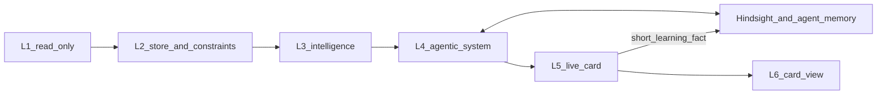

# Stamped — Product & Technical Architecture (SSOT)

*Status: current · 2026-09-25*  
*Authority:* product framing is [ADR-030](../decisions/028-032/ADR-030-five-domain-decision-loop.md) and [`research/plant-efficiency-exploration-2026-09/09-stamped-founder-vision.md`](../research/plant-efficiency-exploration-2026-09/09-stamped-founder-vision.md).  
*L4 architecture:* [`l4/`](l4/) · ADRs [033](../decisions/033-039/ADR-033-l4-decision-runtime.md)–[039](../decisions/033-039/ADR-039-registries-and-stage-graph.md).  
*Coarse evolution (how the stack changes):* [`14-coarse-architecture.md`](../research/plant-efficiency-exploration-2026-09/14-coarse-architecture.md).  
*As-built hops and invariants:* [`13-as-built-invariants.md`](../research/plant-efficiency-exploration-2026-09/13-as-built-invariants.md).

This file is the **overall** product + technical architecture. It does not replace layer-repo deep-dives. Per-layer specs under [`layers/`](layers/) and handoffs under [`../handoff/`](../handoff/) will be updated in a later pass; until then, prefer this file and `14` over older L4 “compiler-only” wording in those deep-dives.

> Honesty: `[~]` approximate · `[!]` evolving — verify before customer-facing claims. Do not invent savings, customers, or revenue.

---

## 1. What Stamped is

**Stamped** helps plant teams **choose, assign, and verify** the next operating action across **energy, cost, time / throughput, continuity / flow, and short-horizon exceptions**.

One meaningful condition → **one decision card** → **one owner** → honest closure. Energy is the entry wedge, not the product name and not the category. Recommend and assign by default. Hard stops in ADR-030 and vision `09` stay absolute.

### Tech and innovation bar

The company is the closed decision loop. The **bar for how we build it** is to be among the best at industrial agentic systems and detection science — not a thin wrapper on a chat model, and not a frozen detector catalog. Compute cost is not a reason to under-build L3 or L4. Hard stops still bind what the system may *do* to the plant; they do not cap how ambitious the intelligence inside L3 and L4 may be.

We study state-of-the-art agentic systems (planning, tools, memory, evaluation, selective control) and first-class detection / ML methods, then adopt what raises the quality of the card — without becoming a plant OS or silent controller.

| Dimension | Definition |
| --- | --- |
| **Category** | Closed operational decision loop (not EMS / monitoring-only / OpEx suite) |
| **Buyer outcome** | A named next action with owner and evidence that closes — across five domains |
| **Client enemy** | Insight without closure — dashboards that never become assigned, verified actions |
| **Integration** | Read / ingest default; write-back human-confirmed, narrow, allow-listed |
| **Operating loop** | detect → recommend → assign → act → verify (optional propose learning) |
| **Proof** | Evidence labeled Measured / Confirmed / Modeled / Unknown; domain sections separate; calculator owns money |

### Five domains on one card

```text
One product — Stamped
 ├── Energy · Cost · Time/throughput · Continuity/flow · Exception response
 ├── One primary domain section per card; optional secondary sections; one owner
 └── Stack L1→L6 topology stays (ADR-008); claim is the closed action
```

| Say | Do not say |
| --- | --- |
| Stamped | Product name with Energy appended |
| Five-domain decision loop | Withdrawn dual-pillar framing |
| Energy as entry wedge | Energy-only company |
| Choose / assign / verify | Dashboard-only / runs the plant |
| Read ERP/MES context | We replace MES / APS / ERP |

**30-second pitch:** Put the next operating action in front of one named owner. Close it with honest evidence. Start where energy data opens the door; expand when a non-energy decision closes the same way.

External marketing is archived under [`archive/external-marketing-2026-09/`](../archive/external-marketing-2026-09/). Agents do not take identity from that folder.

---

## 2. Named outcome domains

| Domain | Owns | Does not own |
| --- | --- | --- |
| **Energy** | When/how loads run; avoidable use / intensity where data supports | Retail energy, bill-audit firm, meter hardware, critical remote control |
| **Cost** | Visible operating-cost levers | Plant ledger / FP&A |
| **Time / throughput** | Machine-minutes, dwell, constraint-cell next choice | Full plant schedule publish |
| **Continuity / flow** | One handoff / batch / queue decision | New dispatch list / month-ahead plan |
| **Exception response** | Next choice after stop / slip under visible constraints | APS / MRP replacement; quality hold release |

On the card these are **sections**, not five queues. Each section that applies has its own claim, evidence tier, and effect. Sections are never summed into one headline savings number.

---

## 3. Operating loop

| Step | Name | What happens |
| --- | --- | --- |
| 1 | Ingest | Meters, machine state, production, maintenance context, calendars, structured human input |
| 2 | Normalize | Join enough to name one condition (condition key) |
| 3 | Detect | L3 intelligence: ML models / methods / rules → Finding with verification plan |
| 4 | Recommend | L4 **agentic system**: Finding **or** certified discovery / grounded hypothesis → plan, tools, PSM, memory, cross-section check, constraints, portfolio, uncertainty, one owner role → emit / supersede / withhold / abstain |
| 5 | Assign | L5 resolves role → person on shift |
| 6 | Record | Accept / edit / reject / defer + reason |
| 7 | Verify | Named evidence; honest closure state |
| 8 | Propose learning | Short learning fact into plant memory; named-owner gate for production rule changes |

---

## 4. L0–L6 stack (overall)

Topology is unchanged. Jobs inside L4–L6 are the evolution.

```text
L0  Plant systems (customer-owned)
L1  Connect & normalise          → read-only connectors (edge / cloud / bill)
L2  Universal store              → only layer opening Timescale for **plant truth**; constraints + roster + condition context (+ topology records)
L3  Intelligence core            → Findings; detection science open to major uplift
L4  Agentic system               → full agent stack → card proposal; never executes
L5  Closure & action             → live card, verify, autonomy policy (default off)
L6  Experience                   → one card queue, constraint UI, Ask (view over L4)
```



| Layer | Overall job | Must not |
| --- | --- | --- |
| **L1** | Read plant and document signals; add connectors only when a decision family needs them | OT write; plant message-broker of record |
| **L2** | Canonical store; constraint registry; shift owner resolution; condition key | Give L3–L6 a database URL; become a plant-wide industrial graph |
| **L3** | Detect conditions; emit Findings; merge same condition_key; verification plan. **Direction open:** push detection, methods, and eval toward best-in-class industrial intelligence — not “keep the old detector list forever” | Open L2 SQL; promote Lab to L4; invent ₹ |
| **L4** | **Agentic system** that turns a Finding **or** an L4 discovery candidate into a card proposal: planning, dual-family specialist passes, tools, Plant Situation Model, memory, portfolio, evaluation, emit / supersede / withhold / abstain. Memory and the opportunity ledger are subsystems, not the whole of L4. Detail: [`l4/`](l4/) | Assign the final person; notify; execute; write equipment or master data |
| **L5** | Own the live card; resolve person; verify; close; run only certified+enabled autonomy classes; honour `superseded` on open proposals | Draft options; invent recommendations; override a withhold |
| **L6** | Decision product UI: Now queue, card, close, autonomy settings, constraints, Ask | Hold bank keys in the browser; five inboxes; summed ₹ headline |

**Layer-per-repo** communicates only through versioned contracts in this pack ([ADR-008](../decisions/006-010/ADR-008-layer-repo-topology-and-interfaces.md)).

Spine invariants that must stay true until an explicit contract bump: only L2 opens Timescale for **plant truth** (L4 may hold derived operational data — PSM, traces, case library, opportunity ledger, OE corpus index); Lab never promotes (`emitted` + `delivery=l4` only); money cites tariff or tagged fallback; customer Now queue hides hard-gate withhold/abstain (soft-gate blocks may appear as an owner opportunity backlog); ops-confirmed ≠ bill-verified. Detail: [`13-as-built-invariants.md`](../research/plant-efficiency-exploration-2026-09/13-as-built-invariants.md) · L4: [`l4/`](l4/).

---

## 5. Two objects: proposal vs live card

| Object | Owner | Nature |
| --- | --- | --- |
| **Card proposal** | L4 | Immutable. `origin` (`l3_finding` \| `l4_pattern` \| `l4_hypothesis`), `exploration` boolean (orthogonal), domain sections (registry ids), one recommended action, ≤2 alternatives (including “no action”), proposed owner role, autonomy class from action-template registry (or human-only), uncertainty, footprint, verification plan (may only narrow the source plan), `operation` emit|supersede, `supersedes_proposal_id` when superseding, decision trace id, lockfile id. Finding path carries `finding_refs`; discovery path carries `pattern_ref` / `hypothesis_type_id`. |
| **Live card** | L5 | Mutable. Person, eight closure states, history, same domain sections, whether a human or an enabled class ran it. Open proposals may be marked **superseded** when L4 sends `operation=supersede` before acceptance (not a new closure state). |

Prescription **1.0.0** remains as a schema. The card proposal is a **new schema beside it**; L5 dual-reads until 1.0.0 is retired. One product — not two customer SKUs. **Field list (current):** [`l4/18-contract-deltas.md`](l4/18-contract-deltas.md). Research [`15`](../research/plant-efficiency-exploration-2026-09/15-contract-deltas.md) is historical with an amendment banner — prefer `l4/18`.

Closure states (minimum): Open; Assigned; In progress; Closed — verified; Closed — no change; Rejected; Deferred / expired; Blocked / disputed. Closed ≠ successful.

---

## 6. L4 agentic system (overall, not implementation)

**Normative detail:** [`technical/l4/`](l4/) — start at [`l4/README.md`](l4/README.md) and the frozen kernel [`l4/00-kernel.md`](l4/00-kernel.md). ADRs [033](../decisions/033-039/ADR-033-l4-decision-runtime.md)–[039](../decisions/033-039/ADR-039-registries-and-stage-graph.md). Research peers: [`19-l4-agent-peer-systems.md`](../research/plant-efficiency-exploration-2026-09/19-l4-agent-peer-systems.md).

L4 is a **complete overhaul** of the old prescription compiler into a **proper agentic system** — not “a long-lived process that happens to have memory.” Memory (including [Hindsight](https://hindsight.vectorize.io/)), the Plant Situation Model, and the opportunity ledger are **subsystems**. The system plans, uses tools, runs dual-family specialist passes, checks the rest of the plant, evaluates whether it can emit honestly, and produces one card proposal — from a Finding **or** from certified discovery / a grounded hypothesis. We keep studying how the best agentic systems are built and raise L4 to that bar. Compute is not a reason to shrink it.

The shell that stays is emit / **supersede** / withhold / abstain, a trace on every run, a code-owned constraint gate, calculator-owned ₹, portfolio + attention, and no equipment or master-data write. Ambition lives *inside* that shell.

**What “agentic system” means here (coarse)**

| Capability | Role in L4 |
| --- | --- |
| Planning / orchestration | Code-owned stage graph; models inside seams — Finding or discovery → bounded option set → proposal |
| Specialist passes | Dual-family drafts (default DeepSeek V4.1 Flash + GPT-5.6 Luna); domain analyses as registry plug-ins; reconcile to **one** card |
| Plant Situation Model | Derived per-plant cache (structure, state, history, constraints, open footprints); as-known-at snapshots |
| Tools | Allowlisted typed reads + **builder reads** for PSM construction (distinct catalogs); L3 method tools (calculator, simulator, condition test, verification builder) |
| Memory | Plant bank + dialogue banks + case library (outcome authority); retain / recall / reflect; observations |
| Discovery | Deterministic scanners → L3 methods → certified patterns; opt-in grounded-hypothesis lane; **shift sweep once per shift** even with no Finding |
| Production hardness | Work queue, DecisionCase lifecycle, port reliability, safe-start, kill switch, release gates — [ADR-040](../decisions/040-044/ADR-040-l4-production-hardness.md) · [`l4/25`](l4/25-work-queue-and-concurrency.md)–[`29`](l4/29-software-quality-and-release.md) |
| Evaluation / gates | Hard vs soft gates; constraint conflict; cross-section; portfolio; opportunity ledger on every block |
| Decision seams | Closed choices may later use a decision model (e.g. Jev); **LLM-only in v1** with a logged replacement route |

**Memory — [Hindsight](https://hindsight.vectorize.io/) plus case library**

| Bank | Scope | Holds | Does not hold |
| --- | --- | --- | --- |
| Plant bank | One per plant | World facts; short learning facts from closes / withholds | Full card body; chat transcripts |
| Dialogue bank | One per conversation | That thread (stable document id) | Other threads; plant operating knowledge |
| Case library | Per plant (L4 store) | Traces joined with L5 outcomes | Chat; authority when it disagrees with Hindsight |

Banks are hard walls. Ask merges plant + dialogue reads in L4; Hindsight has no cross-bank query. Hosting (cloud vs self-host) is an L4-repo decision. Mental-model **questions** are owner-gated; refreshed mental-model **content** is advisory only.

Self-improvement is **observation consolidation** from short learning facts **plus** learning from soft-gate blocks (opportunity ledger, owner backlog, opt-in exploration) — not storing the whole card and not silent weight post-training on raw closures. An ineligible close may teach that evidence was missing; it must not teach that the action worked. Production thresholds / playbooks change only with named-owner acceptance after replay. Offline council (Opus 5.5 + GPT-5.6 Sol) never sits on the plant request path.

**Cross-section and portfolio.** Before emit, L4 checks upstream feed, downstream block, shared utilities, shift, and open cards on related assets (PSM + typed constraints). A locally attractive action that starves another cell is withheld or ships with the conflict visible. Over attention budget → **hold** (L4-internal). Soft-gate blocks reach the plant owner's opportunity backlog; hard-gate blocks stay hidden from the customer Now queue.

**Tools.** Allowlisted typed reads: L2 query HTTP, constraint registry, open cards, Hindsight recall / reflect, L3 methods. **Builder reads** (bulk topology/state for the PSM) are a separate catalog — not agent tools. No raw SQL, no open web as authority, no OT write.

**Owner routing.** Configured roles only. L4’s dual-family seam chooses the role from the closed set; disagreement on owner → **withhold** (not a soft fallback to a free generative agent). L5 resolves the person on shift. That choice is a closed **decision seam** (later replaceable by a decision model such as [Jev](https://jevtypesafeai.com/jev-ai) without changing the card). Seams are specified in [`l4/11-models-and-seams.md`](l4/11-models-and-seams.md); v1 stays LLM-only until a classifier beats the logged record set.

**Ask.** L6 paints the thread; L4 holds the session. Ask does not emit cards, change autonomy, or issue a second prescription. Chat enters the plant bank only via explicit promotion after confirm or verified closure.

**L4 operational store.** L2 remains the only database for **plant truth**. L4 may hold derived operational data (PSM, traces, case library, opportunity ledger, held proposals) — not a second plant SoR ([ADR-034](../decisions/033-039/ADR-034-plant-situation-model-and-memory.md)).

**Expandability.** Domains, families, workflows, stages, patterns, constraint kinds, and soft-gate thresholds are versioned registries under one release lockfile ([ADR-039](../decisions/033-039/ADR-039-registries-and-stage-graph.md)). Product framing remains five domains under ADR-030; the architecture accepts more domain registry ids without a kernel rewrite.

---

## 6a. L3 direction — detection that can go much further

Today’s L3 core (scheduler paths, dual-lane emit, Finding contract, no DB URL, calculator-owned money) is the **floor**, not the ceiling. The **direction is open**: we will invest in better detectors, methods, features, evals, and multi-signal condition finding so that what reaches L4 is as sharp as the best industrial intelligence we can field. Lab still never promotes. Rupees still never invent. That is not permission to freeze L3 as “a few energy engines and dark CNC flags.”

Fine design of that uplift belongs in the L3 repos later. This SSOT only locks that **technological excellence in L3 is in scope and encouraged**.

---

## 7. L5 action and autonomy

L5 is the case layer: open card, resolve person, accept / edit / reject / defer, notify when destination is clear, verify against L2, close honestly, emit the short learning fact.

**Autonomy default: no actions.** A class runs only after **Stamped certifies** it and a **named plant owner enables** it. First catalog classes (from vision `09`): suppress duplicate notification; open a review task. A plant may propose another class; it stays pending until certified as reversible, low-risk, audited, watched, rollback-ready, and not a hard stop. Idle-load and equipment actions are **not** in the catalog.

Hard stops that never become autonomy classes: automatic safety / remote critical-equipment command; quality hold release; maintenance authorization; silent change to customer priority, promise date, routing, master data, or full dispatch; recommendation that outranks a known plant constraint.

**Constraints.** Named plant owner authors rows in L6; L2 stores them; L4’s constraint gate withholds on conflict regardless of predicted benefit.

---

## 8. L6 experience (overall)

Home is the **next action**, not a dashboard.

| Surface | Job |
| --- | --- |
| **Now** | One queue, one owner, due / review, primary domain, honest state |
| **Card** | Condition, cross-section checks, recommended action + alternatives, domain sections, constraints, uncertainty, accept / edit / reject / defer |
| **Close** | Verified / no-change / rejected / deferred / blocked in the same place as open work |
| **Autonomy** | Default “no autonomous actions”; certified classes off until enabled; stop / revert / dispute on in-flight autonomous work |
| **Constraints** | Author / expire / review plant constraints |
| **Evidence** | Live vs Preview honesty; signals as proof behind a card |
| **Ask** | Secondary conversational view over L4 memory |

Compiler / Hindsight internals stay off the customer card.

---

## 9. Pilot 1 and admission rule

**Pilot 1:** confirmed machine idle with extra loads still on. Operational task → ops head. Primary section energy; machine-minutes (if any) as a separate time section. Autonomy off. Verification follows **IPMVP retrofit isolation** on the named auxiliary circuit: Option B (load + idle interval measured) may close as verified; Option A keeps estimated parameters Modeled; whole-facility meter is the wrong boundary. Detail: [`16-pilot-and-hard-stops.md`](../research/plant-efficiency-exploration-2026-09/16-pilot-and-hard-stops.md).

**Next family** (alarm dwell, then handoff or exception) only with a named owner role, verification source already in L2, reviewed constraint, and reusable template. New L1 connectors follow that manifest — not an “ingest everything” program.

What we will not build: [`17-do-not-build.md`](../research/plant-efficiency-exploration-2026-09/17-do-not-build.md). Layer-repo sequence: [`18-propagation.md`](../research/plant-efficiency-exploration-2026-09/18-propagation.md).

---

## 10. How value is engineered

Value is **not** one model score and **not** a fixed savings-% identity claim.

> Closed decision cards × honest closure (including rejection and no-change) × evidence that matches its tier.

Architecture must (a) detect conditions across domains, (b) assign one owner, (c) verify with labeled evidence, (d) learn from eligible closures without inventing success.

---

## 11. Technology defaults (spine cost-first; L3/L4 intelligence is excellence-first)

The ingest/store spine stays portable and cost-aware. **L3 detection and the L4 agentic system are excellence-first:** we do not under-build them to save tokens or GPU. Compliance and hard stops still apply.

| Concern | Default | Upgrade when |
| --- | --- | --- |
| TSDB | TimescaleDB on Postgres | Scale / retention pressure |
| Messaging | Mosquitto MQTT (L1) · Postgres outbox | Need Redpanda-class bus |
| Runtime shape | Modular monoliths per layer repo | Clear satellite boundaries |
| Deploy modes | `local`, `local-dashboard`, `cloud` ([ADR-010](../decisions/006-010/ADR-010-deployment-profiles-and-portability.md)) | Same contracts in all modes |
| Edge | Go agent; no OT write on the default path | Plant-accepted earned path only inside hard stops |
| L3 intelligence | Contract + dual-lane floor | Best detection / methods / eval we can field for each decision family |
| L4 agentic system | Full agent stack; Hindsight + case library + PSM + opportunity ledger; dual-family plant models; seams LLM-only until Jev beats the log | Hosting + orchestration in L4 repo; study SOTA agent patterns continuously; see [`l4/`](l4/) |
| Decision seams | Language model today; closed answer sets; disagreement on action/owner/constraint/verification/terminal → withhold | Optional decision-model (e.g. Jev) later at those seams only |

India compliance posture (CERT-In residency, DPDP) remains an engineering constraint on deploy modes; the old compliance register was archived under [`../archive/cleanup-2026-09/compliance/`](../archive/cleanup-2026-09/compliance/).

---

## 12. Anti-confusion

| Concern | Stamped is | Stamped is not |
| --- | --- | --- |
| Energy | Entry wedge + one domain section | Energy-only product / EMS dashboard |
| Time / flow / exception | Sections on the same card | APS / logistics SKU / plant OS |
| Equipment / maintenance | May escalate with evidence | Full CMMS / vibration PdM company |
| MES / ERP | Read context | Dispatch / WIP / scheduling SoR |
| L4 | **Agentic system** for recommend + plan + tools + PSM + memory + discovery + learn | The company; silent plant control; “just a chatbot with a vector store”; Finding-only intake forever |
| L3 | Detection science we keep raising | A frozen energy-only detector list |
| Autonomy | Certified class, default off | Progressive equipment autonomy |
| Memory | Plant bank + dialogue banks + case library + **OE knowledge corpus** (advisory literature) | Chat as system of record; memory as the whole of L4; sourcebook text as Measured truth |

---

## 13. Reading map (agents)

| Priority | Doc |
| --- | --- |
| 1 | [`AGENT-START.md`](../research/plant-efficiency-exploration-2026-09/AGENT-START.md) → [`09`](../research/plant-efficiency-exploration-2026-09/09-stamped-founder-vision.md) → [`10`](../research/plant-efficiency-exploration-2026-09/10-stamped-vision-agent-alignment.md) |
| 2 | [ADR-030](../decisions/028-032/ADR-030-five-domain-decision-loop.md) |
| 3 | **This file** (overall stack) |
| 4 | [`l4/`](l4/) — L4 architecture contract (kernel + docs) · ADRs [033](../decisions/033-039/ADR-033-l4-decision-runtime.md)–[039](../decisions/033-039/ADR-039-registries-and-stage-graph.md) |
| 5 | [`14-coarse-architecture.md`](../research/plant-efficiency-exploration-2026-09/14-coarse-architecture.md) and [`15`](../research/plant-efficiency-exploration-2026-09/15-contract-deltas.md)–[`18`](../research/plant-efficiency-exploration-2026-09/18-propagation.md); L4 peers [`19`](../research/plant-efficiency-exploration-2026-09/19-l4-agent-peer-systems.md) |
| 6 | [handoff/README.md](../handoff/README.md) → your layer (update when layer deep-dives catch up) |
| 7 | [`contracts/`](../contracts/) + `scripts/contracts/contract-check.sh` |
| 8 | Layer specs under [`layers/`](layers/) — prefer this file + `l4/` + `14` if they still describe L4 as compiler-only |
| Legacy names | Thin pointers in [`pointers/`](pointers/) redirect here |

Prior product snapshot: tag `v2026.09.24`. Marketing archive is not identity.
