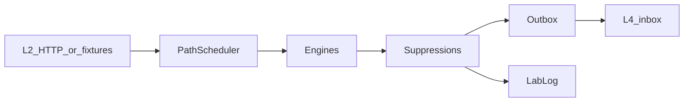

# L3 — Detection runtime

*Status: as-built · 2026-09-26*  
*Repo:* `intelligence-core` (`stamped_l3_core`)

## Pipeline

```text
L2 query HTTP / fixtures
  → PathScheduler (hot ~900s / warm ~3600s / cold ~86400s)
  → engines build Finding 1.2.0
  → waste_classifier / value_domain
  → SuppressionService
  → TransactionalOutbox + LabLog
  → publish()  (only emitted ∧ delivery=l4 leaves)
```



## Paths

| Path | Interval (default) | Does | Notes |
| --- | --- | --- | --- |
| **Hot** | ~900s | MD (+ PF/TOD when configured); registered hot engines; CNC fleet if `ENABLE_CNC` | Must not stall behind cold |
| **Warm** | ~3600s · lookback P7D | EWMA / CUSUM residuals → unexplained draw | Lab by default; outbox if `ENABLE_WARM_EMIT` / `PROOF_RUN` |
| **Cold** | ~86400s · lookback P30D | TOW-P baseline fit; TimesFM / TabPFN / LGBM **shadow only** | Shadows are not L4 work |
| **Dual-mode** | on demand | Same engines on live lookback **or** historian `[from_ts,to_ts]` | Evidence tags carry `data_source:` / `window:` only |

`PathScheduler` ensures cold never blocks hot.

## Dual-lane

| Lane | Condition | Destination |
| --- | --- | --- |
| L4 | `status=emitted` **and** `delivery=l4` | Outbox → L4 inbox |
| Lab | everything else (suppressed, shadow, hypothesis, …) | LabLog / RunArtifact **1.1.0** |

Invariant (`detection_lane.py`): `delivery == l4` iff `status == emitted`. There is no promote-Lab-to-L4 path in core.

## Money

| Concern | Behavior |
| --- | --- |
| Tariff | `get_active_tariff` from L2 → stamp `l2:{tariff_id}:` or tagged `fallback:` |
| Decomposition | Engines attach INR / kWh bands with bill_line hints where applicable |
| Guard | Outbox blocks forged INR ≥ 1M without decomposition |

## Fail-closed

| Gate | Effect |
| --- | --- |
| No `L2_DATABASE_URL` | Core never opens Timescale |
| Missing tags | Engine KeyError / empty — no invented points |
| Schema | Outbox rejects Finding ≠ **1.2.0**; requires `ops_clearance` |
| Suppressions | startup / maintenance / mix / data_quality |

## Related modules (as-built)

| Area | Package path |
| --- | --- |
| Scheduler | `stamped_l3_core.scheduler` |
| Engine registry | `stamped_l3_core.engines.registry` |
| Dual-lane | `stamped_l3_core.detection_lane` |
| Outbox | `stamped_l3_core.outbox` |
| L2 client | `stamped_l3_core.clients.l2` |

Next: [`02-engines.md`](02-engines.md).
