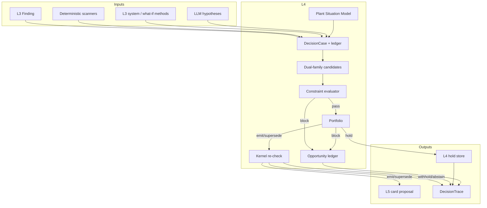
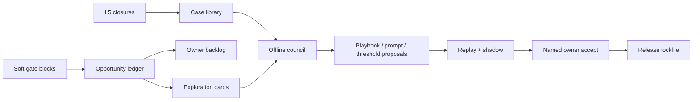

# L4 system overview

**Status:** Architecture overview. Normative rules live in [`00-kernel.md`](00-kernel.md).  
**ADRs:** [033](../../decisions/033-039/ADR-033-l4-decision-runtime.md) · [034](../../decisions/033-039/ADR-034-plant-situation-model-and-memory.md) · [035](../../decisions/033-039/ADR-035-l4-discovery.md)

---

## What L4 does

1. Accepts a **Finding** from L3, or a **discovery candidate** from L4 scanners / patterns / (opt-in) hypothesis lane — including on a **shift sweep** when nothing anomalous fired.
2. Builds a **DecisionCase** with a condition key and a frozen PSM snapshot (as-known-at).
3. Runs a code-owned **stage graph**: candidates → constraints → portfolio → card minimizer → kernel re-check → terminal.
4. Ends in `emit` | `supersede` | `withhold` | `abstain`, always with a DecisionTrace.
5. Records every gate block in the **opportunity ledger** so refusals teach the system.

Humans decide and execute. L5 owns the live card after emit. L4 never writes equipment or schedules.

**Whole-plant claim:** Finding path is reactive. Discovery + shift sweep are how L4 still looks across the plant on a quiet shift — same kernel, same portfolio, same owner card. Cadence: [`08-discovery.md`](08-discovery.md).

---

## End-to-end picture

---

## Two intake paths, one floor

| Path | Origin | Doc |
| --- | --- | --- |
| Finding | L3 detector (`detector_id` / `detector_version`) | [`07-finding-runtime.md`](07-finding-runtime.md) |
| Discovery | Scanners, certified patterns, grounded-hypothesis lane | [`08-discovery.md`](08-discovery.md) |

Both meet the same proof floor, constraint evaluator, and portfolio. Uncertified detector versions and ungrounded LLM ideas stay in **shadow** (traced, never sent).

---

## Plant context (not per-Finding only)

| Layer | Owner | Doc |
| --- | --- | --- |
| Topology | Site pack → L1→L2 | [`02-plant-structure.md`](02-plant-structure.md) |
| Derived situation | L4 PSM (cache) | [`03-plant-situation-model.md`](03-plant-situation-model.md) |
| Constraints | Typed rows + code evaluator | [`04-constraints.md`](04-constraints.md) |
| Memory | Hindsight + case library | [`06-memory.md`](06-memory.md) |

---

## Models

| Role | Default | Path |
| --- | --- | --- |
| Plant family A | DeepSeek V4.1 Flash (`deepseek-flash`) | Live |
| Plant family B | GPT-5.6 Luna | Live |
| Offline council | Opus 5.5 + GPT-5.6 Sol | Never on plant request path |

See [`11-models-and-seams.md`](11-models-and-seams.md). Seams are LLM-structured today; each has a Jev / classifier replacement row.

---

## Expandability

Registries under one release lockfile ([`21-registries-and-stage-graph.md`](21-registries-and-stage-graph.md)). Adding a domain or stage is registration plus replay — not a kernel rewrite ([`17-change-guide.md`](17-change-guide.md)).

---

## Improvement loop

Detail: [`13-improvement.md`](13-improvement.md) · [`22-missed-opportunities.md`](22-missed-opportunities.md).

---

## Layer boundaries (short)

| Layer | Owns | Does not own |
| --- | --- | --- |
| L1 | Collect, topology publish | Decisions |
| L2 | Plant SoR, series, context records | Card proposals |
| L3 | Detectors, calculators, simulators, verification builders | Portfolio / attention |
| L4 | Decision runtime, PSM, opportunity ledger | Live card, equipment write |
| L5 | Live card, notification, verification, policy | Detection methods |
| L6 | Surfaces / Ask view | Second memory, second judge |

---

## v1 slice vs later

| v1 | Later |
| --- | --- |
| Finding path + certified patterns + opt-in hypothesis lane | Broader scanner/method library |
| Dual-family plant models; offline council off-path | Jev/classifier seam replacements as they beat the log |
| Opportunity ledger + owner backlog | Exploration volume under caps |
| Five product domains (ADR-030) | Additional domain registry ids without kernel rewrite |
