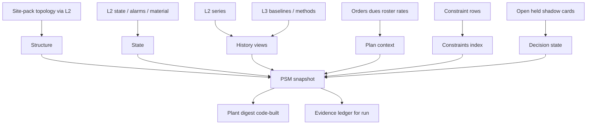

# Plant Situation Model (PSM)

**Status:** Architecture. Normative gates: [`00-kernel.md`](00-kernel.md).  
**ADR:** [034](../../decisions/033-039/ADR-034-plant-situation-model-and-memory.md) · [037](../../decisions/033-039/ADR-037-site-pack-topology.md)  
**Siblings:** [`02-plant-structure.md`](02-plant-structure.md) · [`04-constraints.md`](04-constraints.md) · [`05-context-engineering.md`](05-context-engineering.md)

---

## Purpose

A DecisionCase needs more than the Finding’s local window. Portfolio conflicts, shifting bottlenecks, shared-utility peaks, and open-card footprints live at plant scale. The PSM is the derived, versioned, per-plant model that holds that context. It is a **cache with provenance** in the L4 operational store — not a system of record. L2 remains plant truth for raw series and published topology.

---

## Layers

| Layer | Contents |
| --- | --- |
| **Structure** | Areas, flow edges, shared resources, meter hierarchy, asset draws — from site-pack topology ([`02-plant-structure.md`](02-plant-structure.md)) |
| **State** | Latest `asset_state`, alarms/events, batch/queue positions, material, maintenance and quality status |
| **History** | Temporal views (raw series stay in L2): state episodes; mode/product/shift-conditioned baselines (L3 where they exist); bottleneck residence; shared-resource envelopes; constraint activation intervals; change points / asset epochs; pre/post-action windows for closed cards |
| **Plan context** | Orders and dues as **do-not-disturb** context; roster; operating rates. Never a schedule to rewrite |
| **Constraints** | Typed set indexed by scope and time ([`04-constraints.md`](04-constraints.md)) |
| **Decision state** | Open cards with footprints and acceptance state; held proposals; shadow proposals; recent closures |

---

## Propagation rules

Typed, versioned, directed, with lag:

- Upstream starve
- Downstream block
- Buffer and lag along flow edges
- Shared-resource demand aggregation

A plain k-hop neighbourhood cannot tell starving from blocking. Propagation code walks structure; models do not.

---

## Plant digest

Built in **code**, not by an LLM. Fixed schema per area:

- state summary
- ranked deviations from baseline (L3 method where certified)
- what changed since the last digest
- open footprints
- constraints about to expire
- unknowns

Plus a **coverage manifest**: assets and resources included, excluded, or unknown. Size budget and digest version are pinned in the lockfile.

---

## Bitemporal snapshots

Each element carries **effective time** and **recorded time**. A run snapshot is **as-known-at**: late L2 corrections do not change what replay says L4 knew. Working ledgers freeze the snapshot into the DecisionTrace ([`05-context-engineering.md`](05-context-engineering.md)).

---

## Scaling

- Hierarchical partitions: plant → area → resource group → asset
- Incremental updates by watermark
- Deterministic scanners run **before** any LLM call
- Admission rule: an element exists only if a family, pattern, or constraint kind reads it (ADR-031 / research `17`)

---

## Graph and zoom

| Actor | May |
| --- | --- |
| PSM builder + propagation | Walk structure |
| Models | Request allowlisted **typed zoom reads**; code executes and appends ledger rows |

Models never traverse the graph and never invent edges into live structure (suggestions go through the owner path in [`02-plant-structure.md`](02-plant-structure.md)).

---

## Pluggable elements

Each PSM element has its own builder registered behind a port. An element can be added, replaced, or retired without rebuilding the rest. New builders are registry + lockfile + replay ([`21-registries-and-stage-graph.md`](21-registries-and-stage-graph.md)).

---

## Why derived and temporal

Per-Finding assembly cannot see portfolio conflicts, recurring patterns, or shifting bottlenecks. An L2-owned product graph turns every topology change into a store migration and reopens “graph becomes the product.” The PSM is the middle path: derived, versioned, admitted by use, replayable.

---

## v1 slice vs later

| v1 | Later |
| --- | --- |
| Structure + state + open footprints + constraint index + code-built digest for commissioned areas | Full episode library, richer bottleneck residence, shared-resource envelopes |
| Propagation: starve / block / buffer-lag / shared demand for commissioned edges | Additional typed rules as families admit them |
| Bitemporal as-known-at snapshots | Same; more element builders |
| No cross-plant PSM merge | Optional anonymised priors only via future seam |
