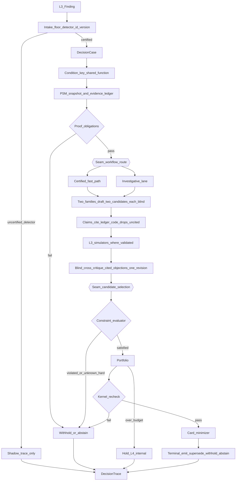

# 07 — Finding runtime

**Status:** Architecture (docs). Not normative — the yardstick is [`00-kernel.md`](00-kernel.md).  
**Date:** 2026-09-25  
**ADR:** [ADR-033](../../decisions/033-039/ADR-033-l4-decision-runtime.md)  
**Related:** [`09-portfolio.md`](09-portfolio.md) · [`11-models-and-seams.md`](11-models-and-seams.md) · research [`15-contract-deltas.md`](../../research/plant-efficiency-exploration-2026-09/15-contract-deltas.md)

This doc is the Finding path from L3 intake to a terminal. Discovery uses the same mid-pipeline and the same exit ([`08-discovery.md`](08-discovery.md)). Humans decide and execute. L4 recommends, assigns a role, and records. It does not write equipment, schedules, or master data.

---

## Decision

Code owns the stage graph, proof floor, money references, constraint evaluation, portfolio hand-off, and terminals. Models draft candidates, cite ledger rows, fill registry-bounded seams, and revise once against cited objections. Dual families work blind. There is no multi-round debate and no voting.

Rupees come only from L3 calculator references. Uncited claims and unreferenced quantities are dropped by code before critique. A candidate that still carries an unreferenced rupee withholds.

---

## Why

A Finding is already a structured condition. The work left is honesty: same condition as an open card, constraints that hold under a whole-plant footprint, one owner, one recommended action, and a verification plan that can only narrow. Free agent debate fails that bar in industrial settings (see research `19`). Independent drafts plus one cited revision keeps disagreement visible without turning the run into a committee.

---

## Pipeline

Default stage order (any declared stage graph must still hit the kernel checkpoints in [`00-kernel.md`](00-kernel.md)):

### 1. Intake

Apply the Finding contract floor from research `15`:

- `condition_key` material (or enough fields for the shared key function)
- `decision_family_id` and primary domain as a **domain registry id** (from the family registry — not chosen by a model)
- evidence-tiered facts
- effects with method, tier, and optional calculator reference (no raw rupee from a model)
- verification plan with signal refs and a post-action predicate
- `constraint_refs_considered`

Require `detector_id` and `detector_version`. If the detector is not certified for this plant (or the version is outside the certified set), the run is **shadow**: full DecisionTrace, no L5 card. Lab Findings never promote.

### 2. DecisionCase

Open a DecisionCase with origin `l3_finding`, the Finding id(s), detector pin, release lockfile hash, and as-known-at watermark. Merged Findings that share a condition key arrive as one case (L3 merge before delivery; L4 still dedupes against open cards later).

### 3. Condition key

Compute the condition key with the **shared key function** (same function L3 and discovery use — see [`15-l3-l4-interface.md`](15-l3-l4-interface.md)). Asset, state window, and shift are the usual ingredients. The key is the one-card identity the portfolio and case library use.

### 4. PSM snapshot

Freeze a Plant Situation Model snapshot as-known-at for this run ([`03-plant-situation-model.md`](03-plant-situation-model.md)). Build the evidence ledger from that snapshot, targeted builder reads, frozen memory rows, and L3 method outputs. Partitions stay separate: measured, advisory, model. Free text is delimited data.

### 5. Proof obligations

Code checks the hard proof floor before any drafting seam:

- asset binding present
- verification path exists (Finding plan or an L3-built plan that only narrows)
- evidence tiers assigned by code from source type
- for discoveries: L3 condition test (Finding path inherits L3 emission already)

Failure → withhold or abstain with a typed gate id. Soft freshness margins can still fire later; they do not replace this floor.

### 6. Seam: workflow route

Registry-bounded seam ([`11-models-and-seams.md`](11-models-and-seams.md)). Closed options: **certified fast path** or **investigative lane**. Disagreement on this routing seam takes the registry default (not withhold). The choice is logged as a seam decision record.

- **Certified fast path** — family and plant already have a certified workflow recipe; skip optional analysis expansion.
- **Investigative lane** — need optional domain analyses, extra zoom reads, or simulator choice before candidates.

Constraint evaluation and money still run the same way on both paths.

### 7. Dual-family draft (blind)

Two plant model families each draft **two** candidates, independently, without seeing the other family's output. Each candidate includes:

- recommended action template (registry-bounded)
- at most the structure that will later allow one recommendation and two alternatives (one always no action) after selection
- claimed domain sections with **ledger citations**
- proposed owner role from the configured set
- autonomy class from the **action-template registry** (code) — human-only or a certified class id; models do not choose the class
- footprint draft (assets, shared resources, crew/role, material, time window with lag)

### 8. Citation gate (code)

Every claim must cite a ledger row id. Code drops uncited claims. Any quantity that looks like money without an L3 calculator reference is dropped; if a candidate still depends on an unreferenced rupee after drops, that candidate is invalid and cannot be selected for emit.

Models do not assign evidence tiers. Models do not invent ₹.

### 9. L3 simulators (where validated)

Where a validated L3 method exists for the candidate's what-if, call it. Output is **Modeled**, cites method and version, and must sit inside that method's validated envelope to support emit. Outside the envelope → evidence-only or withhold; never an invented counterfactual price.

### 10. Blind cross-critique

Each family sees the other's candidates (not the other's private scratch). Objections must cite ledger ids. One revision pass only. No scoring average across families. Disagreement on action, owner, verification narrowing, or terminal class → withhold (`action_seam_disagreement`, hard). Models may propose extra constraint rows to evaluate; they may not omit intersecting hard rows.

### 11. Seam: candidate selection

Closed options from the candidate set plus "no action". Produces the single recommended action and at most two alternatives (one always no action). Logged seam decision record.

### 12. Constraint evaluator → portfolio → card minimizer → kernel re-check → terminal

Order is fixed relative to kernel checkpoints ([`00-kernel.md`](00-kernel.md) §12):

1. Constraint evaluator
2. Portfolio (dedupe, conflict, attention hold, supersede decision)
3. **Card minimizer** (one primary domain, wallets not summed, verification narrowed)
4. **Kernel re-check**
5. Terminal

Minimizer must run **before** re-check so the yardstick sees the final card shape.

- **Constraint evaluator (code)** — `satisfied | violated | unknown` plus conflicting fact set. Violated or unknown-on-hard → withhold. An LLM "possible conflict" is not a pass; it withholds. Modeled benefit cannot override. Code evaluates every intersecting hard row.
- **Portfolio** — dedupe, conflict, supersede-before-accept, attention budget ([`09-portfolio.md`](09-portfolio.md)). Over budget → **hold** (deterministic; L4-internal).
- **Card minimizer** — strip dropped claims, enforce one primary domain registry id, one owner role, section wallets never summed, verification plan only narrowed, autonomy class from action-template registry.
- **Kernel re-check** — normative list in [`00-kernel.md`](00-kernel.md) §12 on the chosen set before any terminal that reaches L5.
- **Terminal** — `emit` | `supersede` | `withhold` | `abstain`. Always a DecisionTrace. Portfolio hold is not a terminal to L5.

HITL: emit proposes. A named owner accepts, edits, rejects, or defers in L5. Execution stays human unless a certified, enabled autonomy class says otherwise — and hard stops still bind.

---

## Rejected alternatives

| Rejected | Why |
| --- | --- |
| Multi-round specialist debate as the decision mechanism | Noise, judge bias, no outside signal |
| Model self-reported confidence as uncertainty | Prefer tier + freshness + cross-family agreement on seams |
| LLM as constraint evaluator or terminal judge | Hard stops and money must be code |
| Skipping portfolio on "urgent" Findings | Exceptions are budget-exempt via domain registry; they still dedupe and conflict-check |
| Generative fallback that invents a second recommendation when seams disagree | Withhold instead (amends research `14`/`15`) |

---

## What evidence would change this

- Measured pass^k and grounding-violation rates on Pilot 1 closures showing the investigative lane adds no lift over the fast path for certified families → collapse route options.
- A third independent family that systematically catches constraint misses the dual pair miss → revisit family count (not debate rounds).
- Validated L3 methods covering most Pilot families → move more of draft consequence-testing earlier and shrink critique scope.

---

## v1 slice vs later

| v1 | Later |
| --- | --- |
| LLM fills workflow-route and candidate-selection seams | Jev (or equivalent) on those seams when it beats the logged baseline |
| Two families; one-family mode with stricter thresholds | Additional families only if replay shows lift |
| Idle-load and a small certified family set | More families as detectors and topology allow |
| Card minimizer as code rubrics | Same surface; richer section rendering specs per domain registry entry |
| Opportunity ledger on every block | Gate calibration loop fully wired ([`22-missed-opportunities.md`](22-missed-opportunities.md)) |

---

## Links

- Normative rules: [`00-kernel.md`](00-kernel.md)
- Portfolio after constraints: [`09-portfolio.md`](09-portfolio.md)
- Seams and dual-family policy: [`11-models-and-seams.md`](11-models-and-seams.md)
- ADR: [ADR-033](../../decisions/033-039/ADR-033-l4-decision-runtime.md)
