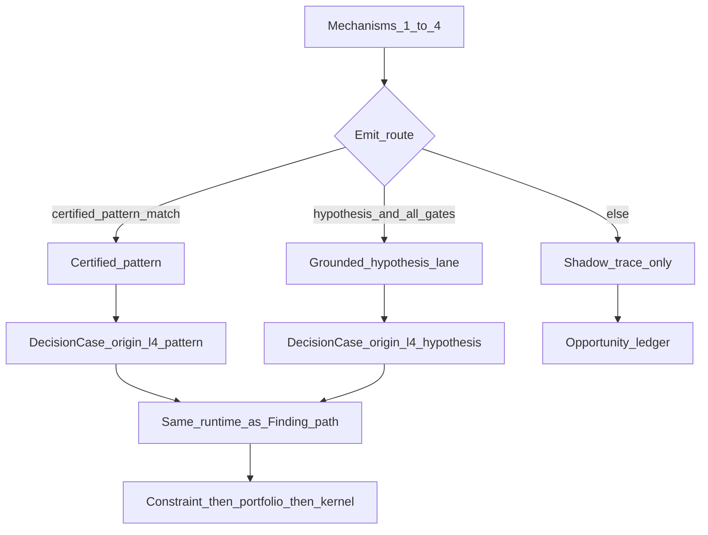

# 08 — Discovery

**Status:** Architecture (docs). Runtime still exits through the Finding path mid-pipeline and the kernel.  
**Date:** 2026-09-25  
**ADR:** [ADR-035](../../decisions/033-039/ADR-035-l4-discovery.md)  
**Related:** [`07-finding-runtime.md`](07-finding-runtime.md) · [`09-portfolio.md`](09-portfolio.md) · [`00-kernel.md`](00-kernel.md) · [`03-plant-situation-model.md`](03-plant-situation-model.md)

L3 detectors catch registered conditions. Plants also waste on overlaps, idle auxiliaries, handoff waits, partial loads, and shared-utility imbalance that no Finding names yet. Discovery surfaces some of that under the **same evidence floor** as a Finding. Card origin is `l4_pattern` for certified patterns and `l4_hypothesis` for the grounded-hypothesis lane. Exploration is a separate boolean flag, not an origin. Humans still accept and execute.

This amends the older line "L3 detects; L4 only turns a Finding into a card."

---

## Decision

Four mechanisms run in fixed order. Only two emit routes reach the decision runtime; everything else is shadow. Ranking is a feasibility floor, then a lexicographic policy from a versioned registry — never a blended score. Money still comes from L3.

---

## Why

Scanners and L3 system methods are cheap, repeatable, and auditable. LLM hypotheses are useful for naming mechanisms the scanners have not encoded yet, but only after L3 grounds condition, price, and verification. Free LLM emit floods owners. A blended multi-objective score hides which axis lost.

---

## Cadence — when L4 runs without a Finding

L4 is **not** Finding-only. If the plant looks “normal” (no L3 anomaly), discovery still runs. That is how Stamped searches for efficiency while the floor is quiet — idle auxiliaries, overlapping shared-resource starts, handoff waits, partial loads, envelope proximity — conditions that often never trip a detector.

| Trigger | What fires | Typical use |
| --- | --- | --- |
| **Finding intake** | L3 emits a Finding | Named detector condition |
| **Material PSM change** | Event-driven discovery shortlist | Asset state flip, alarm, constraint activate/expire, open-card change, topology publish |
| **Shift sweep** | Full registered discovery pass once per shift | Whole-plant opportunity search when nothing “broke” |
| **Ask enqueue** | Owner/staff requests a discovery sweep | On-demand ([`14-ask.md`](14-ask.md)) |
| **Owner backlog promote** | Soft-gate block re-enters the runtime | Human-driven, not automatic |

**Shift sweep (normative for v1 product claim):**

1. **Once per shift** per plant, at a site-pack configured offset after shift start (default: **+15 minutes** after roster shift boundary — illustrative default until the plant locks it).
2. Code refreshes the PSM digest (as-known-at), runs **all commissioned** scanners + admitted L3 system methods for that plant, then optional hypothesis shortlist if the lane is opted in.
3. Hits become discovery candidates → same constraint / portfolio / kernel path as Findings. Attention budget and one-card rule still apply; the sweep does **not** flood the Now queue.
4. Caps: shadow volume, hypothesis volume, exploration budget — all soft gates. Hard stops unchanged.
5. If the previous shift’s sweep is still running, the new one **queues** (does not overlap LLM-heavy stages). Scanner-only stages may overlap with watermarking.

**Registry knobs** (soft / data — not kernel):

| Knob | Meaning | v1 default |
| --- | --- | --- |
| `discovery.shift_sweep.enabled` | Plant opt-in (default on once commissioning minimums pass) | on when commissioned |
| `discovery.shift_sweep.offset_after_shift_start` | Minutes after shift boundary | 15 (illustrative until site-locked) |
| `discovery.shift_sweep.max_candidates_to_runtime` | Hard cap into DecisionCase pipeline after ranking | plant registry |
| `discovery.event_triggers` | Which PSM change kinds enqueue a partial sweep | state / constraint / open-card / topology |

All discovery and Finding intake **enqueue** through the plant work queue ([`25-work-queue-and-concurrency.md`](25-work-queue-and-concurrency.md)). Emit stays off until safe-start ([`28-commissioning-and-controls.md`](28-commissioning-and-controls.md)).

**What a shift sweep is not:** a full plant reschedule, a dashboard rebuild, or an unsupervised LLM tour of every asset. It is a **code-owned whole-plant shortlist** → the same honest card path. That is the product claim: decisions backed by the full plant view, on a clock, not only when something alarms.

**Mid-shift partial sweeps:** material PSM events enqueue a **scoped** discovery pass (neighbourhood / shared resource of the change), not a second full shift sweep — unless the event is marked plant-wide (e.g. feeder constraint activate).

---

## Mechanisms (order)

### 1. Deterministic temporal scanners

Code over PSM episodes and digests. No model. Typical predicates:

- overlapping starts on a shared resource
- persistent idle auxiliaries while the parent asset is down
- recurring handoff waits between areas
- partial loads that could consolidate inside a known window
- constraint activation or expiry
- verification gaps on recent closures
- recurring condition keys in the case library without an open card

Each hit produces a shortlist row: predicate id, footprint template bindings, evidence row ids, pattern candidate id if any.

### 2. System methods via L3

Where L3 exposes them as typed tools: dynamic bottleneck detection, blocked/starved propagation, shared-utility supply/demand imbalance, demand-envelope proximity. Outputs enter the ledger as method-versioned rows. L4 does not reimplement the math.

### 3. L3 what-if

Bounded alternatives replayed against a validated method. Return: affected set, assumptions, uncertainty, constraint results. Outside the method envelope → not usable for emit.

### 4. LLM hypotheses (last)

Both families read the plant digest and the scanner/method shortlist. Each proposes a mechanism plus the signals that would prove it. Hypotheses do **not** emit by themselves.

---

## Emit routes

### Certified pattern

Registry entry (`status=certified`) naming:

- scanner predicate (or method binding)
- footprint template
- primary domain (registry id)
- condition-key recipe (shared function inputs)
- verification recipe
- owner role default
- dependencies (PSM elements, L3 tools, prompts)

Emits into the normal decision runtime ([`07-finding-runtime.md`](07-finding-runtime.md)) with origin `l4_pattern` and `pattern_ref`. New patterns start in **shadow** until certified. L3 condition test (or equivalent certified scanner predicate) is required before emit — same proof floor as hypothesis grounding ([`15-l3-l4-interface.md`](15-l3-l4-interface.md), [`00-kernel.md`](00-kernel.md)).

### Grounded-hypothesis lane (ADR-035)

Per-plant opt-in by the named plant owner. A hypothesis emits only when **all** of the following hold:

1. L3 **condition test** passes
2. L3 **prices** each domain-section effect (calculator owns rupees)
3. L3 **verification-plan builder** returns a plan from signals already in L2
4. Footprint is computable
5. Constraint evaluator returns **satisfied** (not unknown on a hard constraint)
6. Both families independently select the **same** action template (lane **disabled** in one-family mode)
7. Every kernel criterion passes
8. Per-plant **volume cap** is not exceeded

Origin: `l4_hypothesis`. Precision is tracked. The lane **auto-disables** for a plant when rejected-plus-no-change exceeds the owner-set threshold. A hypothesis type that keeps succeeding becomes a **pattern proposal** for certification — it does not silently promote itself.

### Else: shadow

Traced, opportunity-ledgered, never sent to L5. Soft-gate shadow items may appear on the owner backlog; hard-gate blocks stay audit-only ([`22-missed-opportunities.md`](22-missed-opportunities.md)).

---

## Quality controls

| Control | Behavior |
| --- | --- |
| Per-pattern precision | Track accept / verify / reject / no-change. Poor precision → **auto-demotion** to shadow (soft gate; threshold in registry) |
| Re-proposal cooldown | Per condition key and pattern after reject or no-change; lift only on materially new evidence |
| Shadow volume cap | Soft gate; excess stays ledgered, not promoted to backlog flood |
| Pattern → detector hand-off | When L3 ships a detector for the same condition, the L4 pattern **retires** so two detectors never run for one condition |
| Certifier roles | Stamped tech lead for **global** patterns; named plant owner for **plant-scoped** patterns |

---

## Ranking

No blended score.

1. **Feasibility floor** (hard): proof obligations, constraint satisfied (not unknown-hard), footprint computable, method envelope if priced, hard stops clear.
2. **Lexicographic order** from the versioned **ranking-policy** registry entry (order itself is a release, not a prompt):

   1. Evidence and constraint safety  
   2. Exception urgency  
   3. Effect on the current bottleneck or shared resource  
   4. Interference with accepted work  
   5. Section-specific priced effect (**sections never summed**; calculator refs only)  
   6. Attention cost  

Ties break by condition-key stability and earlier first-seen time. Portfolio still applies after ranking ([`09-portfolio.md`](09-portfolio.md)).

---

## Rejected alternatives

| Rejected | Why |
| --- | --- |
| Free LLM discovery emit without L3 grounding | Nuisance cards; invented money |
| Blended multi-objective score | Hides which axis lost; hard to calibrate |
| Discovery that bypasses portfolio or attention budget | Floods owners; conflicts with open work |
| Auto-certifying successful hypotheses | Patterns need a named certifier and replay |

---

## What evidence would change this

- High verified closure rate on grounded hypotheses with low reject rate → raise volume cap or shorten path to pattern proposal.
- Scanners alone matching L3 detectors on Pilot families → keep LLM hypotheses shadow-only for those predicates.
- Ranking policy regret (portfolio regret metric) dominated by one axis → reorder the ranking-policy registry entry via replay, not a one-off prompt tweak.

---

## v1 slice vs later

| v1 | Later |
| --- | --- |
| Scanners for idle auxiliaries, feeder/shared-resource overlap, a few handoff waits | Broader temporal library as PSM elements admit them |
| Grounded-hypothesis lane opt-in, strict gates, dual-family required | Same gates; thresholds tuned by opportunity-ledger calibration |
| Ranking-policy seed as above | Reordered only by release + replay |
| Pattern hand-off manual/process with registry status | Automated retire when L3 detector id binds the same condition-key recipe |

---

## Links

- ADR: [ADR-035](../../decisions/033-039/ADR-035-l4-discovery.md)
- Shared exit path: [`07-finding-runtime.md`](07-finding-runtime.md)
- Kernel: [`00-kernel.md`](00-kernel.md)
- Portfolio: [`09-portfolio.md`](09-portfolio.md)
