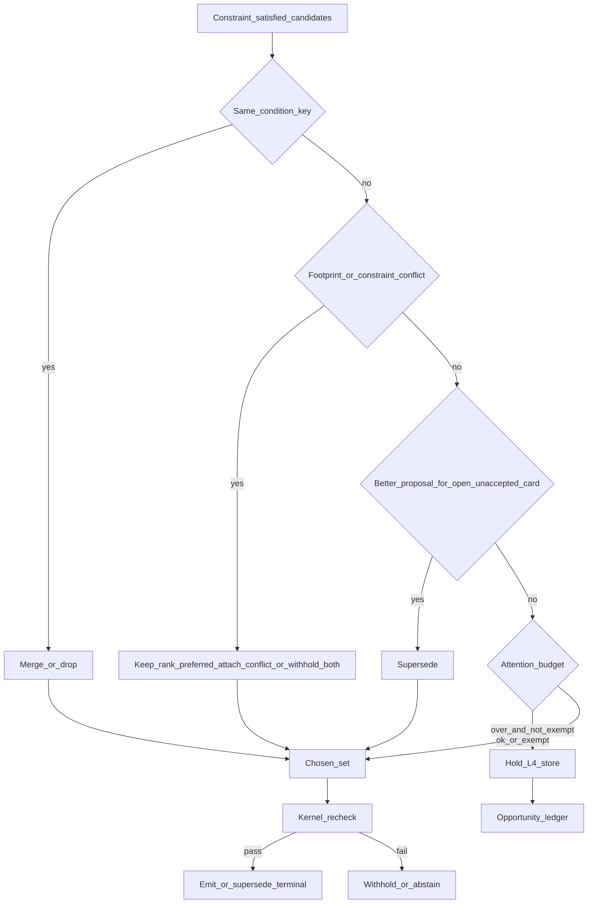

# 09 — Portfolio

**Status:** Architecture (docs). Runs after the constraint evaluator and before the final kernel re-check.  
**Date:** 2026-09-25  
**Related:** [`00-kernel.md`](00-kernel.md) · [`07-finding-runtime.md`](07-finding-runtime.md) · [`08-discovery.md`](08-discovery.md) · [`04-constraints.md`](04-constraints.md) · [ADR-035](../../decisions/033-039/ADR-035-l4-discovery.md)

The plant is not one card at a time in isolation. Open cards, held proposals, and in-flight cases share assets, feeders, crews, and owner attention. The portfolio manager keeps that set coherent before anything reaches L5.

HITL still holds: portfolio decides what may be proposed this shift. Owners accept. The system does not clear conflicts by writing the plant.

---

## Decision

After constraints pass for a candidate set:

1. **Dedupe** by condition key (shared key function).  
2. **Conflict** by footprint overlap and constraint evaluation across proposals.  
3. **Supersede** only before owner acceptance.  
4. **Attention budget** per plant / owner role / shift — over budget → **hold** (L4-internal).  
5. **Exception-response** cards are attention-exempt via the **domain registry** flag, not a hard-coded domain name in kernel or portfolio code.  
6. **Kernel re-check** on the chosen set after portfolio actions.

Money is not re-ranked here into a hero ₹. Section effects stay separate; ranking already refused summed wallets ([`08-discovery.md`](08-discovery.md)).

---

## Why

Without portfolio, two honest Findings still double-book a feeder or bury the ops head. Without hold-as-internal, "over budget" either drops silently (lost opportunity) or ships anyway (nuisance). Supersede after accept rewrites a human commitment; that is a new card or a conflict note, not a quiet replace.

---

## Stage position

Fixed relative order (see default stage graph in [`01-system-overview.md`](01-system-overview.md)):

`candidates → constraint evaluator → portfolio → kernel re-check → terminal`

Portfolio never prefers a candidate the constraint evaluator already failed. Any declared stage graph must keep portfolio **after** constraints and **before** the pre-terminal kernel checkpoint.

---

## Dedupe

Same condition key as an open L5 card, a held proposal, or an in-flight DecisionCase → **merge or drop**.

- Prefer the richer evidence ledger and the stricter (narrower) verification plan.
- Primary domain stays the registry id from the family or pattern — L4 does not re-tag primary to "win" a duplicate.
- Finding refs and pattern refs accumulate on the surviving case where useful for audit.

The key function is shared with L3 and discovery ([`15-l3-l4-interface.md`](15-l3-l4-interface.md)).

---

## Conflict

Conflict when either:

- **Footprint overlap** — assets, shared resources, crew/role, material, or time windows (with lag) intersect; or  
- **Constraint conflict** — evaluating the joint claim set returns violated or unknown-on-hard.

Resolution (seam-assisted, closed options — see [`11-models-and-seams.md`](11-models-and-seams.md)):

- keep the rank-preferred proposal and attach the conflict on the card / trace  
- hold one  
- hold both  
- request evidence (withhold path with gate id)

Both withheld when the joint set is unknown on a hard constraint. Modeled benefit does not break a tie against a hard conflict.

---

## Supersede

Allowed **only before** the owner accepts the open card.

- State changed and a better proposal exists for that condition key → new proposal version, terminal `supersede`, L5 marks the prior proposal superseded (not a new closure state).
- **After acceptance** → separate card, or a conflict note on the open card. Do not silently replace an accepted commitment.

---

## Attention budget

- Scope: **per plant, per owner role, per shift**.  
- Counting unit: cards that would notify or assign that role this shift (exact counter in ops config).  
- **Over budget** → **hold**: proposal stays in the L4 operational store, visible to Stamped staff and (as labelled backlog items where soft-gated) to the plant owner. **Not** sent to L5 as a live card.  
- Hold is **not** a kernel terminal to L5; it still produces a DecisionTrace and an opportunity-ledger row.

### Exception-response exemption

Cards whose primary domain registry entry sets `attention_budget_exempt=true` skip the budget gate. Seed: the exception-response domain. The portfolio code reads the **flag on the registry entry**. It never branches on a hard-coded domain name. A future exempt domain is data, not a kernel change.

Exempt cards still dedupe, conflict-check, and supersede by the same rules.

---

## Kernel re-check

After portfolio chooses the set, run kernel criteria again ([`00-kernel.md`](00-kernel.md)): one card per condition key, money references, constraint results, hard stops, verification narrowing, no write tools. Failure → withhold / abstain even if portfolio had selected emit. This is what keeps a graph reorder from sneaking a bad candidate past the yardstick.

---

## Rejected alternatives

| Rejected | Why |
| --- | --- |
| Drop over-budget items silently | Loses real opportunities; no calibration signal |
| Ship over budget and "let the owner triage" | Trains nuisance; breaks the one-queue promise |
| Hard-code exception exemption in portfolio source | Breaks open domain set; kernel/portfolio must not name domains |
| Supersede after accept | Rewrites a human commitment without a new decision |
| Rank by summed ₹ across sections | Dual-wallet honesty; calculator sections stay separate |

---

## What evidence would change this

- Measured portfolio regret and owner dismiss reasons showing budget too tight → raise per-role budget via plant override + replay (soft gate).  
- Conflict miss rate (two shipped cards that fought one resource) → tighten footprint templates or lag defaults.  
- Exempt domain flooding attention → clear the registry flag or add a separate exception cap (still registry, not kernel).

---

## v1 slice vs later

| v1 | Later |
| --- | --- |
| Dedupe + footprint overlap + attention hold | Richer cumulative-resource conflict packs as constraint kinds expand |
| Exception exempt via domain registry flag | Same mechanism; more flags if product ADR amends |
| Seam for conflict action (send one / hold one / hold both / request evidence) | Jev when it beats the logged seam baseline |
| Staff-visible holds + owner backlog for soft gates | Clearer L6 backlog UX (contract delta in doc 18) |

---

## Links

- Kernel: [`00-kernel.md`](00-kernel.md)
- Finding path: [`07-finding-runtime.md`](07-finding-runtime.md)
- Discovery ranking feeds this set: [`08-discovery.md`](08-discovery.md)
- Constraints and footprints: [`04-constraints.md`](04-constraints.md)
