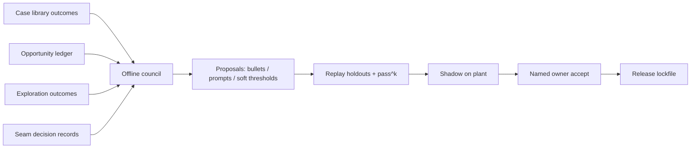

# 13. Improvement loop

**Status:** Architecture.  
**ADRs:** [025](../../decisions/024-026/ADR-025-improve-loop-step-06.md) · [036](../../decisions/033-039/ADR-036-dual-family-models.md) · [038](../../decisions/033-039/ADR-038-soft-gates-opportunity-ledger.md)  
**Siblings:** [`06-memory.md`](06-memory.md) · [`11-models-and-seams.md`](11-models-and-seams.md) · [`12-trace-and-eval.md`](12-trace-and-eval.md) · [`22-missed-opportunities.md`](22-missed-opportunities.md)

L4 gets better from what it sent **and** from what it held back. Humans accept every production pin. Nothing promotes itself.

Month-12 quality is a versioned playbook and prompt set — not silent weight post-training on raw closures. Improvement runs **offline**. Opus 5.5 + GPT-5.6 Sol never sit on the plant request path.

---

## 1. Decision summary

| # | Topic | Decision |
| --- | --- | --- |
| 1 | Offline council | Opus 5.5 + GPT-5.6 Sol label and propose; **never** on the plant request path |
| 2 | Two learning streams | (A) cards + closures (B) opportunity ledger, backlog, exploration ([ADR-038](../../decisions/033-039/ADR-038-soft-gates-opportunity-ledger.md)) |
| 3 | Playbooks | ACE-style bullet playbooks with **helpful** / **harmful** counters |
| 4 | Loop shape | Generator → reflector → curator; proposer and red-team swap each cycle |
| 5 | Prompt evolution | GEPA-style prompt candidates — replayed, never live-edited |
| 6 | Code merges | Registry / stage-graph / adapter deltas as versioned PRs; same shadow path |
| 7 | Promotion | Shadow → named-owner accept → canary → pin. Unpin = rollback |
| 8 | Weights | **No** silent weight post-training on raw closures. Clean step labels first; small verifier or Jev on closed seams before any weight work |
| 9 | Pins | **No** self-promotion of model pins, thresholds, playbooks, or patterns |

---

## 2. Why

A system that only learns from cards it sent drifts cautious: gates hide their own mistakes. The opportunity ledger is the honest half of improvement ([ADR-038](../../decisions/033-039/ADR-038-soft-gates-opportunity-ledger.md)).

ACE-style bullets stay inspectable. A plant owner can read “helpful 12 / harmful 3” on a playbook line. Opaque weight updates on messy closures teach false lessons (ineligible closes, selection bias, detector epoch shifts).

HITL is the product promise: recommend and record; humans decide what enters production registries.

---

## 3. Inputs

| Stream | Source | Use |
| --- | --- | --- |
| Sent cards | DecisionTrace + L5 closures + learning facts | What worked / failed after emit |
| Held back | Opportunity ledger, backlog promote/dismiss, `exploration=true` | Soft-gate miss rate, over-strict blocks |
| Process labels | Council (+ human on dissent) | Bad route, weak grounding, flooded owner, … |
| Holdouts | Suites proposers never see | Replay gate before any pin |

Ineligible closes set “action worked” to null. Closure rate alone never ranks patterns.

---

## 4. Offline council

| Role | Model | Job |
| --- | --- | --- |
| Generator | Opus **or** Sol (alternates) | Propose deltas from labeled misses |
| Reflector | The other model | Red-team: nuisance cost, hard-gate adjacency, selection bias |
| Curator | Code + human checklist | Keep only deltas that pass schema, replay, and owner pack rules |

Where the two models **agree** on a process label, it stands as a candidate. Where they **disagree**, a human decides. Council judgement on blocked items may **prioritise** backlog review; it is not itself a training label for “should have emitted.”

---

## 5. ACE-style bullet playbooks

Procedural memory holds versioned playbook bullets per domain / family / pattern scope.

| Field | Rule |
| --- | --- |
| Bullet text | Short, operational; when to apply / not apply |
| `helpful` counter | Incremented when a labeled good step or verified path used the bullet |
| `harmful` counter | Incremented when a labeled miss or reject path used the bullet |
| Status | `draft \| shadow \| certified \| retired` |
| Scope | Global or plant override |

Generator → reflector → curator emits add / update / remove. **Deterministic code** merges — no monolithic rewrite (brevity bias / context collapse). Counters never auto-delete a bullet; low helpful / high harmful triggers a **proposal** to retire, accepted by the owner.

Directives and hard stops are **not** editable by this loop.

---

## 6. Generator → reflector → curator (one cycle)

1. **Label** — council labels a sample of traces and blocked ledger items ([`12-trace-and-eval.md`](12-trace-and-eval.md)).  
2. **Generate** — ACE bullets · GEPA-style prompt candidates · registry edits (thresholds, soft gates, patterns, workflows) · stage-graph proposals · seam threshold changes · Jev swap proposals when records are strong enough.  
3. **Reflect** — other model attacks nuisance rate, hard-gate adjacency, and “this only looks good on sent cards.”  
4. **Curate** — drop illegal deltas (hard-gate loosens, write tools, money invention).  
5. **Replay** — holdouts proposers never saw; pass^k and suite gates.  
6. **Owner pack** — dissent visible; tech lead for global; plant owner for plant-scoped.  
7. **Shadow → canary → pin** — unpin rolls back. In-flight runs finish under the lockfile they started; new runs take the new pin.

Proposer and red-team **swap every cycle**.

---

## 7. GEPA-style prompt evolution

Prompts are registry entries under the lockfile.

| Rule | Detail |
| --- | --- |
| Candidates | Generated offline; scored by replay on frozen episodes; Pareto frontier under replay metrics |
| Live path | Never hot-edits the plant prompt mid-shift |
| Grammar vs knowledge | Hard grammar fixed; retrieved bullets and evolved sections are separate |
| Accept | Same shadow → owner → pin path as playbooks |

If a candidate improves pass^k but raises nuisance or grounding violations, it fails curation.

---

## 8. Opportunity ledger → improvement (ADR-038)

Soft-gate scorecards (miss rate, block precision, foregone Modeled effect, nuisance cost of loosening) are first-class generator fuel.

| Direction | Trigger |
| --- | --- |
| Loosen | Miss rate or foregone effect crosses a registered bar |
| Tighten | Released cards under that gate keep getting rejected / no-change |

Hard gates are **outside** this loop. A pattern of hard-gate blocks that looks wrong is a **data** problem for the constraint owner — not a threshold knob.

Exploration closures (`exploration=true`) are the unbiased sample. Prefer them when proposing soft-gate moves. Detail: [`22-missed-opportunities.md`](22-missed-opportunities.md).

---

## 9. Seams → Jev

Seam decision records are the training and comparison set. A classifier / Jev candidate must **beat** the logged LLM seam under replay before replacing it ([`11-models-and-seams.md`](11-models-and-seams.md)).

---

## 10. Forbidden

| Forbidden | Why |
| --- | --- |
| Weight post-training of the generator on raw closures | Labels sparse, delayed, confounded; wait for clean step labels |
| Silent pin / threshold / playbook / pattern promotion | Lockfile + named owner |
| Plant-path council models | Latency and blast radius |
| Ranking patterns by closure rate alone | Selection bias |
| Editing hard stops via playbook | Kernel / ADR only |
| Online RL from accept/reject clicks | Teaches to please the click, not the plant |
| Auto-apply mental-model changes from Ask | Confirm / verified closure only ([`14-ask.md`](14-ask.md)) |

---

## 11. Named ownership

| Change | Accepts |
| --- | --- |
| Global playbook / prompt | Tech lead (or designated) after replay |
| Plant-scoped threshold / pattern | Named plant owner |
| Soft-gate threshold | Named owner after ledger evidence |
| Kernel / hard gate | ADR + version bump |
| Model pin swap | Tech lead + replay; plant owner for plant override |

---

## 12. Rejected alternatives

| Alternative | Why rejected |
| --- | --- |
| Online RL from clicks | Noisy, unsafe |
| Single-model self-improvement on the live path | Correlated blindness |
| Unbounded prompt rewrite without replay | Regressions land on the floor |
| Learning only from sent cards | Selection bias toward caution |
| Auto-certify patterns from hypothesis success alone | Still needs owner / tech-lead certifier |

---

## 13. Evidence that would change this

- ACE counters too sparse after N weeks → add exploration sampling or tighten label cadence; do not jump to silent fine-tunes.  
- Small verifier on closed seams beats LLM under replay → allow weight/Jev track for **that seam only**.  
- Owner pack fatigue → raise auto-filter bar; do not remove the human pin.

---

## 14. v1 slice vs later

| v1 | Later |
| --- | --- |
| Council labeling + ACE bullets + soft-gate proposals | Higher automation on label agree-set |
| GEPA-style candidates on a few high-traffic prompts | Broader prompt population |
| No generator weight training | Verifier / Jev first; weights only with clean labels |
| Manual owner packs | Same HITL; better packaging |
