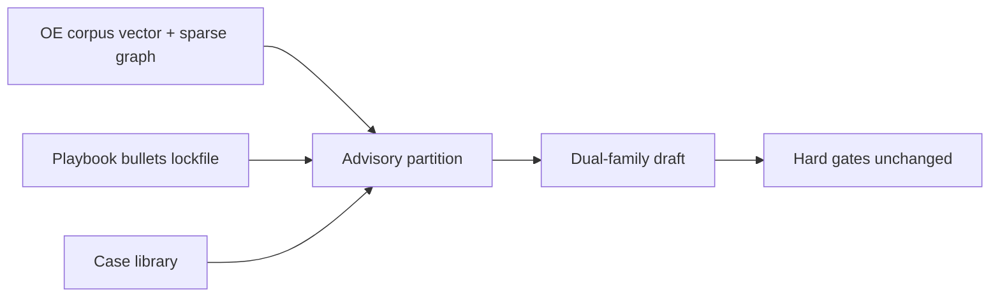

# OE knowledge corpus (advisory retrieval)

**Status:** Architecture. Fills a gap called out after the L4 kernel set: general “how to drive efficiency” knowledge, not plant memory.  
**Research:** [`../../research/plant-efficiency-exploration-2026-09/20-oe-knowledge-retrieval.md`](../../research/plant-efficiency-exploration-2026-09/20-oe-knowledge-retrieval.md)  
**Normative:** [`00-kernel.md`](00-kernel.md) — retrieved text never evaluates gates, invents ₹, or writes equipment.  
**Siblings:** [`05-context-engineering.md`](05-context-engineering.md) · [`06-memory.md`](06-memory.md) · [`11-models-and-seams.md`](11-models-and-seams.md) · [`13-improvement.md`](13-improvement.md)

---

## Purpose

Plant memory answers what worked **here**. Detectors answer what is happening **now**. The OE knowledge corpus answers: **for this class of situation, what methods does industrial practice use to drive efficiency?**

Without it, dual-family models lean on weights and thin playbook bullets. That is not enough when Stamped wants excellence across energy, cost, time, continuity, and exceptions.

---

## Decision

| # | Topic | Decision |
| --- | --- | --- |
| 1 | Gap | First-class **OE knowledge corpus** — separate from Hindsight, case library, and PSM |
| 2 | v1 retrieval | Sparse method ontology + **vector retrieval** (Vector-First or light Parallel Hybrid). Graph is methods↔scenarios↔signals, **not** plant topology |
| 3 | Partition | All hits → **advisory** ledger rows only |
| 4 | Authority | Advisory. Case library wins outcomes. Calculator owns ₹. Code owns constraints |
| 5 | Plant path | No Agentic GraphRAG; no unbounded research loops |
| 6 | Offline | Council / corpus curation may use heavier GraphRAG patterns to propose playbook bullets |
| 7 | Pins | Corpus version + embedding model in release lockfile |

**Rejected:** dumping books into the system prompt; using PSM as the literature graph; letting chunks override hard stops; inventing rupees from a sourcebook example figure.

**Would change this:** Pilot evidence that vector-only (no method ontology) is enough; or that Graph-First is worth the latency for method selection.

---

## Place in the stack

---

## Ingest (summary)

Detail and license notes: research [`20`](../../research/plant-efficiency-exploration-2026-09/20-oe-knowledge-retrieval.md).

| Tier | Examples | v1? |
| --- | --- | --- |
| A — public | DOE sourcebooks (air, pumps, fans, motors, steam, process heat); DOE tip sheets; EPA Lean & Energy toolkit; public IPMVP / ISO 50001 summaries | Yes |
| B — licensed / curated | Factory Physics, TOC, Roser papers → curated method cards; full text only with rights | Selective |
| C — plant-private | SOPs, treasure hunts, OEM manuals — owner-gated, plant-partitioned | Later |
| Out | Marketing % claims; OT-write instructions; chat logs; raw series | Never |

---

## Runtime use

1. Code classifies situation → `ScenarioClass` (from family / pattern / scanner).
2. Allowlisted mission (`oe_methods_for_scenario`, …) retrieves top-K chunks + method nodes.
3. Rows appended to advisory partition with `provenance=doc_id#chunk` and corpus version.
4. Models may cite those row ids. Uncited claims drop.
5. Hard gates, constraint evaluator, calculator path unchanged.

Seam id (catalog add): `oe_retrieval_mission` — options from mission registry; disagreement → registry default (routing class). Jev may later replace mission choice, not the store.

---

## Change class

| Surface | Class |
| --- | --- |
| New public PDF in Tier A | Data (ingest job + lockfile corpus pin) |
| New method node / edge | Plug-in / registry |
| New retrieval mission | Registry + replay |
| Letting corpus set money or hard gates | Forbidden (kernel) |

---

## v1 slice vs later

| v1 | Later |
| --- | --- |
| Tier A ingest; vector index; hand-curated sparse ontology for Pilot scenarios | Broader Tier B/C; Parallel Hybrid default; Ask Adaptive Router |
| Investigative lane + Ask retrieve OE knowledge | Certified fast path may pull a tiny pinned method card only |
| Offline council proposes playbook bullets from corpus + cases | Same |
| Agentic GraphRAG | Offline curation only |

---

## Links

- Research deep-dive: [`20-oe-knowledge-retrieval.md`](../../research/plant-efficiency-exploration-2026-09/20-oe-knowledge-retrieval.md)
- Context partitions: [`05-context-engineering.md`](05-context-engineering.md)
- Memory tiers: [`06-memory.md`](06-memory.md)
- Improvement: [`13-improvement.md`](13-improvement.md)
