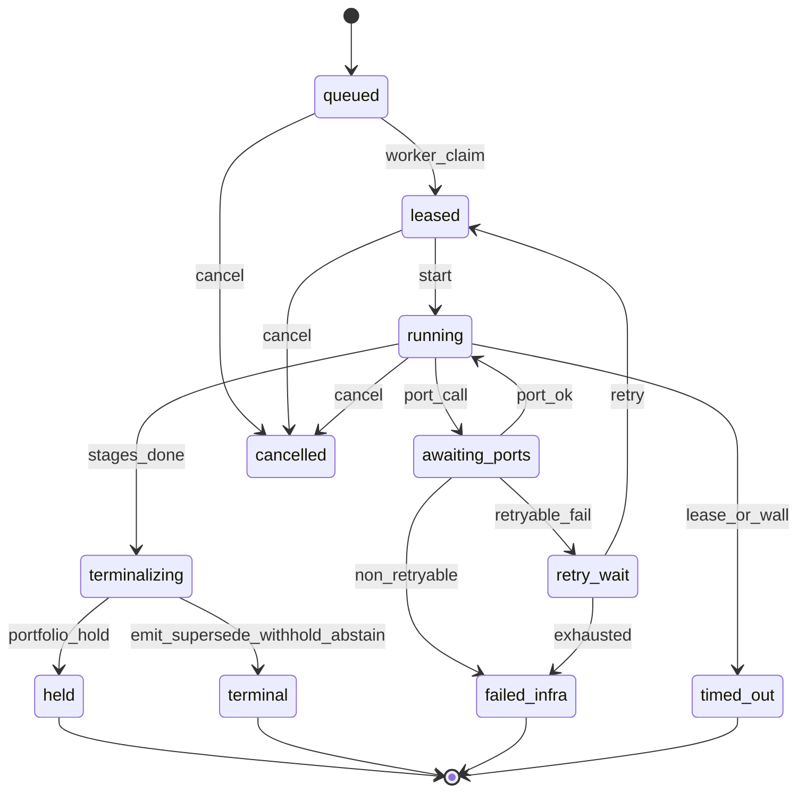

# DecisionCase lifecycle

**Status:** Architecture (production hardness).  
**ADR:** [040](../../decisions/040-044/ADR-040-l4-production-hardness.md)  
**Siblings:** [`07-finding-runtime.md`](07-finding-runtime.md) · [`12-trace-and-eval.md`](12-trace-and-eval.md) · [`25-work-queue-and-concurrency.md`](25-work-queue-and-concurrency.md) · [`27-ports-and-reliability.md`](27-ports-and-reliability.md) · [`00-kernel.md`](00-kernel.md)

---

## Purpose

A DecisionCase is a durable unit of work, not a single request. Models, L3, and memory calls fail. Processes restart. Without explicit states, leases, timeouts, and resume rules, you get orphan traces and double emits. This doc is the lifecycle contract.

---

## States

| State | Meaning |
| --- | --- |
| `queued` | On plant work queue |
| `leased` | Worker claimed; lease heartbeat required |
| `running` | Inside stage graph |
| `awaiting_ports` | Blocked on ModelSlot / L3 / memory / builder |
| `retry_wait` | Scheduled retry after retryable port failure |
| `terminalizing` | Kernel re-check / CardSink |
| `terminal` | `emit` \| `supersede` \| `withhold` \| `abstain` recorded |
| `held` | Portfolio hold — L4 store, not L5 |
| `cancelled` | Explicit cancel; trace closed with reason |
| `timed_out` | Wall or lease timeout; trace closed; opportunity ledger if a candidate existed |
| `failed_infra` | Non-retryable infra abort — **not** a semantic withhold; ops alert |

**Rule:** `failed_infra` and `timed_out` are **not** customer withholds. They do not teach soft gates. They page on-call. Semantic `withhold` / `abstain` only after the stage graph could finish with a frozen ledger.

---

## Identity and durability

| Field | Role |
| --- | --- |
| `decision_case_id` | Stable UUID |
| `plant_id` | Tenancy |
| `lockfile_id` | Pin for the whole case — never mid-case pin flip |
| `correlation_id` | From work item; joins logs/metrics/trace |
| `condition_key` | When known |
| `lease_owner` / `lease_until` | Crash recovery |
| `attempt` | Retry count |
| `created_at` / `updated_at` | Recorded time |

Case row + append-only stage events live in the **L4 operational store**. Crash mid-stage: resume from last completed stage checkpoint if ledger frozen for that stage; otherwise restart from last safe checkpoint (never re-emit without idempotency key — [`27`](27-ports-and-reliability.md)).

---

## Timeouts (registry defaults — lock in ops)

| Timeout | Applies to | On fire |
| --- | --- | --- |
| `case_wall_clock` | Entire case | `timed_out` |
| `lease_heartbeat` | Worker lease | Another worker may reclaim if lease expired |
| `stage_budget` | Single stage | Fail stage → retry policy or `timed_out` |
| `port_deadline` | Each port call | See [`27`](27-ports-and-reliability.md) |

Exception-tier cases get tighter wall clocks than energy/cost investigative lanes (`latency_tier` registry).

---

## Cancel

Who may cancel: on-call (ops), plant owner (plant-scoped), system on kill-switch ([`28-commissioning-and-controls.md`](28-commissioning-and-controls.md)).

Cancel writes a DecisionTrace with `terminal_reason=cancelled` (or closes as `failed_infra` if no ledger). Never leaves a half-sent CardSink without compensating idempotent check.

---

## Crash resume algorithm (normative intent)

1. Worker starts → claim next `queued` / reclaim expired `leased`.  
2. Load case + last completed stage id + frozen sub-ledger.  
3. If CardSink already succeeded for this `decision_case_id` + `emit_idempotency_key` → mark `terminal` emit/supersede; do not call models again.  
4. Else continue from next stage under the **same** lockfile and as-known-at snapshot id.  
5. Do not refresh PSM to “now” on resume — that breaks replay. New evidence requires a **new** case or explicit `recheck` work item.

---

## Token budget failure

If a stage cannot fit **required** proof rows (proof floor, intersecting hard constraints, calculator refs for priced claims) inside the token budget after zoom policy:

→ **`withhold` or `abstain`** with `gate_id=token_budget_required_proof` (hard-adjacent: not soft-tunable to “drop proof”).  

Never silently truncate required measured rows to force a draft. Optional advisory / OE chunks truncate first ([`05-context-engineering.md`](05-context-engineering.md)).

---

## Rejected alternatives

| Alternative | Why |
| --- | --- |
| Stateless request/response only | Cannot survive restart or multi-port calls |
| Auto-refresh PSM on resume | Breaks as-known-at / pass^k |
| Counting infra timeouts as soft-gate blocks | Poisons calibration |
| Mid-case lockfile upgrade | Non-reproducible terminal |

---

## What would change this

- Wall clocks too tight for enveloped L3 sims → raise stage budgets by latency tier after measured p95.  
- Need human “pause case” without cancel → add `paused` state via ADR.

---

## v1 slice vs later

| v1 | Later |
| --- | --- |
| States above; lease + wall timeout; resume from stage checkpoint | Multi-worker HA with fencing tokens |
| Infra fail vs semantic withhold split | Same |
| Manual cancel via ops tooling | L6 plant-owner cancel for plant-scoped cases |

---

## Change class

Timeouts and caps: **data**. New states that change terminal semantics: **ADR + kernel/lifecycle bump**.
