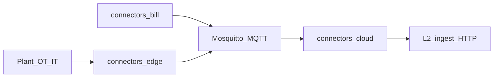

# L1 — Connect & normalise

*Status: as-built · 2026-09-26*  
*Authority:* [STAMPED_ARCHITECTURE.md](../STAMPED_ARCHITECTURE.md) §4 · [ADR-008](../../decisions/006-010/ADR-008-layer-repo-topology-and-interfaces.md) · [ADR-001](../../decisions/001-005/ADR-001-l1-repo-split-and-boundaries.md) · [L1-L2-DATA-PLANE.md](../L1-L2-DATA-PLANE.md)

L1 reads plant and document signals and turns them into **canonical JSON** that L2 can store. It never opens Timescale and never writes OT registers.

| Label | Meaning |
| --- | --- |
| **as-built** | Code on the three connector repos’ main |
| **contract** | Schemas and MQTT topics in this pack |
| **direction** | Field readiness still gated (e.g. DLMS / BACnet / MTConnect) |

---

## Repos

| Repo | Job | Must not |
| --- | --- | --- |
| `connectors-edge` | Plant gateway: protocol adapters → tag map → SQLite buffer → MQTT uplink | OT write; inbound plant HTTP as SoR; `L2_DATABASE_URL` |
| `connectors-cloud` | Cloud door: MQTT/HTTP intake → schema + quality gate → Postgres outbox → HTTP relay to L2 | Plant protocol poll; L2 SQL |
| `connectors-bill` | DISCOM / plant-doc PWA: OCR → **₹ gate** → MQTT publish | MQTT consumer; outbox writer; L2 SQL |

---

## Data flow

1. **Edge** polls/subscribes (Modbus, MQTT/Sparkplug, OPC UA, filewatch, REST, historian, DLMS/BACnet/MTConnect sim-first, fake) → `RawReading` → signed mapping → MQTT topics under `stamped/v1/{org}/{plant}/…`.
2. **Bill** extracts `bill_line` (and plant docs / context sheets); **`recompute_bill` ±₹1** must set `extraction.validated` before publish.
3. **Cloud** validates fail-closed against contracts, SHA-256 dedupe, wraps `StampedRecordEnvelope`, writes `l1_outbox`, relays `POST` L2 `/v1/ingest/records` (at-least-once; L2 idempotent). Invalid → DLQ.

---

## Record catalog (contract)

| Record type | Typical source | Notes |
| --- | --- | --- |
| `measurement` | edge | Live + historian backfill path |
| `event` | edge health / bill arrival | |
| `production_record` / `production_order` | edge MES-lite / bill exports | |
| `bill_line` | bill | Requires `extraction.validated=true` at L2 |
| Context (`asset_state`, batches, flow, maintenance, quality, materials, shift, rates) | edge context-agent / bill sheets | [ADR-031](../../decisions/028-032/ADR-031-l1-l2-context-records.md) · MQTT `…/context` wrapper |

Schemas: [`contracts/schemas/`](../../contracts/schemas/) · topics: [`contracts/TOPICS.md`](../../contracts/TOPICS.md) (if present) / data plane.

---

## Hard rules

| Rule | Why |
| --- | --- |
| Read-only OT on the default path | Hard stop — no silent plant control |
| No `L2_DATABASE_URL` in L1 | Only L2 opens Timescale for plant truth |
| Bill ₹ gate before publish | OCR must not invent charges |
| Schema fail-closed at cloud | Bad payload → DLQ, not silent store |

---

## Related handoffs

Integration playbooks under [`../../handoff/connectors/`](../../handoff/connectors/). Prefer **this page** for architecture; handoffs may still carry older build detail.
