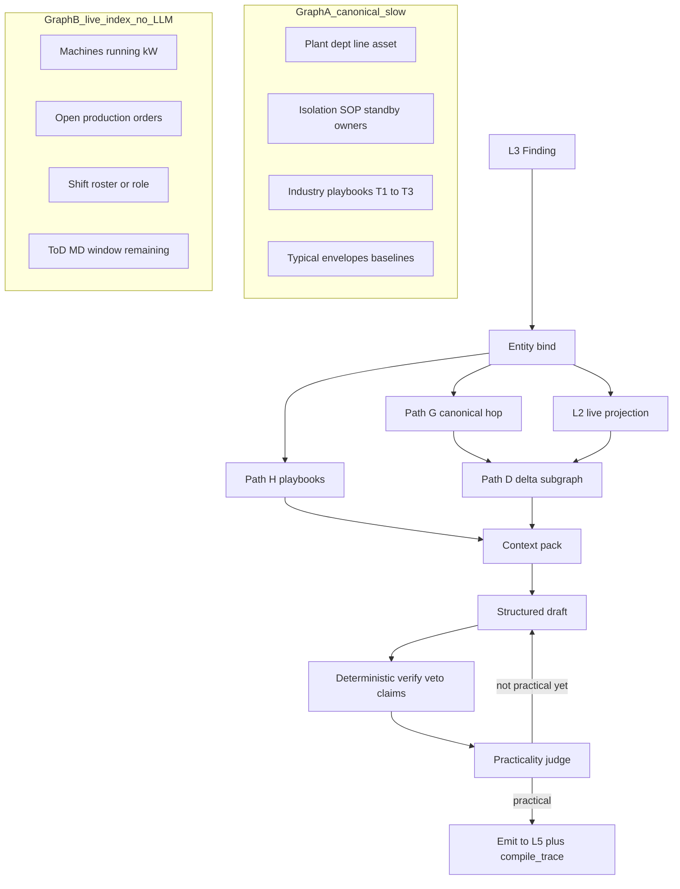
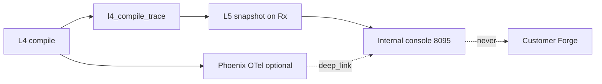

# L4 — Plant context graphs

*Companion SSOT · August 2026. Pulls the Path G trigger in [ADR-017](../../../decisions/016-020/ADR-017-l4-adaptive-retrieval-and-web-trust.md). Decision: [ADR-028](../../../decisions/028-032/ADR-028-dual-plant-graphs-and-path-d.md). Research: [context graphs note](../../research/stamped-context-graphs-and-practical-prescriptions.md). Parent: [L4 knowledge and reasoning](L4-knowledge-and-reasoning.md). Eval: [practicality rubric](../../cross-cutting/05-prescription-practicality-eval.md). Staff UI: [L5 internal console](../../../handoff/holistic/improve/stamped-l5-internal-console-handoff.md).*

> L4 still does not detect waste, own tariff arithmetic, write OT, or auto-approve. This document changes **how** a Finding becomes a practical Prescription — not those boundaries.
>
> Gold bar: [demo prescriptions](../../../demo-decks/prescriptions-examples.md). Example 6 (Tuesday inspect blocked → Thursday after Job 447) is Path D, not a better prompt.

---

## 1. Thesis

Two persistent graphs share **the same node IDs**.

| Graph | Name | Update | LLM? | Answers |
| --- | --- | --- | --- | --- |
| **A** | Canonical plant knowledge | Every few days, or on SOP / asset / tariff-structure change | Allowed on the batch; T3 still human-reviewed | What is this plant, what is allowed, who owns what, what is typical |
| **B** | Live operational index | Event-driven (measurements, orders, shift clock) | **Never** | What is true *right now* |
| **Path D** | Delta pack (query-time) | Built per Finding | No (deterministic diff) | What is different from typical/allowed — this *is* Why and Due |

The **quality path** is the default compiler for all categories. **Lane A (0 LLM) is kept, not default.**

---

## 2. Compile flow

Default steps:

1. Bind Finding → asset / class / vertical / waste.
2. Path G hop on Graph A (owners, standby, SOP, typical).
3. Live pull Graph B for those IDs (L2 projection — L4 never `L2_DATABASE_URL`).
4. Path D: emit delta facts (need / blocker / next-best window).
5. Path H: playbook chunks filtered by vertical + equipment class. Trust tiers T1–T4 unchanged ([ADR-017](../../../decisions/016-020/ADR-017-l4-adaptive-retrieval-and-web-trust.md)).
6. Deterministic next-best window ([ADR-024](../../../decisions/024-026/ADR-024-holistic-plant-decisions.md) feasibility **at compile**).
7. Draft What/Why/Who/When from the pack. `template_id` still bounds the **action family** (no free-form What rewrite).
8. Verify ₹ / citations / veto (non-tradeable).
9. Practicality judge (language only). Repair if weak. **≥10 generation calls allowed** when quality needs it; not a ceiling. If still not practical: abstain / human — never emit a generic card to look busy.

Lane A (zero-call template graph) remains for CI without a provider, `force_lane=a`, `L4_DEFAULT_LANE=template` (ops/emergency), and automatic degrade when the structured model is down. Label those cards `provenance.lane = template_fast_path`.

---

## 3. Graph A — canonical ontology

Keep this small. ISA-95-shaped, not a MES product ([ADR-026](../../../decisions/024-026/ADR-026-two-pillars-shared-context.md)).

### 3.1 Node types

| Type | Example | Notes |
| --- | --- | --- |
| Plant | `plant_ghaziabad_1` | One site |
| Department | utilities, packaging, melt_shop, pyro, batch_hall | Matches department graph |
| Line / area | compressor house, kiln string, packaging line 1 | |
| Asset | `COMP2`, `KILN1`, `P-12` | Tagged machine |
| AssetClass | screw_compressor, holding_furnace, raw_mill, chiller, CW_pump | Playbook join key |
| Role | utilities_lead, area_supervisor, electrical_lead, mechanical_maint | |
| Person | optional named human | Only if roster exists |
| Constraint | isolation_requires_standby, min_header_bar, validated_setback_band, hold_safe_SOP | |
| Playbook | T1/T2/T3 doc chunk | Industry + class |
| TypicalEnvelope | baseline SP, idle-aux kW, ramp coincidence | |
| Vertical | generic \| steel \| cement \| pharma \| packaging | Path H filter |

### 3.2 Edge types

| Edge | From → To |
| --- | --- |
| `CONTAINS` | Plant → Department → Line → Asset |
| `INSTANCE_OF` | Asset → AssetClass |
| `OWNED_BY` | Asset / Line → Role (Role → Person if roster) |
| `STANDBY_FOR` | Asset → Asset (COMP1 standby for COMP2) |
| `FEEDS` / `SERVED_BY` | e.g. WHR → mill, chiller → hall |
| `CONSTRAINED_BY` | Asset → Constraint |
| `REMEDY_IN` | AssetClass + waste_category → Playbook |
| `IN_VERTICAL` | Plant → Vertical |
| `CRITICAL_NO_STAGGER` | Department → Asset (already on department graph) |

Refresh: clock (e.g. 72 h) or SOP / asset / tariff-structure change. Store later: L4 Postgres property-graph tables. **Not** Neo4j / Graphiti in this spec.

---

## 4. Graph B — live index (same IDs, no LLM)

Graph B does not add a parallel universe of nodes. It stamps **now** on Graph A IDs. **L2 is source of truth.** L4 reads a projection for the compile window.

| Subject | Properties |
| --- | --- |
| Asset | `running`, `kw`, `vs_typical_pct`, `header_bar`, `available_as_standby` |
| Line | `output_zero_for_min`, `occupancy` |
| Order | `order_id`, `status`, `due_at`, `hot`, `line_id` from [`production-order.json`](../../../contracts/schemas/plant/production-order.json) |
| Tariff | `tod_block`, `md_window_remaining` |
| Shift | `shift_id`, `role_on_duty`; `person_id` only if roster |
| PendingRx | other open Rx on the same asset (avoid stacking) |

Updates: measurement ticks, order status, shift clock. **Zero model calls.**

**Have today:** running/kW (L2 measurements), production orders, department graph, ToD/MD.

**Gap:** named crew — optional [`shift-roster`](../../../contracts/schemas/plant/shift-roster.json). Degrade to `role + department + shift`. Never invent a name (`owner_resolution: role_only`).

Standby *now* is derivable from sibling load + header, not a separate product.

---

## 5. Worked example — COMP2 inspect (demo cards 3 + 6)

**Canonical**

- `COMP2` INSTANCE_OF screw_compressor · OWNED_BY utilities_lead + mechanical_maint
- `COMP1` STANDBY_FOR `COMP2` · isolation CONSTRAINED_BY min_header_bar
- TypicalEnvelope: SP within 8-week matched band
- Playbook: inspect filter / unload valve in next low-load window

**Live**

- `COMP2.vs_typical_pct = +14%` for 9 days, header matched
- `COMP1.load = 90%` → `available_as_standby = false` Tuesday 09:00–11:00
- `Job 447` in_progress on an air-using line, completes Thursday noon
- Shift B: utilities_lead on duty (name unknown → role only)

**Path D delta (what the model sees)**

| Fact | Value |
| --- | --- |
| Need | Inspect COMP2 (canonical remedy still valid) |
| Blocker | Tuesday window infeasible (standby + Job 447) |
| Feasible | Thursday 14:00–16:00 after Job 447 · COMP1 confirmed spare |
| Who | Utilities lead + mechanical maint · Shift B · compressor house |
| Not | “Improve compressor efficiency” · not “Tuesday 9am” |

Hybrid RAG fetches the inspect playbook. It does **not** discover Job 447.

---

## 6. Router

| Mode | When | `provenance.lane` |
| --- | --- | --- |
| **Quality (default)** | All categories, including the 16 that used to auto-route to Lane A | `quality` |
| Lane A | `force_lane=a`, `L4_DEFAULT_LANE=template`, or structured model unavailable | `template_fast_path` |

Today’s `CATEGORY_TEMPLATE_ID → Lane A` default is **revoked** by ADR-028. Templates remain the action-family guard on the quality path.

Analyst and Path W budgets are unchanged (still cheap / allowlisted).

---

## 7. Non-tradeables

- No OT write
- Calculator-owned ₹ / kWh / tCO₂e
- T4 never sole money source
- L5 owns approval; negotiation never auto-commits
- Deterministic gates **before** the judge
- L6 never shows compile guts

---

## 8. L5 visibility (staff verify)

L5 **does not own the graphs.** It stores [`l4-compile-trace`](../../../contracts/schemas/intelligence/l4-compile-trace.json) with the Rx. Internal console (`:8095`) renders it. Phoenix (`:6006`) remains the OTel/LangGraph waterfall; console shows a summary plus `otel_trace_id` deep link.

**Per-Rx tabs** (extend the [internal console handoff](../../../handoff/holistic/improve/stamped-l5-internal-console-handoff.md)):

1. Card — What/Why/Who + AD-5 gate (existing)
2. Graph overview — neighborhood for *this* Rx (canonical edges + live stamps)
3. Retrieval log — Path H / G / D, filters, ranked chunk IDs, trust tier
4. Compile loop — draft → verify → judge → repair; call count; lane
5. Eval / practicality — judge rubric next to AD-5 so staff can withhold

**Plant-level (secondary):** Graph A snapshot age, node/edge counts, vertical — not required to verify one Rx.

Keep `prescription.provenance` small: lane, versions, `compile_trace_id`, optional `otel_trace_id`. Do not stuff the subgraph into provenance (`additionalProperties: false` today).

---

## 9. Ownership

| Concern | Owner |
| --- | --- |
| Telemetry, orders, live properties | L2 |
| Canonical KG + quality compile + Path H/G/D | L4 |
| Detection, TradeoffEngine numbers, rules veto | L3 |
| Compile-trace snapshot, approval, console | L5 |
| Customer card UX | L6 |

---

## 10. Consumer implementation (later)

This document is platform spec. `knowledge-reasoning` implements Path G/D after a platform pin. `closure-verification` internal console renders the compile-trace. Neither is in the ADR-028 docs pass.
