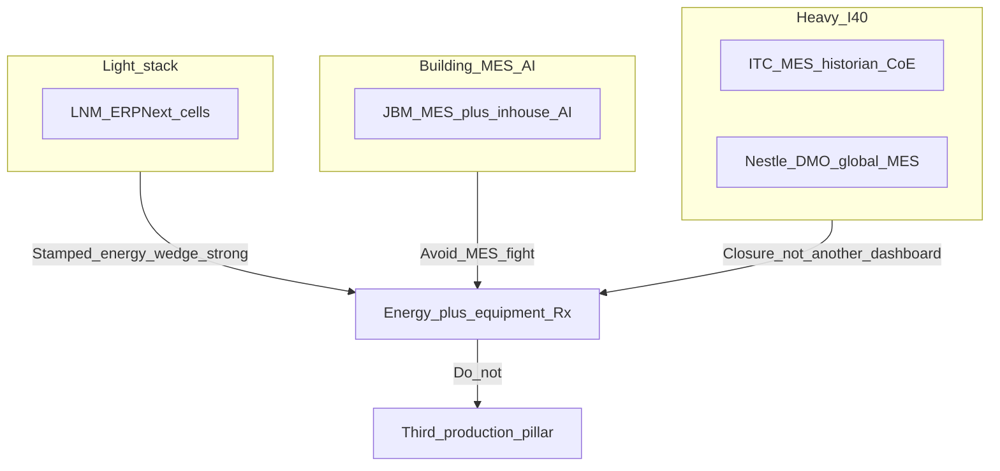
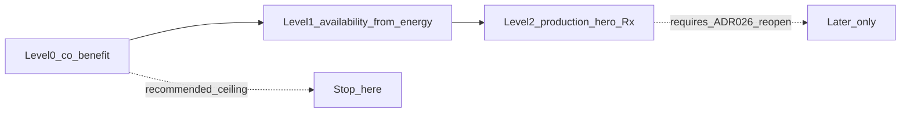

# India MES / AI + production-Rx expansion

*Companion to [ADR-024](../../decisions/024-026/ADR-024-holistic-plant-decisions.md), [ADR-026](../../decisions/024-026/ADR-026-two-pillars-shared-context.md), [STAMPED_ARCHITECTURE.md](../STAMPED_ARCHITECTURE.md), client narrative [`../../copy/client/POSITIONING_AND_NARRATIVE.md`](../../copy/client/POSITIONING_AND_NARRATIVE.md).*

> **Honesty:** `[~]` approximate / vendor-survey · `[!]` evolving / incomplete public trail · `[VERIFIED]` primary source checked this pass.  
> **Scope:** Desk research + architecture gap analysis. **No ADR reopen, no contracts, no code** in this pack.  
> **Framing lock:** This is *not* a proposal to lead client pitches with “we improve production volume.” It answers whether production-efficiency Rx is a credible expansion and whether the India MES/AI gap is real.

---

## 1. Executive answer

**Market.** Indian manufacturers largely *have* MES or MES-like systems on paper; far fewer have them fully integrated. AI is present as **pockets** (vision, PdM pilots, CoE use cases, workforce analytics)—not as a plant-wide **agentic MES** that assigns and closes production decisions with proof. Your instinct is right: deep AI penetration into the industrial buyers you target is still low outside large-group lighthouses.

**“Agentic / AI MES” improvement.** Literature and lighthouse cases suggest **~10–30% throughput**, **~15–25% OEE**, **~30–50% less unplanned downtime** *when* data is integrated and process owners change how the floor runs `[~]`. Most Indian plants are not there. Bolt-on “AI on MES” without data fabric usually stalls at pilots. Realistic near-term gain from “make our MES agentic” for a typical mid-tier plant: **single-digit to low-teens OEE/availability**—and most of that is monitoring + discipline, not an LLM.

**Stamped expansion.** You *can* extend the stack toward production-efficiency prescriptions—but that is a **category change** (third hero outcome / near-MES), not an agent prompt. Current connect surface + contracts support **energy/equipment Rx with production co-benefits**, not cycle-time / scrap / OEE-loss-tree heroes. **Recommendation: do not add a third production pillar or `prod_*` decision class in this wave.** Deepen co-benefits + fix the EMS objection with clearer job-to-be-done language. Revisit only if pilots show energy buyers will not close unless production is the hero metric.

**Founder lock (2026-08-24):** Keep this research on file. **Do not build production-efficiency Rx** unless a pilot explicitly demands it (kill criteria §6). Before chasing OEE/volume as an expansion, prefer studying **margin-scored operating decisions** (CVector-style) — see [Appendix D](#appendix-d--cvector-plant-margin-optimization).

**Parked location:** [`future/`](../../future/README.md) — nearer: [`future/near-term/plant-margin-optimization.md`](../../future/near-term/plant-margin-optimization.md); later: [`future/later/production-efficiency-prescriptions.md`](../../future/later/production-efficiency-prescriptions.md). Agents must **not** implement either unless the founder explicitly asks.

---

## 2. India MES + AI penetration

### 2.1 Adoption vs maturity

| Signal | Figure | Source | Meaning for Stamped |
|--------|--------|--------|----------------------|
| India manufacturers with *some* MES | **98%** `[~]` | Rockwell *Scaling MES Across the Enterprise* (India cut, via CXOToday) [1] | “We have MES” is a common objection; often means site modules or thin tracking |
| India fully integrated MES | **36%** `[~]` | Same [1] | Majority still fragmented — room for a **decision/closure** layer that is *not* MES |
| Global have MES / fully integrated | **93% / 23%** `[~]` | Rockwell global report [2] | Scale problem is worldwide; India surveys read more optimistic on “have MES” |
| Top India MES barriers | TCO **56%**, ERP integration **49%**, expertise **47%**, security **45%** `[~]` | [1] | Buyers buy modules slowly; another production AI SKU competes for the same budget/attention |
| India industrial tech spend vs global | **1.6×** `[~]` | Express Computer / Rockwell Smart Manufacturing framing [3] | Spend ≠ usable intelligence |
| India #1 internal AI obstacle = data use | **60%** (vs **37%** global) `[~]` | [3] | AI features outrun pipelines — same reason Stamped’s “assigned + verified” job still differentiates |

**Practical read:** MES is ubiquitous as a *checkbox*; agentic closed-loop production AI is rare. The gap is **integration + action**, not “nobody has a system.”

### 2.2 What vendors actually ship as “AI MES”

| Vendor family | Typical India footprint | AI in product marketing | Floor reality `[~]` |
|---------------|-------------------------|-------------------------|-------------------|
| Siemens (Opcenter / WinCC / Totally Integrated) | Auto, process, large FMCG | Analytics, low-code, digital twin hooks | Strong SCADA/MES; AI often separate CoE projects |
| Rockwell (FactoryTalk / Plex) | Discrete + auto | PdM, ops intelligence, cloud MES | Same: AI modules need clean tags + IT/OT program |
| Dassault DELMIA Apriso | Complex discrete / aerospace-adjacent | Twin + optimization narrative | Heavy SI programs |
| Schneider EcoStruxure | Process / utilities-heavy | Predictive + energy-adjacent | Overlaps *monitoring*; not Stamped’s closure job |
| Local / ERP-as-MES (ERPNext, Tally+, custom) | Mid-market auto, MSME | Little true AI | Common under “MES” in sales calls |

**Agentic MES** (LLM/agent proposes line actions, owns dispatch trade-offs, closes with M&V) is mostly **roadmap language**. Shipped value today is closer to: OEE dashboards, downtime codes, quality SPC, recipe/genealogy, and bolted PdM/vision.

### 2.3 Improvement realism (“if we made MES agentic”)

Separate three gain sources buyers conflate:

| Lever | Typical cited uplift | What it actually requires | Agent/LLM contribution |
|-------|---------------------|---------------------------|------------------------|
| **See losses** (OEE monitor, downtime tree) | **+5–15 pts OEE** in messy plants `[~]` (Sicagen-style IoT monitoring claims up to ~40% OEE relative gain in one India case [4] — treat as outlier / baseline-sensitive) | Sensors + reason codes + supervisor habit | Low — mostly telemetry + UX |
| **Predict / prevent stops** | **~15%+ OEE** on specific lines (e.g. Bharat Forge ThingWorx story [5]); McKinsey **30–50%** less machine downtime at scale [6] | Condition data + maintenance workflow | Medium — models + work orders |
| **Replan / sequence / yield** | McKinsey **10–30%** throughput; **15–25%** OEE in vendor blogs `[~]` [6][7] | MES+APS+quality + process ownership | High only with trusted schedules and constraints |

**For Stamped ICP (energy-intensive Indian plants):**

- Converting their *current* MES into “agentic” would **not** reliably deliver McKinsey lighthouse numbers.
- Honest expectation if a plant hired a SI for AI-on-MES for 12–18 months: **~5–15%** effective capacity / OEE improvement *if* data and ownership exist; **~0–5%** if MES is a reporting island.
- Energy cost AI (your wedge) is a **different P&L line** than OEE AI; plants can need both.

---

## 3. Prospect sketches

Confidence: public trail only. Always validate in discovery.

### 3.1 LNM Auto (Faridabad — precision auto / forging / machining)

| Dimension | Public trail | Confidence |
|-----------|--------------|------------|
| Ops systems | Migrated **SAP → ERPNext** (Apr 2023) with I4.0 roadmap language [8] | Med |
| Shop floor | In-house CNC gantry / robot pick-place; automation cells [9] | Med-High |
| Classic MES (Siemens/Rockwell) | No public Opcenter/FactoryTalk claim found | Low (absence ≠ proof) |
| AI | Not publicly described as plant-wide AI MES | Low |

**Implication:** Likely **ERP-as-ops + cells**, not enterprise MES AI. Stamped energy + equipment prescriptions remain differentiated. A “production efficiency Rx” product would collide with ERPNext manufacturing consultants and in-house IE—not with a missing agentic MES.

### 3.2 JBM Group (auto + EV buses)

| Dimension | Public trail | Confidence |
|-----------|--------------|------------|
| MES | New Delhi-NCR EV plant described as I4.0 with **MES** + virtual manufacturing [10] | Med-High |
| Monitoring | Press/weld machine productivity online; bottleneck RCA language (annual report era) [11] | Med |
| AI | In-house AI (Third Eye / vision, facial attendance); Group CIO digital narrative [12] | Med-High |
| Ownership | Strong internal digital mandate | Med |

**Implication:** Production AI/MES is **strategically owned**. Competing as “agentic MES” is a bad fight. Win on **₹ energy + assigned closure** that their MES/AI programs usually do not own with DISCOM/tariff evidence.

### 3.3 ITC (esp. PPB / multi-BU manufacturing)

| Dimension | Public trail | Confidence |
|-----------|--------------|------------|
| Stack | MES + **data historian** (sensors, quality from SAP, MES) [13] | High |
| AI/analytics | **100+** use cases; claimed **~2.4% EBIDTA** impact in paperboards journey `[~]` [13] | Med (self-reported) |
| Org | I4.0 CoE, Analytics CoE, Digital Council [13]; ITC Infotech sells smart factory / OEE programs [14] | High |
| MES role | Integration layer shop-floor ↔ SAP; yield/quality/ops | High |

**Implication:** Sophisticated buyer. “We will be your AI MES” fails. Narrative that works: *you already monitor; Stamped is the layer that decides energy/load actions, checks production feasibility, assigns, verifies ₹* (matches existing client narrative).

### 3.4 Nestlé-class CPG (India)

| Dimension | Public trail | Confidence |
|-----------|--------------|------------|
| MES | **DMO (Digital Manufacturing Operations)** — Nestlé’s MES; modules include performance, quality, **energy**, CIP, safety; SAP integration [15][16] | Med-High (role posts + tech press) |
| Digital | Factory I4.0 / DMO rollout; India tech budget rising; DCs with digital twin (logistics) [17] | Med |
| AI | Predictive / analytics language; uneven by factory | Low-Med |

**Implication:** Global MES already includes **energy module** adjacent to EMS. Objection risk is high (“we have DMO + EMS”). Differentiation must be **prescription closure + Indian tariff/MD/idle ₹ evidence**, not production OEE AI (they already instrument performance in DMO).

### 3.5 Tier summary

---

## 4. Stamped: can we add production-efficiency prescriptions?

### 4.1 What “production Rx” would mean

Buyers usually mean one or more of:

1. **More volume** (units/shift) — throughput / bottleneck  
2. **Higher OEE** (Availability × Performance × Quality)  
3. **Less scrap / rework**  
4. **Shorter cycle / changeover**  
5. **Better schedule adherence** (OTIF)

Stamped today covers (5) only as **constraint** on energy management Rx, and (1)–(2) only as **co-benefit narrative** (`throughput_risk`, `oee_impact` strings on trade-off block)—not as hero outcomes with M&V.

### 4.2 Data you already have vs what you need

| Need for production-hero Rx | Stamped today | Gap |
|----------------------------|---------------|-----|
| Order id, qty, due date | [`production-order.json`](../../contracts/schemas/plant/production-order.json) | Enough for deadline-aware **energy** stagger |
| Window quantity (SEC denominator) | [`production-record.json`](../../contracts/schemas/telemetry/production-record.json) | Enough for SEC / idle vs produce |
| Power, load, equipment baselines | L1–L3 energy + Pillar 2 | Strong |
| Cycle time / takt | — | **Missing** |
| Scrap / yield / FPY | — | **Missing** |
| Downtime reason tree / OEE A-P-Q | — | **Missing** (only narrative co-benefit) |
| Bottleneck / WIP / dispatch | Explicitly **non-goal** (ADR-024) | **Missing by policy** |
| Throughput M&V ledger | Energy ₹ / kWh ledger | **Missing** |

**Conclusion:** “We already see the whole plant” is **overstated**. You see energy + some production *context*. You do **not** yet see the production-performance ontology an MES AI product needs.

### 4.3 Architecture cost of a third lane

| Layer | Additions for production-hero Rx |
|-------|----------------------------------|
| L1 | Connectors for cycle, scrap, downtime codes, line state (read MES/OEE tags) |
| L2 | Performance stores; OEE feature pipelines |
| L3 | New Finding engines; ranker conflict with energy TradeoffEngine |
| L4 | New template family; possibly third `value_domain` |
| L5 | Throughput/OEE verification path (not bill/₹-first) |
| L6 | Separate triage lane; sales/copy as near-MES |
| Policy | **Supersede ADR-026** (“Forbidden for now” third pillar) |

This is a **multi-quarter product**, not “improve the agentic stack.”

### 4.4 Capability ladder (recommended stop)

| Level | What | Status | Do now? |
|-------|------|--------|---------|
| **0** | Production as **co-benefit** on `mgmt_*` Rx (order risk, downtime risk) | Designed (ADR-024/026) | **Yes — deepen** |
| **1** | Availability-adjacent Rx from **energy/equipment** stack (idle aux, trip clusters) sold as energy/reliability, co-benefit = capacity | Partially in catalog | **Yes — keep framing** |
| **2** | Full **production-efficiency Rx** lane (OEE/volume hero) | Policy-forbidden for now | **No this wave** |

### 4.5 Policy

- [ADR-026](../../decisions/024-026/ADR-026-two-pillars-shared-context.md): no third Production/OEE/MES pillar; no full OEE/MESA product.  
- [CONSTRAINTS.md](../../copy/prescriptions/CONSTRAINTS.md): do not claim MES / EMS / plant OS replacement.  
- Expanding to Level 2 is **possible with capital and ADR change**, not blocked by physics—but **strategically wrong** while EMS objections are solved by clearer category, not by becoming MES.

---

## 5. EMS objection playbook

**Prospect says:** “We already have EMS / energy monitoring — we don’t need this.”

| Wrong response | Better response |
|----------------|-----------------|
| “We’ll also improve your production volume / OEE” | Different job: monitoring ≠ assigned decisions with ₹ proof |
| “We’re an AI MES” | Triggers IT/MES owners; dilutes energy wedge |
| Feature dump | One sentence job + one sample Rx + ledger |

**Talk track (plain):**

1. EMS / DMO / SCADA **show** load and often OEE.  
2. Stamped turns findings into **named prescriptions** (who, when, effort, ₹), **checks production constraints**, and **verifies** outcomes on a ledger.  
3. We do **not** replace EMS, MES, or CMMS.  
4. Optional: “When order context exists, we show throughput risk on the same card so energy actions don’t break OTIF.”

**Battlecard (appendix A).**

---

## 6. Recommendation (decision)

| Option | Verdict |
|--------|---------|
| Rebrand / expand into AI-MES or production-volume product | **Reject** |
| Add `prod_*` decision_class + OEE hero M&V | **Reject for this wave** (ADR-026 stands) |
| Deepen Level 0–1 co-benefits + EMS/MES objection scripts | **Accept** |
| Partner / read OEE tags as context when a plant insists | **Accept later** (integrate, don’t rebuild) |

**Kill criteria to reopen Level 2:** ≥3 qualified pilots refuse to buy *because* hero metric must be OEE/units **and** they will give cycle/scrap/downtime feeds **and** legal/category review accepts near-MES positioning. Until then, do not build.

---

## 7. Discovery experiments (no build)

Use on next LNM / JBM / ITC / Nestlé-class calls:

1. “What system do you call MES today—and what does it *not* close by end of shift?”  
2. “Show me the last energy or MD saving that died because nobody owned the action.”  
3. “If OEE rose 5 points but the HT bill didn’t move, whose KPI won?”  
4. “Which AI pilots ran in the last 24 months—and which scaled past one line?”  
5. “Would you ever let a vendor write production setpoints, or only utilities/idle?”

Log answers against Level 0–2; do not promise Level 2.

---

## Appendix A — Battlecard

### vs EMS / energy monitoring

| | EMS | Stamped |
|--|-----|---------|
| Job | Monitor, alarm, trend | Prescribe, assign, verify ₹ |
| Output | Dashboards, reports | Floor-tied Rx + ledger |
| Production | Often none | Constraint + co-benefit |
| Replace? | — | No |

**Landmine:** “When was the last EMS insight that became a named owner with proof on the bill or ledger?”

### vs MES / MES-AI module

| | MES / DMO | Stamped |
|--|-----------|---------|
| Job | Execute production, quality, genealogy | Energy + equipment decisions |
| AI today | PdM, vision, OEE analytics (uneven) | Ranked Rx + agentic drafting under guardrails |
| Hero metric | Units, OEE, quality | ₹ energy / SEC |
| Replace? | — | Never claim |

**Landmine:** “Does your MES AI own MD/ToD/idle ₹ with evidence, or only line KPIs?”

### Where we lose

- Plant wants **dispatch / APS / quality SPC** → MES SI, not us.  
- Nestlé-class with mature DMO energy module → must prove **closure + India tariff specificity**, not “we see energy too.”

### Where we win

- Fragmented MES (majority of India survey) + strong energy pain.  
- I4.0-rich plants (ITC/JBM) that still lack **assigned energy decisions**.  
- Mid-market (LNM-class) with ERP + cells and no production AI brain.

---

## Appendix B — Sources

1. CXOToday — Rockwell India MES cut: 98% have MES, 36% fully integrated — https://cxotoday.com/software/near-universal-adoption-low-integration-98-of-indian-manufacturers-have-mes-but-only-36-have-scaled-it/  
2. Rockwell — *Scaling MES Across the Enterprise* (global 93% / 23%) — press + PDF via rockwellautomation.com  
3. Express Computer — “1.6x problem” / data bottleneck 60% India — https://www.expresscomputer.in/exclusives/the-1-6x-problem-why-indias-manufacturing-ai-spend-is-outrunning-its-data/136995/  
4. Hakuna Matata / Sicagen OEE monitoring case (India) — treat uplift as case-specific  
5. PTC — Bharat Forge ThingWorx / OEE >15% on forging lines  
6. McKinsey — Industry 4.0 value (downtime 30–50%, throughput 10–30%)  
7. Vendor/industry blogs citing 15–25% OEE from AI — use as marketing upper bound only  
8. LinkedIn — LNM Auto SAP→ERPNext (Asim N. / IBSL, Apr 2023)  
9. lnmauto.com — In-house automation / gantry  
10. JBM EV sustainability report — MES at new EV plant  
11. JBM Auto annual report (machine productivity monitoring)  
12. IBRS / digital mandate — JBM CIO / Third Eye AI themes  
13. DQ India — ITC Industry 4.0 case (historian, 100+ use cases, EBIDTA claim)  
14. ITC Infotech smart factory / OEE case materials  
15. Nestlé DMO / MES — public role descriptions (Performance, Energy modules, SAP)  
16. TechCircle — Nestlé India tech / DMO / I4.0 factories  
17. Nestlé India Bhiwandi DC digital twin (logistics—not factory MES, but digital maturity signal)

---

## Appendix C — Decision gate (for founder)

| Choice | Meaning | Status |
|--------|---------|--------|
| **(a) Stop** | No product work; research stands | **Accepted 2026-08-24** — production Rx only if pilots demand |
| **(b) Sales-only** | Update talk-tracks / battlecard into decks or WhatsApp scripts; no ADR | Optional later |
| **(c) Later ADR** | Only if kill criteria in §6 are met | Deferred |

**Author recommendation remains:** (a) now; (b) if sales needs the EMS landmines; (c) only after kill criteria. Prefer Appendix D (margin) over production-efficiency if expansion is revisited.

---

## Appendix D — CVector Plant Margin Optimization

*Primary: [Plant Margin Optimization](https://www.cvector.com/solutions/plant-margin-optimization) · [CVector home](https://www.cvector.com/) · [TechCrunch / $5M seed](https://techcrunch.com/2026/01/26/ai-startup-cvector-raises-5m-for-its-industrial-nervous-system/) · PR Newswire seed note. HQ NYC (not London) `[VERIFIED]` site/press; “London” may be a misremember — treat as US peer.*

### What it is

CVector’s **umbrella identity** is “AI-native **margin** optimization,” not OEE/MES. Product suite (public):

| CVector solution | Rough Stamped analogue |
|------------------|------------------------|
| **Plant Margin Optimization** | Broader than any single Stamped pillar — **₹/$-scored ops decisions** using plant + **market** economics |
| Industrial Energy Management | Pillar 1 (load / demand / ToU / storage) |
| Asset Health Intelligence | Pillar 2 (dollar-ranked anomalies + operator feedback) |
| Custom Model Integration | Bring-your-own techno-economic models |

**PMO job (plain language):** Continuously combine plant telemetry, ERP/CMMS/inventory, and **external** signals (energy prices, feedstock/commodity prices, weather, demand) → run scenario/impact/risk → emit **dollar-ranked** recommendations (feed rate, dispatch, restart, storage charge, shift melt, pull maintenance forward) → human accept/reject/adjust with audit trail.

Claimed outcome bands on their page `[~]` marketing: **3–7%** operating margin uplift, **10–15%** production cost savings, **3–8%** less off-spec, **12–15%** throughput, faster decision latency. Treat as brochure until independently verified.

### Is this “production efficiency” / a third pillar?

**No — different expansion axis.**

| Axis | Production-efficiency Rx (this memo §§4–5) | CVector PMO |
|------|--------------------------------------------|-------------|
| Hero metric | Units, OEE, cycle/scrap | **Contribution margin $** |
| Category risk | MES / plant OS fight | Overlaps **commercial ops + energy** — closer to Stamped’s decision layer |
| Data needs | Cycle, downtime tree, yield | Feedstock/product prices, offtake, inventory, market/weather |
| Example moves | Bottleneck, changeover, OEE loss | Reduce feed on price spike; shift EAF melt; charge storage; scrap-mix economics |

PMO is closer to **expanding the scorecard from energy-₹ to margin-₹** (operational economics) than to building MES. CVector’s CEO framing: sit *between* plant operation and **how much money you make** ([TechCrunch](https://techcrunch.com/2026/01/26/ai-startup-cvector-raises-5m-for-its-industrial-nervous-system/)).

For Stamped taxonomy:

- **Not** ADR-026 “Pillar 3 = OEE/MES.”  
- **Could** be framed as (i) hero-metric upgrade on Pillar 1 management Rx, or (ii) a future commercial SKU — still **one product**, richer economics — *if* India data exists.  
- Overlaps ADR-024 trade-off block (`energy_benefit` + throughput risk) but CVector pushes **revenue/feedstock** into the same ranker Stamped keeps energy-first.

### Fit for Indian ICP (LNM / JBM / ITC / Nestlé-class)

| Factor | US/EU CVector beachhead | India Stamped beachhead |
|--------|-------------------------|-------------------------|
| Live power/gas markets | LMP, Henry Hub, DR/capacity stacks | Mostly **ToD / MD / HT bill** — weaker “spot margin” story |
| Feedstock transparency | Commodity APIs + offtake | Often **opaque ERP costs**; spreads not live |
| Best verticals they name | Chemicals/gases, dispatchable power, metals/foundries | Your wedge is energy-intensive manufacturing — **metals/foundries scrap+power** is the closest PMO fit |
| What you already sell | Energy + asset health under margin brand | Energy + equipment under **verified ₹** brand |

**Practical India read:** Full CVector-style PMO is a **heavier** lift than energy Rx (needs commercial/cost data plants often won’t share). A **thin** India version = rank some management Rx by **bill ₹ + avoided order penalty / scrap cost** when ERP gives unit economics — still not OEE-as-hero.

### Should Stamped add PMO before production-efficiency?

| Priority | Verdict |
|----------|---------|
| Build production-efficiency / OEE pillar now | **No** (locked) |
| Build full Plant Margin Optimization now | **No** — market-price + feedstock stack not beachhead; dilutes India energy wedge |
| Prefer PMO *direction* over OEE if expanding later | **Yes** — same category as “decision layer,” better peer (CVector), less MES collision |
| Near-term learning only | Discovery: “Do you price shifts by **margin** (power + scrap + offtake) or by **units/OEE**?” If margin — note for later ADR; if OEE — still don’t build Level 2 without kill criteria |

### Competitive note

CVector’s public site structure (energy management + asset health + margin umbrella) is **very close** to Stamped’s two-pillar + economics story. Differentiation for India remains: **DISCOM/HT bill proof, WhatsApp closure, India tariff/MD**, human-guided execute — not “we also do margin.” Do not copy US commodity-first positioning onto LNM-class calls.

### Extra discovery questions (margin track)

6. “When power or scrap moved last quarter, who decided melt/feed timing — and did anyone show ₹ impact before the window closed?”  
7. “Would you share feedstock or SKU contribution margins with a vendor, or only energy meters?”  
8. “Is the pain ‘bill too high’ or ‘we made the wrong heat when prices moved’?”

---

## Appendix E — Sources (CVector addendum)

18. CVector — Plant Margin Optimization — https://www.cvector.com/solutions/plant-margin-optimization  
19. CVector — Home / solutions suite — https://www.cvector.com/  
20. TechCrunch — CVector $5M seed / “operational economics” — https://techcrunch.com/2026/01/26/ai-startup-cvector-raises-5m-for-its-industrial-nervous-system/  
21. PR Newswire — CVector $5M seed (Powerhouse) — via cvector / prnewswire
